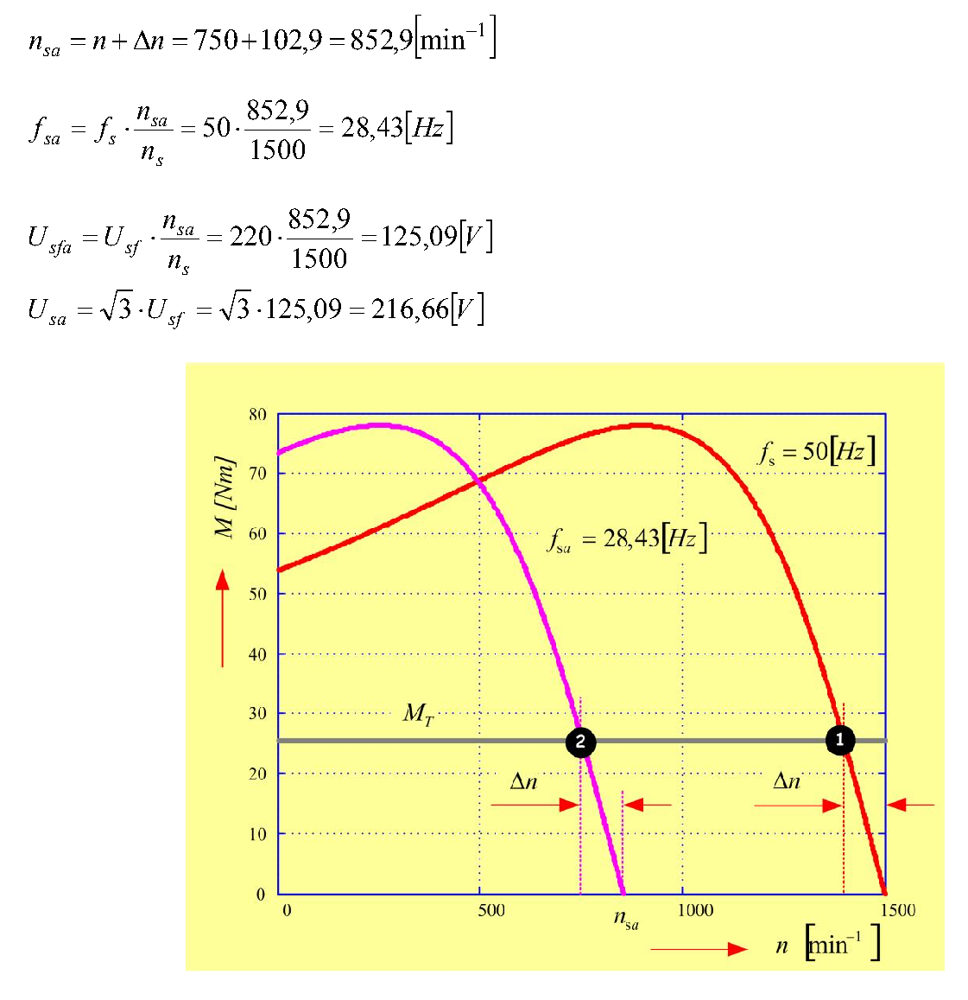
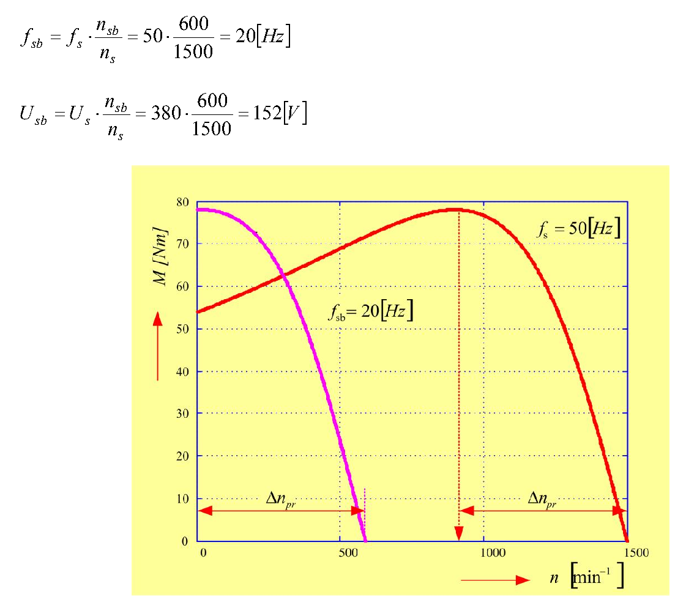

# Zadatak 52 — U/f upravljanje asinhronim motorom: zadata brzina i polazak sa maksimalnim ubrzanjem

## Postavka

Trofazni asinhroni motor sa kratkospojenim (kaveznim) rotorom pokreće radnu mašinu čiji je
otporni moment $M_T = 26\ \mathrm{Nm}$ i ima **potencijalnu prirodu** (dakle, konstantan je,
ne zavisi od brzine obrtanja).

**a)** Odrediti napon i frekvenciju napajanja motora pri kojima će brzina motora biti
$n = 750\ \mathrm{min^{-1}}$, uz uslov da se promena frekvencije vrši tako da odnos napona i
frekvencije ostane stalan: $U/f = \mathrm{const.} = U_{\mathrm{n}}/f_{\mathrm{n}}$.

**b)** Sa kojom učestanošću i sa kojim naponom treba **startovati** motor da bi se postiglo
**maksimalno početno ubrzanje**?

Podaci o motoru: $380\ \mathrm{V}$, $50\ \mathrm{Hz}$, broj pari polova $p = 2$, sprega
statora Y (zvezda), induktivnost rasipanja statora $L_{\gamma s} = 10\ \mathrm{mH}$, svedena
induktivnost rasipanja rotora $L'_{\gamma r} = 8{,}8\ \mathrm{mH}$, svedena otpornost rotora
$R'_r = 2{,}37\ \mathrm{\Omega}$. **Napomena:** zanemariti otpornost statorskog namotaja
($R_s \approx 0$).

> **Napomena o originalu:** u postavci originalne zbirke odštampano je „svedena otpornost
> rotora 2,3 Ω", ali se u celom rešenju dosledno koristi vrednost $2{,}37\ \mathrm{\Omega}$
> (npr. $s_{pr} = 2{,}37/5{,}928 \approx 0{,}4$) i samo sa njom se dobijaju svi objavljeni
> rezultati. Očigledno je u pitanju štamparska greška u postavci, pa i mi računamo sa
> $R'_r = 2{,}37\ \mathrm{\Omega}$. (Sa $2{,}3\ \mathrm{\Omega}$ dobilo bi se
> $s_{pr} \approx 0{,}39$, $f_{sa} \approx 28{,}3\ \mathrm{Hz}$ i $U_{sa} \approx 216\ \mathrm{V}$ —
> blizu, ali ne isto.)

> **Prevod na običan jezik:** Imamo motor koji se normalno napaja iz mreže 380 V, 50 Hz i
> tada bi se vrteo blizu 1500 min⁻¹. Mi, međutim, imamo frekventni pretvarač (uređaj koji
> može da pravi trofazni napon proizvoljne veličine i učestanosti) i želimo dve stvari.
> Prvo (a): da motor vrti teret tačno na 750 min⁻¹ — koju frekvenciju i koji napon da
> podesimo na pretvaraču, ako se držimo pravila da napon i frekvenciju smanjujemo u istoj
> srazmeri? Drugo (b): kada motor tek uključujemo iz mirovanja, kojom frekvencijom i naponom
> da krenemo pa da motor „šutne" teret najjače što može, tj. da ubrzanje u prvom trenutku
> bude najveće moguće?

## Podaci

| Veličina | Oznaka | Vrednost | Šta ta veličina fizički znači |
|---|---|---|---|
| Nazivni (linijski) napon | $U_{\mathrm{n}} = U_s$ | $380\ \mathrm{V}$ | Efektivna vrednost napona između dve fazne stezaljke motora pri nazivnom napajanju. |
| Nazivna učestanost | $f_{\mathrm{n}} = f_s$ | $50\ \mathrm{Hz}$ | Učestanost mrežnog napona za koju je motor projektovan. |
| Broj pari polova | $p$ | $2$ | Koliko puta se magnetno polje „ponovi" po obimu mašine; određuje sinhronu brzinu ($p=2 \Rightarrow 1500\ \mathrm{min^{-1}}$ na 50 Hz). |
| Sprega statora | — | Y (zvezda) | Način vezivanja tri fazna namotaja; kod zvezde je fazni napon $\sqrt{3}$ puta manji od linijskog. |
| Induktivnost rasipanja statora | $L_{\gamma s}$ | $10\ \mathrm{mH}$ | Mera onog dela statorskog fluksa koji se „rasipa" — obuhvata samo statorski namotaj, a ne stiže do rotora, pa ne prenosi energiju. |
| Svedena induktivnost rasipanja rotora | $L'_{\gamma r}$ | $8{,}8\ \mathrm{mH}$ | Isto to za rotor, „svedeno" (preračunato) na statorsku stranu da bismo mogli da radimo sa jednom zajedničkom ekvivalentnom šemom. |
| Svedena otpornost rotora | $R'_r$ | $2{,}37\ \mathrm{\Omega}$ | Omska otpornost rotorskog kola preračunata na statorsku stranu; kroz nju rotorska struja pravi gubitke, a $R'_r/s$ modeluje i mehaničku snagu. |
| Otpornost statora | $R_s$ | $\approx 0$ | Zanemarujemo je po nalogu zadatka — to će nam bitno pojednostaviti sve formule. |
| Otporni moment tereta | $M_T$ | $26\ \mathrm{Nm}$ | Moment kojim se radna mašina „opire" obrtanju; potencijalne je prirode, dakle isti je na svakoj brzini. |
| Tražena brzina (deo a) | $n$ | $750\ \mathrm{min^{-1}}$ | Brzina obrtanja vratila koju želimo u stacionarnom stanju. |

## Šta se traži i zašto

**1. Učestanost $f_{sa}$ i napon $U_{sa}$ za rad na $750\ \mathrm{min^{-1}}$ (deo a).**
Asinhroni motor prikačen direktno na mrežu vrti se brzinom koju mu diktiraju mreža i teret —
ne možemo da je biramo. Čim hoćemo *zadatu* brzinu (transportna traka, pumpa, dizalica...),
moramo da menjamo učestanost napajanja, a sa njom, po pravilu $U/f=\mathrm{const.}$, i napon.
Inženjer koji parametrira frekventni pretvarač mora da zna tačno koju frekvenciju i koji
napon da zada. Plan:

1. Iz nazivnih podataka izračunamo prevalni (maksimalni) moment $M_{pr}$ i prevalno klizanje $s_{pr}$ motora.
2. Klosovim obrascem nađemo klizanje $s_T$ pri kome motor na 50 Hz nosi teret od 26 Nm, pa iz njega razliku brzina $\Delta n = s_T \cdot n_s$.
3. Iskoristimo ključnu činjenicu (dokazaćemo je u teoriji): uz $U/f=\mathrm{const.}$ i $R_s \approx 0$, ta razlika $\Delta n$ je **ista na svakoj učestanosti**.
4. Sinhrona brzina nove radne tačke je onda $n_{sa} = 750 + \Delta n$, a iz nje srazmerom slede $f_{sa}$ i $U_{sa}$.

**2. Učestanost $f_{sb}$ i napon $U_{sb}$ za polazak sa maksimalnim ubrzanjem (deo b).**
Kod teških zaleta (puna dizalica, velika inercija) želimo da motor iz mesta razvije najveći
mogući moment — tada je višak momenta nad teretom najveći, pa je i ubrzanje najveće. Plan:

1. Motor razvija najveći moment (prevalni) kada je „zaostajanje" za sinhronom brzinom tačno $\Delta n_{pr} = s_{pr}\cdot n_s$ — i ta vrednost je, opet uz $U/f=\mathrm{const.}$, ista na svakoj učestanosti.
2. Na polasku je brzina $n=0$, pa vrh momentne krive pada baš u $n=0$ ako sinhronu brzinu podesimo na $n_{sb} = \Delta n_{pr}$.
3. Iz $n_{sb}$ srazmerom dobijamo $f_{sb}$ i $U_{sb}$.

## Potrebna teorija — mini-lekcije

### Sinhrona brzina i klizanje

Trofazni namotaj statora, napajan trofaznim naponom učestanosti $f_s$, stvara **obrtno
magnetno polje** koje se vrti sinhronom brzinom

$$n_s = \frac{60 \cdot f_s}{p}\ \left[\mathrm{min^{-1}}\right],$$

gde je $p$ broj pari polova. Formula potiče otuda što polje za jednu periodu napona
($1/f_s$ sekundi) pređe jedan par polova, tj. $1/p$ punog obrtaja; pomnoženo sa 60 daje
obrtaje u minuti. Za naš motor: $n_s = 60\cdot 50/2 = 1500\ \mathrm{min^{-1}}$.

Rotor se vrti brzinom $n$, uvek nešto sporije od polja (u motorskom režimu). Relativno
zaostajanje zove se **klizanje**:

$$s = \frac{n_s - n}{n_s}\ [\,]\ \text{(bezdimenziono)}, \qquad \Delta n = n_s - n = s\cdot n_s\ \left[\mathrm{min^{-1}}\right].$$

Klizanje je „motor" cele mašine: samo zato što rotor kasni za poljem, u rotorskim provodnicima
se indukuju struje, a one sa poljem prave moment. Kad bi bilo $s=0$, ne bi bilo ni indukovanja,
ni struje, ni momenta. Razliku $\Delta n$ zvaćemo **apsolutno klizanje** ili razlika brzina —
biće nam važnija od samog $s$ jer se lepo ponaša pri promeni frekvencije.

### Moment, prevalni moment i prevalno klizanje (uz $R_s \approx 0$)

U ekvivalentnoj šemi asinhronog motora (po jednoj fazi) rotorska grana ima otpornost
$R'_r/s$ i rasipnu reaktansu, a statorska svoju otpornost $R_s$ i rasipnu reaktansu.
Rasipne reaktanse na učestanosti $f_s$ iznose:

$$X_{\gamma s} = \omega_s L_{\gamma s}, \qquad X'_{\gamma r} = \omega_s L'_{\gamma r}, \qquad \omega_s = 2\pi f_s,$$

gde je $\omega_s$ ugaona (kružna) učestanost napajanja u $\mathrm{rad/s}$. Kada zanemarimo
$R_s$ i struju magnećenja, rotorska struja svedena na stator je prosto napon podeljen
impedansom redne veze:

$$I'_r = \frac{U_{sf}}{\sqrt{\left(\dfrac{R'_r}{s}\right)^2 + \left(X_{\gamma s}+X'_{\gamma r}\right)^2}},$$

gde je $U_{sf}$ **fazni** napon statora. Snaga koja kroz vazdušni zazor pređe na rotor je
$P_{ob} = q_s \, I'^2_r \, R'_r/s$ (sa $q_s = 3$ — broj faza), a moment je ta snaga podeljena
sinhronom mehaničkom ugaonom brzinom $\Omega_s = 2\pi n_s/60 = \pi n_s /30$:

$$M = \frac{P_{ob}}{\Omega_s} = \frac{q_s}{\Omega_s}\cdot \frac{U_{sf}^2 \cdot \dfrac{R'_r}{s}}{\left(\dfrac{R'_r}{s}\right)^2 + \left(X_{\gamma s}+X'_{\gamma r}\right)^2}.$$

Ova funkcija po $s$ ima maksimum — **prevalni moment** $M_{pr}$ — i to tačno tamo gde je
$R'_r/s$ jednako zbiru rasipnih reaktansi (to se pokazuje traženjem izvoda po $s$ ili
teoremom o maksimalnom prenosu snage). Klizanje u kome se maksimum dešava zove se
**prevalno klizanje**:

$$s_{pr} = \frac{R'_r}{X_{\gamma s}+X'_{\gamma r}}.$$

Ako $s = s_{pr}$ uvrstimo u izraz za $M$, imenilac postaje $2\left(X_{\gamma s}+X'_{\gamma r}\right)^2$,
pa posle skraćivanja ostaje:

$$M_{pr} = \frac{q_s \, U_{sf}^2}{2\,\Omega_s \left(X_{\gamma s}+X'_{\gamma r}\right)}
= \frac{30}{\pi}\cdot\frac{q_s}{n_s}\cdot\frac{U_{sf}^2}{2\left(X_{\gamma s}+X'_{\gamma r}\right)},$$

gde je drugi oblik dobijen zamenom $\Omega_s = \pi n_s/30$, tj. $1/\Omega_s = 30/(\pi n_s)$.
Intuicija: prevalni moment je „plafon" motora — teret veći od $M_{pr}$ motor ni teoretski ne
može da nosi, zaustavio bi se. Primetimo dve stvari: $M_{pr}$ raste sa kvadratom napona, a
**ne zavisi od $R'_r$** (otpornost rotora samo pomera gde je vrh, ne i koliko je visok).

### Klosov obrazac

Ako izraz za $M$ podelimo izrazom za $M_{pr}$ i sredimo, sve mašinske konstante se pokrate i
ostane čuvena, vrlo zgodna relacija — **Klosov obrazac**:

$$M = \frac{2\,M_{pr}}{\dfrac{s}{s_{pr}} + \dfrac{s_{pr}}{s}}.$$

On kaže: cela momentna karakteristika $M(s)$ je određena sa samo dva broja, $M_{pr}$ i
$s_{pr}$. Za malo $s$ (normalan rad) dominira drugi sabirak u imeniocu pa je
$M \approx 2M_{pr}\, s/s_{pr}$ — prava linija kroz nulu; za veliko $s$ dominira prvi pa moment
opada. Obrazac važi tačno baš pod našom pretpostavkom $R_s = 0$. U zadatku ćemo ga koristiti
„naopako": znamo $M$ (teret), tražimo $s$.

### Zašto baš $U/f = \mathrm{const.}$ i šta iz toga sledi

Indukovana elektromotorna sila statora srazmerna je proizvodu fluksa i učestanosti
($E \approx 4{,}44 f_s N \Phi$, iz Faradejevog zakona za naizmenično polje). Uz $R_s \approx 0$
napon je praktično jednak toj EMS, pa je fluks u mašini

$$\Phi \sim \frac{U_{sf}}{f_s}.$$

Ako smanjimo samo frekvenciju a napon ostavimo, fluks bi porastao i gvožđe bi otišlo duboko u
zasićenje (ogromna struja magnećenja, pregrevanje). Ako smanjimo samo napon, fluks opada pa
moment (koji zavisi od fluksa) drastično slabi. Zato se napon i frekvencija menjaju **zajedno,
u istoj srazmeri** — fluks ostaje nazivni, mašina ostaje „zdrava" i sposobna za pun moment.
To je klasično **skalarno ili U/f upravljanje**.

Sada ključne posledice. Zapišimo prevalne veličine preko induktivnosti
($X = \omega_s L$, $L = L_{\gamma s}+L'_{\gamma r}$):

$$M_{pr} = \frac{q_s\,U_{sf}^2}{2\,\Omega_s\,\omega_s L} = \frac{q_s\,p}{2L}\left(\frac{U_{sf}}{\omega_s}\right)^{2},
\qquad \Delta n_{pr} = s_{pr}\cdot n_s = \frac{R'_r}{\omega_s L}\cdot\frac{60 f_s}{p} = \frac{60\,R'_r}{2\pi\,p\,L}.$$

(U prvom smo iskoristili $\Omega_s = \omega_s/p$, a u drugom $\omega_s = 2\pi f_s$, pa se
$f_s$ pokratilo.) Čitamo:

- $M_{pr}$ zavisi samo od odnosa $U_{sf}/\omega_s$ — dakle uz $U/f=\mathrm{const.}$ **prevalni moment je isti na svakoj učestanosti**. Vrh momentne krive se pri smanjenju frekvencije samo translira ulevo, ne spušta se (vidi se lepo na slikama 52.1 i 52.2).
- $\Delta n_{pr} = s_{pr} n_s$ **uopšte ne zavisi od $f_s$** — vrh krive je uvek na istom „rastojanju" (u $\mathrm{min^{-1}}$) levo od sinhrone brzine.
- Klosov obrazac se može prepisati preko apsolutnih klizanja, jer je $\dfrac{s}{s_{pr}} = \dfrac{\Delta n / n_s}{\Delta n_{pr}/n_s} = \dfrac{\Delta n}{\Delta n_{pr}}$:

$$M = \frac{2\,M_{pr}}{\dfrac{\Delta n}{\Delta n_{pr}} + \dfrac{\Delta n_{pr}}{\Delta n}}.$$

Pošto su i $M_{pr}$ i $\Delta n_{pr}$ konstante (nezavisne od $f_s$), ovo znači: **kriva
$M(\Delta n)$ je jedna te ista na svim učestanostima**. Za zadati teret $M_T$ motor će se na
svakoj frekvenciji „namestiti" na isto $\Delta n$ — to je srce rešenja dela a).

### Bazni opseg i granica napona (sme li napon iznad nazivnog?)

Pravilo $U/f=\mathrm{const.}$ može da se sprovodi samo dok je traženi napon **manji ili
jednak nazivnom**: iznad $U_{\mathrm{n}}$ ne smemo (izolacija namotaja i naponski limit
pretvarača), a i sam pretvarač više od napona mreže tipično ne može da da. Zato se opseg
$0 < f_s \le f_{\mathrm{n}}$ zove **bazni opseg** — u njemu držimo $U/f=\mathrm{const.}$ i
raspolažemo punim (nazivnim) prevalnim momentom. Za brzine iznad nazivne ($f_s > f_{\mathrm{n}}$)
napon se „zamrzava" na $U_{\mathrm{n}}$, fluks $\sim U/f$ tada opada — to je režim
**slabljenja polja**, u kome raspoloživi moment pada. U našem zadatku tražena brzina
$750\ \mathrm{min^{-1}}$ je ispod nazivne, pa ćemo dobiti $f_{sa} < 50\ \mathrm{Hz}$ i
$U_{sa} < 380\ \mathrm{V}$ — ostajemo u baznom opsegu i rešenje je legalno; u koraku 9 to i
proveravamo.

### Potencijalni otporni moment

Otporni momenti radnih mašina dele se po zavisnosti od brzine: ventilatorski ($M \sim n^2$),
konstantne snage ($M \sim 1/n$)... **Potencijalni** otporni moment je onaj koji potiče od
sile teže (dizalica koja drži teret, lift, vitlo): njegov iznos je **konstantan**, ne zavisi
ni od brzine ni od smera obrtanja. Za nas to znači: horizontalna linija $M_T = 26\ \mathrm{Nm}$
na dijagramu momenta, ista i na 750 min⁻¹ i u trenutku polaska.

### Maksimalno početno ubrzanje

Mehanika obrtnog kretanja (Njutnov zakon za rotaciju) kaže:

$$J\,\frac{d\Omega}{dt} = M - M_T,$$

gde je $J$ moment inercije svih obrtnih masa ($\mathrm{kg\,m^2}$), $\Omega$ mehanička ugaona
brzina, $M$ moment motora, a $M_T$ moment tereta. Ubrzanje je najveće kada je razlika
$M - M_T$ najveća; pošto je $M_T$ konstantan (potencijalan teret), treba **maksimizovati $M$
u trenutku polaska** ($n = 0$). Najveći moment koji motor uopšte ume da da je $M_{pr}$, a
razvija ga na brzini $n = n_s - \Delta n_{pr}$. Dakle, biramo takvu (sniženu) učestanost da
vrh krive padne tačno u $n=0$, tj. da sinhrona brzina bude $n_{sb} = \Delta n_{pr}$.

## Rešenje, korak po korak

### Korak 1: Fazni napon statora

**Zašto ovaj korak:** u svim formulama za moment figuriše *fazni* napon $U_{sf}$, a podatak
$380\ \mathrm{V}$ je *linijski* napon. Kod sprege Y fazni namotaj „vidi" linijski napon
podeljen sa $\sqrt{3}$:

$$U_{sf} = \frac{U_s}{\sqrt{3}} = \frac{380}{\sqrt{3}} = \frac{380}{1{,}732} = 219{,}4\ \mathrm{V} \approx 220\ \mathrm{V}.$$

Kao i originalna zbirka, dalje računamo sa zaokruženom vrednošću $220\ \mathrm{V}$ (to je
standardna nominalna fazna vrednost mreže 380 V).

**Šta smo dobili:** napon jedne faze, oko 220 V — poznata „utičnička" vrednost, što je dobar
znak da smo delili, a ne množili sa $\sqrt{3}$.

### Korak 2: Zbir rasipnih reaktansi na 50 Hz

**Zašto ovaj korak:** i prevalni moment i prevalno klizanje zavise od zbira
$X_{\gamma s}+X'_{\gamma r}$; reaktanse dobijamo iz zadatih induktivnosti množenjem ugaonom
učestanošću $\omega_s = 2\pi f_s$.

$$X_{\gamma s} + X'_{\gamma r} = \omega_s\left(L_{\gamma s} + L'_{\gamma r}\right)
= 2\pi\cdot 50\cdot\left(10 + 8{,}8\right)\cdot 10^{-3}$$

Prvo zbir induktivnosti: $10 + 8{,}8 = 18{,}8\ \mathrm{mH} = 0{,}0188\ \mathrm{H}$. Zatim
$\omega_s = 2\pi\cdot 50 = 314{,}16\ \mathrm{rad/s}$, pa:

$$X_{\gamma s} + X'_{\gamma r} = 314{,}16 \cdot 0{,}0188 = 5{,}906\ \mathrm{\Omega} \approx 5{,}91\ \mathrm{\Omega}.$$

> **Napomena o originalu:** u zbirci na ovom mestu piše $5{,}928\ \mathrm{\Omega}$, što je
> sitna računska omaška (tačno je $2\pi\cdot 50\cdot 0{,}0188 = 5{,}906$; vrednost 5,928
> odgovarala bi induktivnosti 18,87 mH). Razlika je svega 0,4 % i, kao što ćemo videti,
> posle zaokruživanja ($s_{pr}\approx 0{,}4$, $\nu_T \approx 3$) svi dalji rezultati
> ispadaju identični onima iz zbirke.

**Šta smo dobili:** ukupnu rasipnu reaktansu od oko $5{,}91\ \mathrm{\Omega}$ — to je jedina
impedansa koja (uz $R'_r/s$) ograničava struju, pošto je $R_s$ zanemareno.

### Korak 3: Prevalni moment

**Zašto ovaj korak:** prevalni moment nam treba dva puta — kao „plafon" u Klosovom obrascu
(deo a) i kao ciljni polazni moment (deo b).

Opšti oblik (izveden u teoriji):

$$M_{pr} = \frac{30}{\pi}\cdot\frac{q_s}{n_s}\cdot\frac{U_{sf}^{\,2}}{2\left(X_{\gamma s}+X'_{\gamma r}\right)},$$

gde je $q_s = 3$ broj faza statora, $n_s = 1500\ \mathrm{min^{-1}}$ sinhrona brzina na 50 Hz
(izračunata u teoriji: $60\cdot 50/2$), a činilac $30/\pi$ potiče od pretvaranja
$\mathrm{min^{-1}}$ u $\mathrm{rad/s}$ ($\Omega_s = \pi n_s/30$). Uvrštavamo:

$$M_{pr} = \frac{30\cdot 3\cdot 220^2}{\pi\cdot 1500\cdot 2\cdot 5{,}906}
= \frac{30\cdot 3\cdot 48400}{55665}
= \frac{4\,356\,000}{55665} = 78{,}25\ \mathrm{Nm} \approx 78{,}3\ \mathrm{Nm}.$$

(Brojilac: $220^2 = 48400$; $30\cdot 3 = 90$; $90\cdot 48400 = 4\,356\,000$. Imenilac:
$\pi\cdot 1500 = 4712{,}4$; $4712{,}4\cdot 2\cdot 5{,}906 = 55665$.)

> **Napomena o originalu:** zbirka, sa svojih $5{,}928\ \mathrm{\Omega}$ u imeniocu, dobija
> $M_{pr} = 77{,}97\ \mathrm{Nm}$. Razlika (78,25 prema 77,97) je posledica iste omaške iz
> koraka 2 i ne utiče na dalji tok, jer se u sledećim koracima ionako koristi zaokruženo
> $\nu_T \approx 3$.

**Šta smo dobili:** motor maksimalno može oko $78\ \mathrm{Nm}$ — tri puta više od tereta od
26 Nm. Teret je, dakle, komotno u granicama mogućnosti motora i stacionarno stanje postoji.

### Korak 4: Prevalno klizanje

**Zašto ovaj korak:** prevalno klizanje je druga od dve konstante koje potpuno opisuju
momentnu krivu (preko Klosovog obrasca), a u delu b) direktno određuje polaznu učestanost.

$$s_{pr} = \frac{R'_r}{X_{\gamma s}+X'_{\gamma r}} = \frac{2{,}37}{5{,}906} = 0{,}401 \approx 0{,}4\ [\,].$$

Kao i zbirka, dalje računamo sa zaokruženim $s_{pr} = 0{,}4$.

**Šta smo dobili:** vrh momentne krive je na klizanju 0,4, tj. na brzini
$n_s(1-0{,}4) = 900\ \mathrm{min^{-1}}$ pri 50 Hz. Ovako veliko prevalno klizanje (kod
standardnih motora je 0,1–0,3) znak je relativno velike rotorske otpornosti — kriva je
„razvučena", što je tipično za manje motore.

### Korak 5: Klizanje radne tačke iz Klosovog obrasca

**Zašto ovaj korak:** da bismo saznali koliko motor zaostaje za poljem dok nosi 26 Nm,
moramo Klosov obrazac rešiti po klizanju. To je jednačina sa $s_T$ i u brojiocu i u
imeniocu, pa je sređujemo na kvadratnu jednačinu — svaki prelaz prikazujemo.

Polazimo od Klosovog obrasca napisanog za radnu tačku (moment motora = moment tereta $M_T$,
klizanje $s_T$):

$$M_T = \frac{2\,M_{pr}}{\dfrac{s_T}{s_{pr}} + \dfrac{s_{pr}}{s_T}}.$$

Imenilac svedemo na zajednički sadržalac $s_{pr}\,s_T$:

$$\frac{s_T}{s_{pr}} + \frac{s_{pr}}{s_T} = \frac{s_T^{\,2} + s_{pr}^{\,2}}{s_{pr}\,s_T}
\quad\Longrightarrow\quad
M_T\cdot\frac{s_T^{\,2} + s_{pr}^{\,2}}{s_{pr}\,s_T} = 2\,M_{pr}.$$

Pomnožimo obe strane sa $\dfrac{s_{pr}\,s_T}{M_T}$:

$$s_T^{\,2} + s_{pr}^{\,2} = \frac{2\,M_{pr}}{M_T}\, s_{pr}\, s_T,$$

pa sve prebacimo na levu stranu — dobijamo kvadratnu jednačinu po $s_T$:

$$s_T^{\,2} - \frac{2\,M_{pr}}{M_T}\cdot s_{pr}\cdot s_T + s_{pr}^{\,2} = 0.$$

Uvedimo skraćenicu $\nu_T$ — odnos prevalnog momenta i momenta opterećenja:

$$\nu_T = \frac{M_{pr}}{M_T} = \frac{78{,}25}{26} = 3{,}01 \approx 3.$$

(Zbirka, sa $M_{pr}=77{,}97$, dobija $77{,}97/26 = 2{,}999 \approx 3$ — isto zaokruženje.
Da je ispalo $\nu_T < 1$, jednačina ne bi imala realna rešenja: motor slabiji od tereta
nema radnu tačku.)

Rešavamo kvadratnu jednačinu $s_T^{\,2} - 2\nu_T s_{pr}\, s_T + s_{pr}^{\,2} = 0$ standardnom
formulom ($x = \frac{-b \pm \sqrt{b^2-4ac}}{2a}$, ovde $a=1$, $b = -2\nu_T s_{pr}$,
$c = s_{pr}^{\,2}$):

$$s_T = \frac{2\nu_T s_{pr} \pm \sqrt{4\nu_T^{\,2} s_{pr}^{\,2} - 4 s_{pr}^{\,2}}}{2}
= \nu_T s_{pr} \pm s_{pr}\sqrt{\nu_T^{\,2}-1}
= s_{pr}\left(\nu_T \pm \sqrt{\nu_T^{\,2}-1}\right).$$

(Pod korenom smo izvukli $4s_{pr}^{\,2}$ ispred korena kao $2s_{pr}$, pa se dvojke skratile.)
Jednačina ima dva korena:

$$s_{T1} = 0{,}4\left(3 - \sqrt{3^2-1}\right), \qquad s_{T2} = 0{,}4\left(3 + \sqrt{3^2-1}\right) = 0{,}4\cdot 5{,}83 = 2{,}33.$$

Drugi koren ($2{,}33 > 1$) otpada: klizanje veće od 1 značilo bi da se rotor vrti unazad, a
to nije naš režim; matematički, to je presek sa **nestabilnom** granom karakteristike
(desno od prevala), gde motor ne može trajno da radi. Uzimamo, kao i zbirka, rešenje manje
od jedinice:

$$s_T = s_{pr}\left(\nu_T - \sqrt{\nu_T^{\,2}-1}\right) = 0{,}4\cdot\left(3 - \sqrt{8}\right)
= 0{,}4\cdot\left(3 - 2{,}828\right) = 0{,}4\cdot 0{,}1716 = 0{,}0686\ [\,].$$

**Šta smo dobili:** u stacionarnom stanju na 50 Hz motor klizi svega 6,86 % — mnogo manje od
prevalnog 40 %, što je logično: teret je tek trećina prevalnog momenta, pa smo na strmom,
skoro linearnom delu karakteristike blizu sinhrone brzine.

### Korak 6: Razlika brzina (apsolutno klizanje) radne tačke

**Zašto ovaj korak:** klizanje pretvaramo u razliku brzina u $\mathrm{min^{-1}}$, jer je
upravo ta razlika ono što ostaje konstantno pri promeni frekvencije.

$$\Delta n = s_T\cdot n_s = 0{,}0686\cdot 1500 = 102{,}9\ \mathrm{min^{-1}}.$$

**Šta smo dobili:** kad god ovaj motor (uz nazivni fluks) nosi 26 Nm, njegov rotor zaostaje
za obrtnim poljem oko $103\ \mathrm{min^{-1}}$ — na *bilo kojoj* učestanosti u baznom opsegu.

### Korak 7: Potrebna sinhrona brzina za 750 min⁻¹

**Zašto ovaj korak:** tražimo takvu sinhronu brzinu $n_{sa}$ da rotor, zaostajući svojih
$\Delta n$, završi tačno na 750 min⁻¹. Podsetnik zašto je $\Delta n$ isto i na novoj
učestanosti (dokazano u teoriji): uz $R_s\approx 0$ i $U/f=\mathrm{const.}$, kriva
$M(\Delta n)$ je ista za sve učestanosti, pa isti teret uvek znači isto $\Delta n$.

$$n_{sa} = n + \Delta n = 750 + 102{,}9 = 852{,}9\ \mathrm{min^{-1}}.$$

**Šta smo dobili:** obrtno polje treba da se vrti na oko 853 min⁻¹ — nova momentna kriva je
kopija stare, samo pomerena ulevo tako da njen strmi deo seče liniju tereta baš na 750 min⁻¹.

### Korak 8: Potrebna učestanost

**Zašto ovaj korak:** sinhrona brzina i učestanost su vezane relacijom $n_s = 60 f_s/p$, tj.
srazmerne su ($p$ se ne menja). Zato je nova učestanost prosto stara pomnožena odnosom
sinhronih brzina:

$$f_{sa} = f_s\cdot\frac{n_{sa}}{n_s} = 50\cdot\frac{852{,}9}{1500} = 50\cdot 0{,}5686 = 28{,}43\ \mathrm{Hz}.$$

**Šta smo dobili:** pretvarač treba da spusti učestanost sa 50 na oko 28,4 Hz. Vrednost je
manja od nazivne — u baznom smo opsegu, kao što smo i očekivali za brzinu ispod nazivne.

### Korak 9: Potrebni napon

**Zašto ovaj korak:** po pravilu $U/f=\mathrm{const.}$ napon mora da se smanji u istoj
srazmeri kao učestanost (a učestanost u srazmeri sinhronih brzina). Prvo fazna vrednost:

$$U_{sfa} = U_{sf}\cdot\frac{n_{sa}}{n_s} = 220\cdot\frac{852{,}9}{1500} = 220\cdot 0{,}5686 = 125{,}09\ \mathrm{V},$$

pa linijska (kod sprege Y linijski napon je $\sqrt{3}$ puta veći od faznog):

$$U_{sa} = \sqrt{3}\cdot U_{sfa} = 1{,}732\cdot 125{,}09 = 216{,}66\ \mathrm{V}.$$

Provera pravila: $U_{sa}/f_{sa} = 216{,}66/28{,}43 = 7{,}62 \approx 380/50 = 7{,}6$ — odnos
je očuvan (sitna razlika potiče samo od zaokruživanja $219{,}4 \to 220\ \mathrm{V}$).

**Da li je ovakav napon dozvoljen?** Jeste: $U_{sa} = 216{,}66\ \mathrm{V} < U_{\mathrm{n}} = 380\ \mathrm{V}$
i $f_{sa} = 28{,}43\ \mathrm{Hz} < 50\ \mathrm{Hz}$ — radna tačka je unutar baznog opsega, pa
pretvarač ovo može da isporuči, a izolacija i magnetno kolo nisu ugroženi. Da je tražena
brzina bila iznad nazivne, ispalo bi $U > U_{\mathrm{n}}$, što nije dozvoljeno — tada bi se
napon zadržao na nazivnom, fluks bi slabio, i cela ova računica (sa konstantnim $M_{pr}$ i
$\Delta n$) više ne bi važila.

**Šta smo dobili:** kompletan odgovor na deo a): $f_{sa} = 28{,}43\ \mathrm{Hz}$,
$U_{sa} = 216{,}66\ \mathrm{V}$ (linijski), tj. $U_{sfa} = 125{,}09\ \mathrm{V}$ po fazi.

Sledeća slika prikazuje upravo ovu situaciju: dve momentne krive — nazivnu (crvenu, za
$f_s = 50\ \mathrm{Hz}$, radna tačka 1) i sniženu (ljubičastu, za $f_{sa} = 28{,}43\ \mathrm{Hz}$,
radna tačka 2) — i horizontalnu liniju tereta $M_T = 26\ \mathrm{Nm}$. Čitaj je ovako: obe
krive imaju **isti vrh** (isti $M_{pr}$, jer je $U/f$ isto) i obe seku liniju tereta na
**istom rastojanju $\Delta n$** levo od svoje sinhrone brzine (strelice); snižavanjem
učestanosti kriva se samo translira ulevo dok presek ne padne na željenih 750 min⁻¹.

**Slika 52.1 —** Upravljanje brzinom asinhronog motora u baznom opsegu uz uslov
$U/f = \mathrm{const.}$: nazivna karakteristika ($f_s = 50\ \mathrm{Hz}$, tačka 1) i
karakteristika pri $f_{sa} = 28{,}43\ \mathrm{Hz}$ (tačka 2); razlika brzina $\Delta n$
prema liniji tereta $M_T$ ista je na obe krive.

### Korak 10 (deo b): Sinhrona brzina za polazak sa maksimalnim ubrzanjem

**Zašto ovaj korak:** ubrzanje na polasku je $\left(M - M_T\right)/J$, pa je najveće kada
motor u trenutku polaska ($n = 0$) razvija svoj najveći moment $M_{pr}$. Motor razvija
$M_{pr}$ tačno na $\Delta n_{pr} = s_{pr} n_s$ ispod sinhrone brzine, a ta razlika je (uz
$U/f = \mathrm{const.}$, $f < f_{\mathrm{n}}$) nezavisna od učestanosti — pokazano u teoriji.
Najpre je izračunajmo (sa nazivnim $n_s = 1500\ \mathrm{min^{-1}}$):

$$\Delta n_{pr} = s_{pr}\cdot n_s = 0{,}4\cdot 1500 = 600\ \mathrm{min^{-1}}.$$

Vrh krive pada u $n = 0$ ako je sinhrona brzina pri polasku jednaka baš tom rastojanju:

$$n_{sb} = \Delta n_{pr} = 600\ \mathrm{min^{-1}}.$$

**Šta smo dobili:** obrtno polje na polasku treba da se vrti na 600 min⁻¹ — tada rotor koji
miruje „vidi" polje tačno na prevalnom rastojanju i vuče ga punih $\approx 78\ \mathrm{Nm}$,
umesto znatno manjeg polaznog momenta koji bi imao direktnim uključenjem na 50 Hz.

### Korak 11: Polazna učestanost

**Zašto ovaj korak:** kao u koraku 8 — učestanost je srazmerna sinhronoj brzini.

$$f_{sb} = f_s\cdot\frac{n_{sb}}{n_s} = 50\cdot\frac{600}{1500} = 50\cdot 0{,}4 = 20\ \mathrm{Hz}.$$

**Šta smo dobili:** motor treba startovati na 20 Hz. Zgodno je uočiti i prečicu:
$f_{sb} = s_{pr}\cdot f_s = 0{,}4\cdot 50$ — polazna učestanost za maksimalno ubrzanje je
prosto prevalno klizanje puta nazivna učestanost.

### Korak 12: Polazni napon

**Zašto ovaj korak:** i napon mora u istoj srazmeri (pravilo $U/f=\mathrm{const.}$); ovde
ga, kao i zbirka, računamo direktno kao linijski:

$$U_{sb} = U_s\cdot\frac{n_{sb}}{n_s} = 380\cdot\frac{600}{1500} = 380\cdot 0{,}4 = 152\ \mathrm{V}.$$

Provera: $U_{sb}/f_{sb} = 152/20 = 7{,}6 = 380/50$ — odnos tačno očuvan. I ovde je
$U_{sb} < U_{\mathrm{n}}$ i $f_{sb} < f_{\mathrm{n}}$, dakle sve dozvoljeno.

**Šta smo dobili:** kompletan odgovor na deo b): start na $20\ \mathrm{Hz}$ i
$152\ \mathrm{V}$ (linijski).

Sledeća slika prikazuje polaznu situaciju: snižena (ljubičasta) kriva za
$f_{sb} = 20\ \mathrm{Hz}$ nacrtana je tako da joj **vrh stoji tačno iznad $n = 0$** — motor
iz mesta kreće sa prevalnim momentom; poređenja radi, nacrtana je i nazivna (crvena) kriva
za 50 Hz, kod koje je isti razmak $\Delta n_{pr} = 600\ \mathrm{min^{-1}}$ (strelice) samo
pomeren uz $n_s = 1500\ \mathrm{min^{-1}}$, pa je njen polazni moment znatno manji od
prevalnog.

**Slika 52.2 —** Startovanje motora sa maksimalnim početnim ubrzanjem uz podešavanje napona
i učestanosti napajanja, uz uslov $U/f = \mathrm{const.}$: pri $f_{sb} = 20\ \mathrm{Hz}$
prevalni moment se razvija tačno pri $n = 0$; rastojanje $\Delta n_{pr}$ od sinhrone brzine
do vrha isto je kao kod nazivne krive.

## Česte greške i zamke

1. **Linijski umesto faznog napona u formuli za $M_{pr}$.** U formulu ide $U_{sf} \approx 220\ \mathrm{V}$ (sprega Y!), ne 380 V. Sa 380 V prevalni moment ispadne tri puta veći ($3 = (\sqrt 3)^2$, jer napon ulazi na kvadrat) i sve posle toga je pogrešno.
2. **Uzimanje pogrešnog korena Klosove jednačine.** Kvadratna jednačina daje $s_{T} = 0{,}0686$ *i* $s_T = 2{,}33$. Fizičko je samo rešenje manje od jedinice, na stabilnoj grani karakteristike; ko mehanički uzme „plus" ispred korena, dobija besmislicu.
3. **Računanje kao da je 750 min⁻¹ sinhrona brzina.** Nova sinhrona brzina nije 750, nego $750 + \Delta n = 852{,}9\ \mathrm{min^{-1}}$ — motor pod teretom uvek zaostaje za poljem. Ko zaboravi $\Delta n$, dobije $f = 25\ \mathrm{Hz}$ umesto 28,43 Hz i motor koji se vrti prosporo.
4. **Prenošenje relativnog klizanja umesto apsolutnog.** Konstantno pri promeni učestanosti je $\Delta n$ (u $\mathrm{min^{-1}}$), a ne $s$ (procenat): na 28,43 Hz relativno klizanje je $s = 102{,}9/852{,}9 = 0{,}121$, dakle *nije* 0,0686. Ko drži $s$ konstantnim, promaši radnu tačku.
5. **Zaboravljanje uslova važenja.** Cela lepa slika (isti $M_{pr}$, isto $\Delta n$ na svim učestanostima) važi samo uz $R_s \approx 0$ i $U/f=\mathrm{const.}$ u baznom opsegu ($f \le f_{\mathrm{n}}$). Kod realnog motora na malim učestanostima pad na $R_s$ postaje osetan pa prevalni moment ipak opada; iznad $f_{\mathrm{n}}$ napon ne sme preko nazivnog pa važi režim slabljenja polja.

## Rezime rezultata

| Veličina | Oznaka | Vrednost |
|---|---|---|
| Fazni napon statora (nazivni) | $U_{sf}$ | $\approx 220\ \mathrm{V}$ |
| Zbir rasipnih reaktansi (50 Hz) | $X_{\gamma s}+X'_{\gamma r}$ | $5{,}906\ \mathrm{\Omega}$ (u zbirci $5{,}928$) |
| Prevalni moment | $M_{pr}$ | $78{,}3\ \mathrm{Nm}$ (u zbirci $77{,}97$) |
| Prevalno klizanje | $s_{pr}$ | $\approx 0{,}4$ |
| Odnos prevalnog i otpornog momenta | $\nu_T$ | $\approx 3$ |
| Klizanje radne tačke (50 Hz) | $s_T$ | $0{,}0686$ |
| Razlika brzina pod teretom | $\Delta n$ | $102{,}9\ \mathrm{min^{-1}}$ |
| **a)** Sinhrona brzina | $n_{sa}$ | $852{,}9\ \mathrm{min^{-1}}$ |
| **a)** Potrebna učestanost | $f_{sa}$ | $28{,}43\ \mathrm{Hz}$ |
| **a)** Potreban fazni napon | $U_{sfa}$ | $125{,}09\ \mathrm{V}$ |
| **a)** Potreban linijski napon | $U_{sa}$ | $216{,}66\ \mathrm{V}$ |
| **b)** Apsolutno prevalno klizanje | $\Delta n_{pr}$ | $600\ \mathrm{min^{-1}}$ |
| **b)** Polazna sinhrona brzina | $n_{sb}$ | $600\ \mathrm{min^{-1}}$ |
| **b)** Polazna učestanost | $f_{sb}$ | $20\ \mathrm{Hz}$ |
| **b)** Polazni (linijski) napon | $U_{sb}$ | $152\ \mathrm{V}$ |

## Provera smisla

**1. Dimenziona provera reaktanse.** $\omega_s L$ ima jedinicu
$\mathrm{\frac{rad}{s}}\cdot \mathrm{H} = \mathrm{\frac{1}{s}}\cdot\mathrm{\frac{V\,s}{A}} = \mathrm{\frac{V}{A}} = \mathrm{\Omega}$ — ispravno.

**2. Povratna provera Klosovim obrascem.** Uvrstimo dobijeno $s_T$ nazad:
$M = \dfrac{2\cdot 78{,}3}{\frac{0{,}0686}{0{,}4} + \frac{0{,}4}{0{,}0686}}
= \dfrac{156{,}6}{0{,}1715 + 5{,}831} = \dfrac{156{,}6}{6{,}003} = 26{,}1\ \mathrm{Nm} \approx M_T = 26\ \mathrm{Nm}$ —
radna tačka zaista nosi zadati teret (odstupanje 0,4 % je od zaokruživanja).

**3. Odnos prema nazivnim vrednostima (granica baznog opsega).** Obe dobijene radne tačke
imaju $f < 50\ \mathrm{Hz}$ i $U < 380\ \mathrm{V}$, a odnosi $U/f$ iznose
$216{,}66/28{,}43 = 7{,}62$ i $152/20 = 7{,}60$, praktično jednako nazivnom
$380/50 = 7{,}6\ \mathrm{V/Hz}$ — dakle nigde ne tražimo napon iznad nazivnog i pravilo
$U/f=\mathrm{const.}$ je svuda ispoštovano.

**4. Granični slučaj / nezavisna formula za deo b).** U teoriji smo izveli da je
$\Delta n_{pr} = \dfrac{60\,R'_r}{2\pi\,p\,L}$, potpuno nezavisno od učestanosti. Provera:
$\dfrac{60\cdot 2{,}37}{2\pi\cdot 2\cdot 0{,}0188} = \dfrac{142{,}2}{0{,}2362} = 601{,}9 \approx 600\ \mathrm{min^{-1}}$ —
poklapa se (do zaokruživanja $s_{pr}\to 0{,}4$) sa vrednošću iz koraka 10, sasvim drugim putem.

**5. Red veličine ubrzanja na polasku.** Direktnim uključenjem na 50 Hz polazni moment
(Klos, $s=1$): $M_{pol} = \dfrac{2\cdot 78{,}3}{\frac{1}{0{,}4}+\frac{0{,}4}{1}} = \dfrac{156{,}6}{2{,}9} = 54{,}0\ \mathrm{Nm}$,
pa je višak nad teretom $54{,}0 - 26 = 28\ \mathrm{Nm}$. Startom na 20 Hz višak je
$78{,}3 - 26 = 52{,}3\ \mathrm{Nm}$ — skoro dvostruko veće početno ubrzanje, uz još i manju
polaznu struju. Upravo zato se ovakav „meki" start i koristi.
