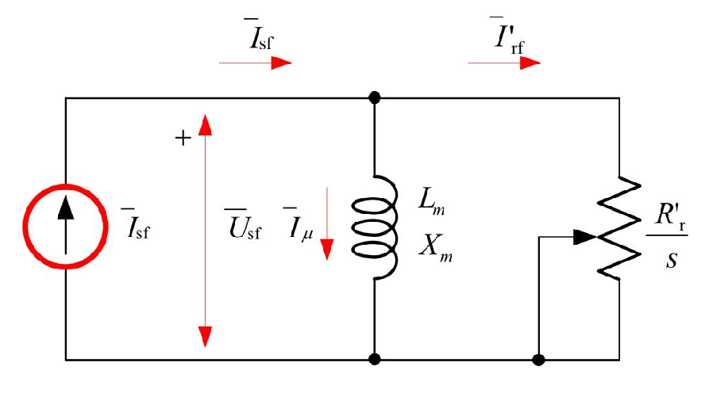

# Zadatak 55 — Maksimalni polazni moment asinhronog motora napajanog iz frekventnog pretvarača (strujni izvor)

## Postavka

Četvoropolni trofazni asinhroni motor ima nazivni (linijski) napon $380\ \mathrm{V}$, nazivnu frekvenciju $50\ \mathrm{Hz}$ i statorski namotaj spregnut u zvezdu (Y). Struja praznog hoda motora iznosi $9\ \mathrm{A}$, a svedena otpornost rotorskog namotaja $0{,}6\ \mathrm{\Omega}$. Motor se u pogonu napaja iz frekventnog pretvarača koji može dati maksimalnu struju od $25\ \mathrm{A}$. Odrediti maksimalni polazni moment motora u ovom pogonu.

> **Prevod na običan jezik:** Motor ne priključujemo direktno na mrežu, nego ga napaja frekventni pretvarač — uređaj energetske elektronike koji sam bira i napon i frekvenciju koje daje motoru, ali mu je struja ograničena na najviše $25\ \mathrm{A}$. Pri polasku (rotor stoji) pretvarač će "gurnuti" baš tih maksimalnih $25\ \mathrm{A}$ u motor da bi ubrzanje bilo što veće. Ali sama struja nije dovoljna: moment zavisi i od toga NA KOJOJ FREKVENCIJI pretvarač tu struju daje. Naš posao je da nađemo frekvenciju pri kojoj tih $25\ \mathrm{A}$ proizvodi najveći mogući polazni moment, i da taj moment izračunamo. Od podataka o motoru imamo samo struju praznog hoda (iz nje ćemo izvući reaktansu magnećenja) i rotorski otpor — pa će i ekvivalentna šema biti maksimalno uprošćena.

## Podaci

| Veličina | Oznaka | Vrednost | Šta ta veličina fizički znači |
|---|---|---|---|
| Broj polova | $2p = 4$, tj. $p = 2$ | 4 pola (2 para polova) | Koliko puta se magnetni "sever–jug" obrazac ponavlja po obimu mašine; određuje odnos između frekvencije napajanja i brzine obrtnog polja. |
| Nazivni linijski napon | $U_{\mathrm{n}}$ | $380\ \mathrm{V}$ | Efektivna vrednost napona između dva fazna provodnika, za koju je motor projektovan. |
| Nazivna frekvencija | $f_{\mathrm{n}}$ | $50\ \mathrm{Hz}$ | Frekvencija napajanja pri kojoj su dati nazivni podaci (i pri kojoj je merena struja praznog hoda). |
| Sprega statora | Y (zvezda) | — | Način vezivanja tri fazna namotaja; kod zvezde je fazni napon $\sqrt{3}$ puta manji od linijskog, a fazna struja jednaka linijskoj. |
| Struja praznog hoda | $I_{sf0}$ | $9\ \mathrm{A}$ | Struja koju motor vuče kad se vrti neopterećen; praktično cela ta struja služi za stvaranje (magnećenje) obrtnog polja. |
| Svedena otpornost rotora | $R'_r$ | $0{,}6\ \mathrm{\Omega}$ | Omski otpor rotorskog namotaja preračunat ("sveden") na statorsku stranu, da bi rotor i stator mogli da se crtaju u istoj šemi. |
| Maksimalna struja pretvarača | $I_{sf}$ | $25\ \mathrm{A}$ | Najveća efektivna vrednost struje koju frekventni pretvarač sme da isporuči — to je strujni limit koji će pri polasku biti u potpunosti iskorišćen. |

Iz sprege Y odmah sledi i izvedeni podatak — fazni napon statora pri $50\ \mathrm{Hz}$:

$$U_{sf} = \frac{U_{\mathrm{n}}}{\sqrt{3}} = \frac{380\ \mathrm{V}}{\sqrt{3}} = 219{,}39\ \mathrm{V}$$

## Šta se traži i zašto

**Traži se: maksimalni polazni moment $M_{p\max}$.**

- **Šta je to?** Polazni moment je elektromagnetni moment koji motor razvija u trenutku polaska, dok rotor još stoji (klizanje $s = 1$). "Maksimalni" ovde znači: najveći polazni moment koji se uopšte može dobiti u ovom pogonu, uz strujni limit pretvarača od $25\ \mathrm{A}$, biranjem najpovoljnije frekvencije napajanja.
- **Zašto to inženjera zanima?** Polazni moment odlučuje da li će motor uopšte pokrenuti teret i koliko brzo će ubrzati. Kod pogona sa frekventnim pretvaračem inženjer bira strategiju polaska: pretvarač drži struju na limitu, a frekvenciju treba podesiti tako da se iz te ograničene struje "iscedi" najviše momenta. Ovaj zadatak pokazuje kako se ta optimalna frekvencija računa — to je srž tzv. strujno regulisanog polaska.
- **Plan rešavanja (u 6 koraka, običnim jezikom):**
  1. Nacrtamo najprostiju moguću ekvivalentnu šemu motora napajanog iz strujnog izvora (slika 55.1): strujni izvor + reaktansa magnećenja $X_m$ + fiktivni rotorski otpor $R'_r/s$, sve paralelno.
  2. Strujnim razdelnikom izrazimo rotorsku struju $I'_{rf}$ preko poznate statorske struje $I_{sf}$.
  3. Napišemo izraz za moment preko snage obrtnog polja i uvrstimo rezultat razdelnika — dobijemo moment kao funkciju $I_{sf}$, $X_m$ i $R'_r/s$.
  4. Postavimo uslov maksimalnog momenta: otpornik $R'_r/s$ izvlači najveću snagu iz strujnog izvora kada je $R'_r/s = X_m$ (teorema o maksimalnom prenosu snage). Pri polasku je $s = 1$, pa uslov glasi $X_m = R'_r = 0{,}6\ \mathrm{\Omega}$.
  5. Iz ogleda praznog hoda odredimo $X_m$ pri $50\ \mathrm{Hz}$, pa iskoristimo činjenicu da je induktivnost $L_m$ stalna, a reaktansa srazmerna frekvenciji — i tako nađemo frekvenciju $f_{s\max}$ pri kojoj $X_m$ padne baš na $0{,}6\ \mathrm{\Omega}$.
  6. Uvrstimo sve u izraz za moment i izračunamo $M_{p\max}$.

## Potrebna teorija — mini-lekcije

### 1. Sinhrona brzina, klizanje i polazak

Trofazni statorski namotaj, kada se napaja simetričnim trofaznim strujama frekvencije $f_s$, stvara **obrtno magnetno polje**. To polje se obrće **sinhronom brzinom**:

$$\Omega_s = \frac{\omega_s}{p} = \frac{2\pi f_s}{p}$$

gde je $\omega_s = 2\pi f_s$ električna ugaona učestanost napajanja $\left[\mathrm{rad/s}\right]$, a $p$ broj **pari** polova (kod četvoropolnog motora $p = 2$). Poreklo: jedan pun električni ciklus struje "prevrne" polje za jedan par polova, pa mašina sa $p$ pari polova mehanički napravi $p$ puta manji ugao za isto vreme — zato deljenje sa $p$.

**Klizanje** meri relativno zaostajanje rotora za poljem:

$$s = \frac{\Omega_s - \Omega}{\Omega_s}$$

gde je $\Omega$ mehanička brzina rotora. Pri **polasku rotor stoji** ($\Omega = 0$), pa je $s = 1$ — i to važi **za bilo koju frekvenciju napajanja**, jer se u brojiocu i imeniocu nalazi ista $\Omega_s$. To je ključno za ovaj zadatak: pretvarač može da menja $f_s$ koliko hoće, polazak je uvek $s = 1$.

### 2. Ekvivalentna šema i fiktivni otpor $R'_r/s$

Asinhroni motor se po fazi modeluje električnom šemom nalik transformatoru: statorska grana (otpor i rasipna reaktansa statora), poprečna grana magnećenja (reaktansa $X_m$) i rotorska grana. Kada se sve rotorske veličine svedu na stator, rotorska grana se predstavlja **fiktivnim otporom** $R'_r/s$ (uz rasipnu reaktansu rotora). Odakle taj čudni otpor koji zavisi od klizanja? U rotoru se indukuju struje frekvencije $s\cdot f_s$; kada se jednačine rotorskog kola preračunaju na statorsku frekvenciju, rotorski otpor $R'_r$ se formalno podeli sa $s$. Snaga koja se razvije na tom fiktivnom otporu je upravo **snaga obrtnog polja** — ukupna aktivna snaga koja preko vazdušnog zazora pređe sa statora na rotor:

$$P_{ob} = 3\cdot\frac{R'_r}{s}\cdot I'^{\,2}_{rf}$$

(faktor 3 jer je šema po jednoj fazi, a mašina ima tri faze).

### 3. Šta znači "svedeno na stator" (oznaka prim)

Rotorski namotaj ima drugačiji broj navojaka od statorskog, pa se njegove veličine ne mogu direktno crtati u istoj šemi sa statorskim. Zato se preračunavaju ("svode") na statorsku stranu preko odnosa transformacije — potpuno isto kao kod transformatora. Svedene veličine se obeležavaju primom: $R'_r$, $I'_{rf}$. U ovom zadatku je $R'_r = 0{,}6\ \mathrm{\Omega}$ već dat kao sveden, pa nikakvo dodatno preračunavanje nije potrebno.

### 4. Strujno napajanje: pretvarač kao strujni izvor

Frekventni pretvarač sa strujnom regulacijom nameće motoru **struju** (i njenu frekvenciju), a napon se "sam namesti" prema impedansi koju motor pokazuje. Zato se u ekvivalentnoj šemi pretvarač crta kao **idealan strujni izvor** $\bar{I}_{sf}$. Odavde sledi vrlo važno uprošćenje: **redna impedansa statora (otpor $R_s$ i rasipna reaktansa $X_{\gamma s}$) ne utiče na raspodelu struja u ostatku kola.** Zašto? Redna impedansa je vezana na red sa strujnim izvorom — kroz nju prolazi tačno $\bar{I}_{sf}$, ma kolika ona bila. Ona menja samo napon koji izvor mora da obezbedi (i koji ovde nije tražen podatak), ali ne i to kako se $\bar{I}_{sf}$ dalje grana. Zato je u ovoj šemi slobodno izostavljamo. (Kod naponskog napajanja to ne bi smelo — tamo redna impedansa direktno određuje struju!) Dodatno, rasipna reaktansa rotora je zanemarena jer za nju u zadatku nemamo podatak; to je dopušteno uprošćenje jer je ona pri ovako niskim frekvencijama (videćemo: oko $1\ \mathrm{Hz}$) i onako sitna u poređenju sa $R'_r$.

### 5. Ogled praznog hoda i reaktansa magnećenja; zašto $X_m$ zavisi od frekvencije

U **praznom hodu** motor se vrti gotovo sinhronom brzinom, pa je $s \approx 0$ i fiktivni otpor $R'_r/s \to \infty$ — rotorska grana je praktično **otvorena** i sva statorska struja teče kroz granu magnećenja. Zanemarimo li rednu impedansu statora, ceo fazni napon pada na $X_m$, pa iz merenja praznog hoda sledi:

$$X_m^{50} = \frac{U_{sf}}{I_{sf0}}$$

Indeks "50" naglašava: to je reaktansa **pri $50\ \mathrm{Hz}$**, jer se struja praznog hoda (ako nije drugačije rečeno) daje za nazivnu frekvenciju. Reaktansa nije svojstvo mašine samo po sebi — svojstvo mašine je **induktivnost magnećenja** $L_m$ (određena geometrijom, gvožđem i brojem navojaka), a reaktansa je:

$$X_m = \omega_s L_m = 2\pi f_s L_m$$

Dakle $X_m$ raste **linearno sa frekvencijom**, dok je $L_m$ konstantna (dokle god gvožđe nije zasićeno). Pretvarač, birajući $f_s$, praktično "štimuje" vrednost $X_m$ — i baš to ćemo iskoristiti.

### 6. Strujni razdelnik

Kada se zadata struja $\bar{I}$ grana na dve paralelne grane impedansi $\bar{Z}_1$ i $\bar{Z}_2$, obe grane imaju **isti napon** (jer su vezane na iste čvorove): $\bar{U} = \left(\bar{Z}_1 \parallel \bar{Z}_2\right)\cdot\bar{I}$, gde je $\bar{Z}_1 \parallel \bar{Z}_2 = \dfrac{\bar{Z}_1\bar{Z}_2}{\bar{Z}_1+\bar{Z}_2}$ ekvivalentna impedansa paralelne veze. Struja kroz granu 2 je onda:

$$\bar{I}_2 = \frac{\bar{U}}{\bar{Z}_2} = \frac{\bar{Z}_1}{\bar{Z}_1+\bar{Z}_2}\cdot\bar{I}$$

Intuicija: struja "voli" manju impedansu — grana 2 dobija utoliko veći deo struje ukoliko je **druga** grana ($\bar{Z}_1$) veća prepreka. Prvi Kirhofov zakon (zbir struja u čvoru je nula) garantuje da se dve granske struje vektorski sabiraju u ukupnu $\bar{I}$.

### 7. Moment preko snage obrtnog polja

Elektromagnetni moment se u teoriji asinhrone mašine uvek može napisati kao odnos snage obrtnog polja i **sinhrone** brzine:

$$M = \frac{P_{ob}}{\Omega_s} = \frac{3\cdot\dfrac{R'_r}{s}\cdot I'^{\,2}_{rf}}{\Omega_s}$$

Poreklo (u dve rečenice): obrtno polje "nosi" snagu $P_{ob}$ preko zazora obrćući se brzinom $\Omega_s$, a moment je po definiciji snaga podeljena brzinom obrtanja onoga što tu snagu prenosi. Formula važi pri **svakom** klizanju, pa i pri polasku ($s = 1$) — tada se doduše cela $P_{ob}$ pretvori u toplotu u rotoru (jer mehaničke snage nema, rotor stoji), ali moment i dalje postoji i jednak je $P_{ob}/\Omega_s$.

### 8. Teorema o maksimalnom prenosu snage (verzija za strujni izvor)

Neka idealan strujni izvor efektivne vrednosti $I$ napaja paralelnu vezu reaktanse $X$ i otpornika $R$. Koliki $R$ izvlači najveću aktivnu snagu? Strujni razdelnik (mini-lekcija 6) daje struju kroz otpornik $I_R = \dfrac{X}{\sqrt{R^2+X^2}}\cdot I$, pa je snaga (po fazi):

$$P(R) = R\cdot I_R^2 = \frac{R\,X^2}{R^2+X^2}\cdot I^2$$

Maksimum tražimo izvodom po $R$ (količnik: izvod brojioca puta imenilac minus brojilac puta izvod imenioca, sve kroz imenilac na kvadrat):

$$\frac{\mathrm{d}P}{\mathrm{d}R} = I^2 X^2\cdot\frac{(R^2+X^2) - R\cdot 2R}{(R^2+X^2)^2} = I^2 X^2\cdot\frac{X^2 - R^2}{(R^2+X^2)^2}$$

Izvod je nula (i menja znak sa + na −, dakle maksimum) tačno kada je:

$$R = X$$

Ovo je poznati uslov **usaglašenosti (jednakosti) impedansi** potrošača i izvora. Intuicija: ako je $R$ premali, napon na paraleli je mali pa je i snaga $\sim U^2/R$ mala; ako je $R$ preveliki, gotovo sva struja "pobegne" kroz reaktansu pa kroz $R$ ne teče ništa — optimum je na sredini, kad su obe impedanse jednake. Tada se, uzgred, struja deli na dva jednaka dela po modulu: kroz svaku granu teče $I/\sqrt{2}$ (grane su fazno pomerene za $90^\circ$, pa se vektorski ipak sabiraju u $I$).

**Važna pedantnost za ovaj zadatak:** kod nas se biranjem frekvencije menja i $X_m = \omega_s L_m$ i $\Omega_s = \omega_s/p$ u imeniocu momenta, pa maksimalna snaga na otporniku nije automatski isto što i maksimalan moment. Srećom, puna maksimizacija po frekvenciji daje **isti uslov**. Uvrstimo $X_m = \omega_s L_m$ i $\Omega_s = \omega_s/p$ u izraz za moment (pri $s=1$):

$$M(\omega_s) = \frac{3R'_r\,p}{\omega_s}\cdot\frac{\omega_s^2 L_m^2}{\omega_s^2 L_m^2 + R'^{\,2}_r}\cdot I_{sf}^2 = 3R'_r\,p\,I_{sf}^2\cdot\frac{\omega_s L_m^2}{\omega_s^2 L_m^2 + R'^{\,2}_r}$$

$$\frac{\mathrm{d}M}{\mathrm{d}\omega_s} \propto \frac{\left(\omega_s^2 L_m^2 + R'^{\,2}_r\right)L_m^2 - \omega_s L_m^2\cdot 2\omega_s L_m^2}{\left(\omega_s^2 L_m^2 + R'^{\,2}_r\right)^2} = \frac{L_m^2\left(R'^{\,2}_r - \omega_s^2 L_m^2\right)}{\left(\omega_s^2 L_m^2 + R'^{\,2}_r\right)^2} = 0 \;\Rightarrow\; \omega_s L_m = R'_r$$

tj. tačno $X_m = R'_r$ — uslov usaglašenosti. Zato smemo, kao i zbirka, da rezonujemo preko maksimalnog prenosa snage.

## Rešenje, korak po korak

### Korak 1: Postavljamo uprošćenu ekvivalentnu šemu strujno napajanog motora

**Zašto ovaj korak:** Sve što o motoru znamo su struja praznog hoda ($\to X_m$) i rotorski otpor $R'_r$; motor je uz to napajan strujnim izvorom. Šema mora da sadrži tačno te elemente i ništa više — svako kolo koje bismo dodali (redna impedansa statora, rasipanje rotora) ili nema podatak ili ne utiče na rezultat (mini-lekcija 4).

Šemu prikazuje slika 55.1. Čitaj je ovako: skroz levo je **strujni izvor** (kružić sa strelicom) koji nameće faznu struju statora $\bar{I}_{sf}$ — to je frekventni pretvarač. Na njegove krajeve vezane su, **paralelno**, dve grane: grana magnećenja sa induktivnošću $L_m$, tj. reaktansom $X_m$ (kroz nju teče struja magnećenja $\bar{I}_\mu$, strelica nadole), i rotorska grana sa fiktivnim promenljivim otpornikom $R'_r/s$ (kroz nju teče svedena rotorska struja $\bar{I}'_{rf}$, strelica na vrhu desno). Napon na svim trima elementima je isti — fazni napon statora $\bar{U}_{sf}$, označen strelicom uz izvor.

**Slika 55.1 —** Uprošćena ekvivalentna šema strujno napajanog asinhronog motora.

U šemi su, u odnosu na punu ekvivalentnu šemu asinhronog motora, uvedena sledeća (obrazložena) uprošćenja:

- **Redna impedansa statora** ($R_s$ i $X_{\gamma s}$) **je potpuno zanemarena** — kroz nju bi ionako tekla nametnuta struja $\bar{I}_{sf}$, pa na grananje struja i na moment ne utiče; menjala bi jedino napon $U_s$ koji ovde nije tražen (mini-lekcija 4).
- **Rasipna reaktansa rotora je zanemarena** — za nju nema podatka, a pri niskoj polaznoj frekvenciji je zanemarljiva prema $R'_r$.
- **Rotor je predstavljen samo fiktivnim otporom $R'_r/s$** kojim se modeluje aktivna snaga koja prelazi sa statora na rotor (mini-lekcija 2).
- **Grana magnećenja je zadržana** — nju poznajemo iz struje praznog hoda i ona je ovde suštinski važna, jer se nametnuta struja deli između nje i rotora.

**Šta smo dobili:** Najprostije moguće kolo koje i dalje sadrži svu fiziku zadatka — jednu podelu struje između $X_m$ i $R'_r/s$.

### Korak 2: Strujni razdelnik — rotorska struja iz statorske

**Zašto ovaj korak:** Moment pravi rotorska struja $I'_{rf}$, a mi znamo (kontrolišemo) statorsku $I_{sf}$. Treba nam veza između njih, a nju daje strujni razdelnik na paraleli $jX_m$ i $R'_r/s$.

Obe grane imaju isti napon $\bar{U}_{sf}$ (vezane su na iste čvorove), a on je jednak proizvodu ekvivalentne paralelne impedanse i ukupne struje:

$$\bar{U}_{sf} = \left[\left(jX_m\right)\parallel\left(\frac{R'_r}{s}\right)\right]\cdot\bar{I}_{sf} = \frac{jX_m\cdot\dfrac{R'_r}{s}}{\dfrac{R'_r}{s}+jX_m}\cdot\bar{I}_{sf}$$

Rotorska struja je taj napon podeljen impedansom rotorske grane:

$$\bar{I}'_{rf} = \frac{\bar{U}_{sf}}{\dfrac{R'_r}{s}} = \frac{jX_m}{\dfrac{R'_r}{s}+jX_m}\cdot\bar{I}_{sf}$$

Nas zanimaju efektivne vrednosti (moduli). Moduo brojioca je $\left|jX_m\right| = X_m$, a moduo imenioca je moduo kompleksnog broja sa realnim delom $R'_r/s$ i imaginarnim delom $X_m$, dakle $\sqrt{\left(R'_r/s\right)^2+X_m^2}$. (Zbirka isti račun zapisuje u obliku $\dfrac{R'_r}{s}\cdot I'_{rf} = \left|\left(jX_m\right)\parallel\left(\dfrac{R'_r}{s}\right)\right|\cdot I_{sf}$ — to je samo napon na paraleli napisan na dva načina, pa podeljen sa $R'_r/s$.) Dobijamo:

$$I'_{rf} = \frac{X_m}{\sqrt{X_m^2+\left(\dfrac{R'_r}{s}\right)^2}}\cdot I_{sf}$$

**Šta smo dobili:** Rotorska struja je uvek **manji deo** statorske (razlomak je manji od 1), jer deo struje "pobegne" u granu magnećenja. Koliki deo — zavisi od odnosa $X_m$ i $R'_r/s$, a taj odnos ćemo uskoro podesiti frekvencijom.

### Korak 3: Moment izražen preko struje statora

**Zašto ovaj korak:** Kontrolisana (poznata) veličina je struja pretvarača $I_{sf}$, pa moment želimo kao funkciju baš nje — tada direktno vidimo šta strujni limit od $25\ \mathrm{A}$ znači za moment. (Napomena: pošto je sprega zvezda, fazna struja statora jednaka je linijskoj izlaznoj struji pretvarača, pa je $I_{sf}$ upravo ona struja na koju se limit odnosi.)

Moment je odnos snage obrtnog polja i sinhrone brzine (mini-lekcija 7), a snaga obrtnog polja je snaga na fiktivnom otporu $R'_r/s$:

$$M = \frac{3\cdot\dfrac{R'_r}{s}}{\Omega_s}\cdot I'^{\,2}_{rf}$$

Uvrstimo rezultat Koraka 2; kvadriranjem razlomka koren nestaje:

$$M = \frac{3\cdot R'_r}{s\cdot\Omega_s}\cdot\frac{X_m^2}{X_m^2+\left(\dfrac{R'_r}{s}\right)^2}\cdot I_{sf}^2$$

Ovde je $\Omega_s = \dfrac{2\pi f_s}{p}$ sinhrona (mehanička) brzina obrtnog polja pri frekvenciji napajanja $f_s$.

**Šta smo dobili:** Moment zavisi od kvadrata struje pretvarača (fiksirano limitom na $25\ \mathrm{A}$) i od kombinacije $X_m$ i $R'_r/s$ — a na $X_m$ i $\Omega_s$ utičemo izborom frekvencije. Ostaje optimizacija.

### Korak 4: Uslov maksimalnog momenta — usaglašavanje impedansi

**Zašto ovaj korak:** Struja je već na limitu; jedina preostala "poluga" je frekvencija. Tražimo uslov pri kome izraz iz Koraka 3, pri polasku, postaje najveći.

Pri polasku je klizanje $s = 1$ (mini-lekcija 1), za svaku frekvenciju. Prema teoremi o maksimalnom prenosu snage (mini-lekcija 8), otpornik $R'_r/s$ izvlači maksimalnu aktivnu snagu iz strujnog izvora sa paralelnom reaktansom $X_m$ tačno onda kada su te dve impedanse **usaglašene, tj. jednake**:

$$\frac{R'_r}{s} = X_m$$

a u mini-lekciji 8 smo pokazali i da puna maksimizacija momenta po frekvenciji (koja uvažava i $\Omega_s$ u imeniocu) daje **isti** uslov, pa je on merodavan i za moment, ne samo za snagu. Sa $s = 1$:

$$X_m = R'_r = 0{,}6\ \mathrm{\Omega}$$

**Šta smo dobili:** Konkretan zahtev za mašinu: reaktansa magnećenja mora pri polasku da iznosi svega $0{,}6\ \mathrm{\Omega}$. Pri $50\ \mathrm{Hz}$ ona je (videćemo) oko $24\ \mathrm{\Omega}$ — dakle pretvarač mora drastično da spusti frekvenciju. Kolika ona tačno treba da bude, računamo u sledeća dva koraka.

### Korak 5: Reaktansa magnećenja pri 50 Hz — iz struje praznog hoda

**Zašto ovaj korak:** Da bismo znali na koju frekvenciju treba sići, prvo moramo znati koliko $X_m$ iznosi pri poznatoj, nazivnoj frekvenciji — a to nam daje ogled praznog hoda.

U praznom hodu je rotorska grana praktično otvorena ($s\approx 0 \Rightarrow R'_r/s\to\infty$), pa je struja praznog hoda u celosti struja magnećenja i važi (mini-lekcija 5):

$$X_m^{50} = \frac{U_{sf}}{I_{sf0}} = \frac{\dfrac{380\ \mathrm{V}}{\sqrt{3}}}{9\ \mathrm{A}} = \frac{219{,}39\ \mathrm{V}}{9\ \mathrm{A}} = 24{,}38\ \mathrm{\Omega}$$

Napon je morao biti **fazni** (sprega Y!), jer je šema po fazi. Struja praznog hoda se, ako nije drugačije naglašeno, daje za nazivnu frekvenciju $50\ \mathrm{Hz}$ — zato indeks "50". Usput, induktivnost magnećenja iznosi:

$$L_m = \frac{X_m^{50}}{2\pi f_{\mathrm{n}}} = \frac{24{,}38\ \mathrm{\Omega}}{2\pi\cdot 50\ \mathrm{Hz}} = 0{,}0776\ \mathrm{H} \approx 77{,}6\ \mathrm{mH}$$

**Šta smo dobili:** Pri $50\ \mathrm{Hz}$ reaktansa magnećenja je $24{,}38\ \mathrm{\Omega}$ — oko 40 puta veća od potrebnih $0{,}6\ \mathrm{\Omega}$. Pošto je $X_m$ srazmerna frekvenciji, i frekvencija će morati da bude oko 40 puta manja od $50\ \mathrm{Hz}$.

### Korak 6: Optimalna polazna frekvencija $f_{s\max}$

**Zašto ovaj korak:** Uslov iz Koraka 4 kaže kolika $X_m$ treba da bude; iz Koraka 5 znamo kolika je pri $50\ \mathrm{Hz}$. Konstantnost induktivnosti $L_m$ povezuje te dve informacije i daje traženu frekvenciju.

Induktivnost je ista pri obe frekvencije (svojstvo mašine, mini-lekcija 5), pa je:

$$L_m = \frac{X_m}{2\pi f_{s\max}} = \frac{X_m^{50}}{2\pi\cdot 50}$$

Množenjem obe strane sa $2\pi$ faktor $2\pi$ se skraćuje (zato ga zbirka i ne piše):

$$\frac{X_m}{f_{s\max}} = \frac{X_m^{50}}{50} \;\Rightarrow\; f_{s\max} = \frac{X_m}{X_m^{50}}\cdot 50$$

Sada uvrstimo $X_m = \dfrac{R'_r}{s}$ (uslov maksimuma, sa $s=1$) i $X_m^{50} = \dfrac{U_{sf}}{I_{sf0}}$ (Korak 5); deljenje razlomkom je množenje njegovom recipročnom vrednošću:

$$f_{s\max} = \frac{R'_r}{s}\cdot\frac{I_{sf0}}{U_{sf}}\cdot 50 = 0{,}6\ \mathrm{\Omega}\cdot\frac{9\ \mathrm{A}}{\dfrac{380\ \mathrm{V}}{\sqrt{3}}}\cdot 50\ \mathrm{Hz} = 0{,}6\cdot\frac{9}{219{,}39}\cdot 50\ \mathrm{Hz}$$

$$f_{s\max} = 0{,}6\cdot 0{,}04102\cdot 50\ \mathrm{Hz} = 1{,}2306\ \mathrm{Hz} \approx 1{,}23\ \mathrm{Hz}$$

**Šta smo dobili:** Pretvarač treba da pokrene motor strujom od $25\ \mathrm{A}$ na frekvenciji od svega oko $1{,}23\ \mathrm{Hz}$ — obrtno polje se tada vrti sa samo $n_s = 60 f_{s\max}/p \approx 37\ \mathrm{min^{-1}}$. To je tipično za strujno regulisani polazak: polje jedva "mili", klizanje je 1, ali su impedanse usaglašene i struja se optimalno deli između magnećenja i rotora.

### Korak 7: Maksimalni polazni moment $M_{p\max}$

**Zašto ovaj korak:** Sve veličine u izrazu za moment iz Koraka 3 su sada poznate — ostaje uvrštavanje.

Prvo pojednostavimo razlomak sa reaktansama: pri usaglašenosti je $\dfrac{R'_r}{s} = X_m$, pa je:

$$\frac{X_m^2}{X_m^2+\left(\dfrac{R'_r}{s}\right)^2} = \frac{X_m^2}{X_m^2+X_m^2} = \frac{X_m^2}{2X_m^2} = \frac{1}{2}$$

Tačno polovina "moment-tvorne" kombinacije preživi — što je u skladu sa podelom struje $I'_{rf} = I_{sf}/\sqrt{2}$ (kvadriranjem: $1/2$). Dalje, sinhrona brzina pri optimalnoj frekvenciji:

$$\Omega_s = \frac{2\pi f_{s\max}}{p} = \frac{2\pi\cdot 1{,}2306\ \mathrm{Hz}}{2} = 3{,}866\ \mathrm{rad/s}$$

Uvrstimo sve u izraz iz Koraka 3 (sa $s = 1$), pri čemu $\dfrac{1}{\Omega_s} = \dfrac{p}{2\pi f_{s\max}}$:

$$M_{p\max} = \frac{3\cdot R'_r}{\Omega_s}\cdot\frac{X_m^2}{2X_m^2}\cdot I_{sf}^2 = \frac{3\cdot R'_r\cdot p}{2\pi\cdot f_{s\max}}\cdot\frac{I_{sf}^2}{2}$$

$$M_{p\max} = \frac{3\cdot 0{,}6\ \mathrm{\Omega}\cdot 2}{2\pi\cdot 1{,}2306\ \mathrm{Hz}}\cdot\frac{\left(25\ \mathrm{A}\right)^2}{2} = \frac{3{,}6}{7{,}732}\cdot\frac{625}{2}\ \mathrm{Nm} = 0{,}4656\cdot 312{,}5\ \mathrm{Nm}$$

$$\boxed{M_{p\max} \approx 145{,}5\ \mathrm{Nm}}$$

> **Napomena o originalu:** Zbirka u završnom uvrštavanju koristi zaokruženu frekvenciju $f_{s\max} = 1{,}23\ \mathrm{Hz}$ i dobija $M_{p\max} = 145{,}5685\ \mathrm{Nm}$; sa nezaokruženom vrednošću $f_{s\max} = 1{,}23067\ \mathrm{Hz}$ dobija se $145{,}49\ \mathrm{Nm}$. Razlika (manja od $0{,}1\ \mathrm{Nm}$, tj. ispod $0{,}06\,\%$) potiče isključivo od zaokruživanja međurezultata — oba računa daju $M_{p\max}\approx 145{,}5\ \mathrm{Nm}$.

**Šta smo dobili:** Motor koji struju od $25\ \mathrm{A}$ dobije na pravilno izabranoj niskoj frekvenciji razvija polazni moment od oko $145{,}5\ \mathrm{Nm}$ — vrlo pristojan moment za mašinu ove veličine (uporedi: isti motor direktno na mreži od $50\ \mathrm{Hz}$ sa istom strujom dao bi, po istoj formuli, jedva oko $7\ \mathrm{Nm}$; vidi Proveru smisla).

## Česte greške i zamke

1. **Broj polova umesto broja pari polova.** "Četvoropolni" znači $2p = 4$, dakle $p = 2$ para polova. Ko u $\Omega_s = 2\pi f_s/p$ uvrsti $p = 4$, dobiće dvostruko manju sinhronu brzinu i **dvostruko veći** moment ($\approx 291\ \mathrm{Nm}$) — grešku koja "lepo izgleda" pa se lako previdi.
2. **Linijski umesto faznog napona kod $X_m^{50}$.** Ekvivalentna šema je po fazi, a sprega je zvezda: mora $U_{sf} = 380/\sqrt{3} = 219{,}39\ \mathrm{V}$. Sa $380\ \mathrm{V}$ ispada $X_m^{50} = 42{,}2\ \mathrm{\Omega}$, pa pogrešna frekvencija $f_{s\max} = 0{,}71\ \mathrm{Hz}$ i pogrešan moment.
3. **Zaboraviti da $X_m$ zavisi od frekvencije.** Najčešća suštinska greška: uzeti uslov $R'_r/s = X_m$ pa uvrstiti $X_m = X_m^{50} = 24{,}38\ \mathrm{\Omega}$ i "zaključiti" da uslov ne može da se ispuni (ili računati moment na $50\ \mathrm{Hz}$). Poenta zadatka je upravo da pretvarač spuštanjem frekvencije **smanjuje** $X_m$ dok se ne izjednači sa $R'_r$.
4. **Mešanje $\omega_s$ i $\Omega_s$.** Moment je snaga obrtnog polja podeljena **mehaničkom** sinhronom brzinom $\Omega_s = \omega_s/p$, a ne električnom učestanošću $\omega_s = 2\pi f_s$. Kod $p = 2$ razlika je faktor 2.
5. **Izgubiti faktor $1/2$ iz razdelnika.** Pri usaglašenim impedansama kroz rotor teče $I_{sf}/\sqrt{2}$, pa u momentu (koji ide sa kvadratom struje) ostaje faktor $1/2$. Ko moment računa kao da svih $25\ \mathrm{A}$ prolazi kroz rotor, dobija dvostruko preveliki rezultat.
6. **Tretirati $25\ \mathrm{A}$ kao amplitudu.** Zadatak izričito kaže da je to maksimalna **efektivna** vrednost struje pretvarača — u formule sa efektivnim vrednostima ulazi direktno, bez deljenja sa $\sqrt{2}$.

## Rezime rezultata

| Veličina | Oznaka | Vrednost |
|---|---|---|
| Fazni napon statora (50 Hz, sprega Y) | $U_{sf}$ | $219{,}39\ \mathrm{V}$ |
| Reaktansa magnećenja pri 50 Hz | $X_m^{50}$ | $24{,}38\ \mathrm{\Omega}$ |
| Induktivnost magnećenja | $L_m$ | $\approx 77{,}6\ \mathrm{mH}$ |
| Uslov maksimalnog momenta (pri $s=1$) | $X_m = R'_r$ | $0{,}6\ \mathrm{\Omega}$ |
| Optimalna polazna frekvencija | $f_{s\max}$ | $1{,}2306\ \mathrm{Hz} \approx 1{,}23\ \mathrm{Hz}$ |
| Sinhrona brzina pri $f_{s\max}$ | $\Omega_s$ | $3{,}87\ \mathrm{rad/s}$ ($\approx 37\ \mathrm{min^{-1}}$) |
| Rotorska struja pri polasku | $I'_{rf} = I_{sf}/\sqrt{2}$ | $17{,}68\ \mathrm{A}$ |
| **Maksimalni polazni moment** | $M_{p\max}$ | $\approx 145{,}5\ \mathrm{Nm}$ (u zbirci $145{,}5685\ \mathrm{Nm}$ sa $f_{s\max}$ zaokruženim na $1{,}23\ \mathrm{Hz}$) |

## Provera smisla

**1. Dimenziona analiza momenta.** U izrazu $M = \dfrac{3R'_r p}{2\pi f_{s\max}}\cdot\dfrac{I_{sf}^2}{2}$ imamo $\dfrac{\mathrm{\Omega}\cdot\mathrm{A^2}}{\mathrm{1/s}} = \dfrac{\mathrm{W}}{\mathrm{rad/s}} = \dfrac{\mathrm{W\cdot s}}{\mathrm{rad}} = \mathrm{N\,m}$ (jer je $\mathrm{\Omega\cdot A^2 = W}$, snaga; a snaga kroz ugaonu brzinu je moment). Dimenzije se slažu.

**2. Da li je $f_{s\max}$ zaista maksimum?** Izračunajmo moment po formuli iz Koraka 3 (sa $s=1$, $X_m = 2\pi f_s L_m$, $I_{sf} = 25\ \mathrm{A}$) za nekoliko frekvencija:

| $f_s$ | $1{,}0\ \mathrm{Hz}$ | $1{,}23\ \mathrm{Hz}$ | $1{,}5\ \mathrm{Hz}$ | $5\ \mathrm{Hz}$ | $50\ \mathrm{Hz}$ |
|---|---|---|---|---|---|
| $M$ | $142{,}4\ \mathrm{Nm}$ | $145{,}5\ \mathrm{Nm}$ | $142{,}7\ \mathrm{Nm}$ | $67{,}5\ \mathrm{Nm}$ | $7{,}2\ \mathrm{Nm}$ |

Moment ima jasan maksimum baš kod $1{,}23\ \mathrm{Hz}$ (levo i desno od njega opada), a pri mrežnoj frekvenciji od $50\ \mathrm{Hz}$ ista struja od $25\ \mathrm{A}$ dala bi **dvadesetak puta manji** polazni moment — jer bi tada $X_m = 24{,}4\ \mathrm{\Omega} \gg R'_r$ pa bi skoro sva struja otišla u rotor, ali bi fluks (struja magnećenja $\approx 0{,}6\ \mathrm{A}$) bio mizeran, a $\Omega_s$ velika. Ovo lepo pokazuje zašto se strujni polazak izvodi na niskoj frekvenciji.

**3. Bilans struja i realnost modela.** Pri usaglašenim impedansama obe grane nose po $25/\sqrt{2} = 17{,}68\ \mathrm{A}$ (fazno pomerene za $90^\circ$, vektorski daju $25\ \mathrm{A}$ — prvi Kirhofov zakon zadovoljen). Napon na paraleli je svega $U_{sf} = \dfrac{X_m}{\sqrt{2}}\cdot I_{sf} = \dfrac{0{,}6}{\sqrt{2}}\cdot 25 = 10{,}6\ \mathrm{V}$ — nizak napon uz nisku frekvenciju, što je konzistentno (grubo "U/f" ponašanje). Primetimo i da je struja magnećenja od $17{,}68\ \mathrm{A}$ gotovo dvostruko veća od struje praznog hoda ($9\ \mathrm{A}$): mašina je pri ovakvom polasku **prepobuđena** i realno bi gvožđe delimično ušlo u zasićenje, pa bi stvarni $L_m$ (i moment) bio nešto manji od predviđenog linearnim modelom. To je poznato ograničenje ovog jednostavnog računa i ne menja njegov rezultat kao gornju, projektnu procenu.

**4. Red veličine momenta.** Motor sa strujnim limitom $25\ \mathrm{A}$ na $380\ \mathrm{V}$ odgovara mašini nazivne snage reda $10\ \mathrm{kW}$; nazivni moment takvog četvoropolnog motora ($\approx 1450\ \mathrm{min^{-1}}$) je reda $60\text{–}70\ \mathrm{Nm}$. Dobijenih $145{,}5\ \mathrm{Nm}$ je otprilike dvostruki nazivni moment — upravo onoliko koliko od dobro vođenog polaska sa forsiranom strujom i očekujemo (tipični preklopni momenti asinhronih mašina su $2$ do $3$ puta nazivni).
