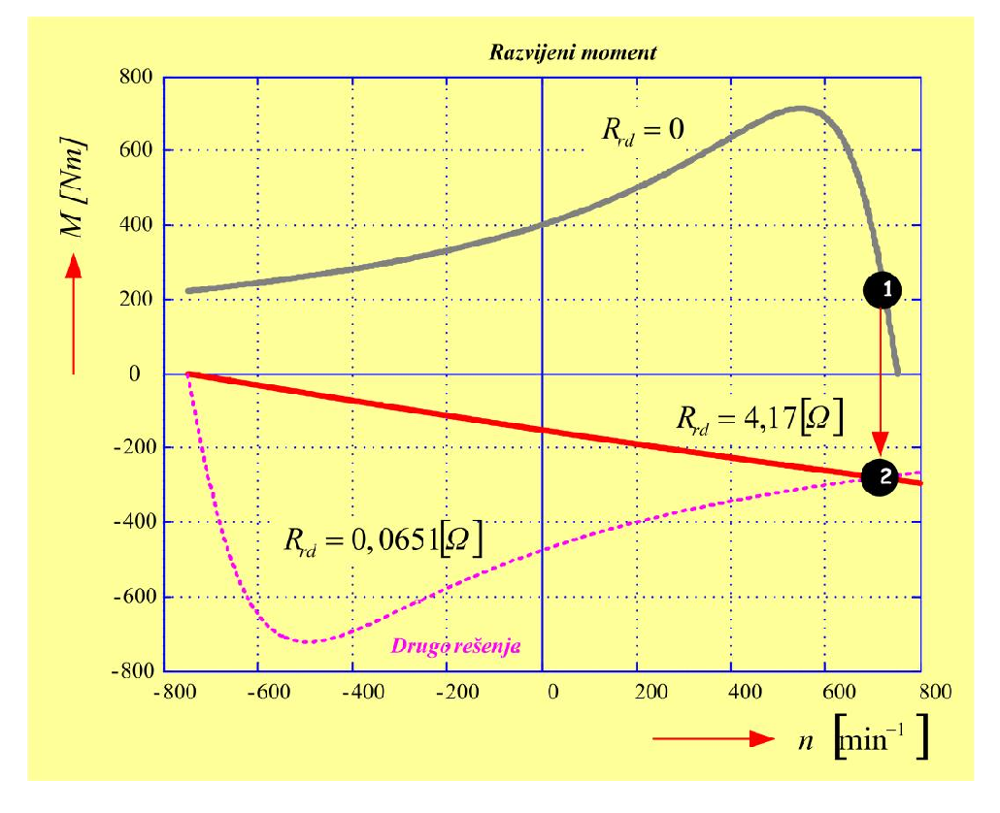

# Zadatak 56 — Protivstrujno kočenje klizno-kolutnog motora: koliki dodatni otpor ubaciti u rotor?

## Postavka

Trofazni asinhroni motor sa namotanim (klizno-kolutnim) rotorom radi u nazivnoj radnoj tački.
U jednom trenutku želimo da ga naglo zakočimo tako što ćemo **zameniti dve faze napajanja
statora** (time obrtno polje promeni smer, a mašina pređe u režim kočenja). Da struja i moment
pri tom kočenju ne bi bili preveliki, u kolo rotora se preko kliznih koluta **uključuje dodatni
otpor**. Treba odrediti koliki taj dodatni otpor mora biti da bi u prvom trenutku kočenja
(dok se rotor još obrće nazivnom brzinom) elektromagnetni kočioni moment bio jednak
**130 % nazivnog momenta**.

Podaci motora: nazivna snaga $16\ \mathrm{kW}$; nazivni napon $380\ \mathrm{V}$; nazivna brzina
obrtanja $718\ \mathrm{min^{-1}}$; omski otpor statora po fazi $0{,}26\ \Omega$; reaktansa
rasipanja po fazi statora $0{,}354\ \Omega$; omski otpor rotora po fazi $0{,}105\ \Omega$;
reaktansa rasipanja po fazi rotora $0{,}24\ \Omega$; prenosni odnos stator/rotor $1{,}63$;
sprega Y (i statora i rotora); frekvencija mreže $50\ \mathrm{Hz}$.

> **Prevod na običan jezik:** Imamo motor koji se vrti punom (nazivnom) brzinom. Hoćemo da ga
> zaustavimo "u mestu" tako što ćemo mu preko prekidača zameniti dva priključka na mreži — polje
> u mašini tada krene da se vrti na suprotnu stranu i mašina počne da koči sopstveni rotor.
> Problem je što bi bez ikakve zaštite struja i moment bili ogromni. Srećom, ovaj motor ima
> namotani rotor sa kliznim kolutima, pa mu možemo spolja dodati otpornike u rotorsko kolo.
> Pitanje glasi: **koliki otpornik (po fazi rotora) treba dodati** da bi kočioni moment u prvom
> trenutku bio tačno $1{,}3$ puta veći od nazivnog momenta? Videćemo da matematika nudi **dva**
> rešenja i da treba umeti izabrati ono pametnije (ono sa manjom strujom).

## Podaci

| Veličina | Oznaka | Vrednost | Šta ta veličina fizički znači |
|---|---|---|---|
| Nazivna snaga | $P_{\mathrm{n}}$ | $16\ \mathrm{kW}$ | Mehanička snaga na vratilu koju motor trajno daje u nazivnom režimu. |
| Nazivni (linijski) napon | $U_{\mathrm{n}}$ | $380\ \mathrm{V}$ | Napon između dva fazna provodnika mreže na koju je stator priključen. |
| Nazivna brzina | $n_{\mathrm{n}}$ | $718\ \mathrm{min^{-1}}$ | Brzina obrtanja rotora pri nazivnom opterećenju. |
| Otpor statora po fazi | $R_s$ | $0{,}26\ \Omega$ | Omski (aktivni) otpor jednog faznog namotaja statora — u njemu nastaju Džulovi gubici statora. |
| Rasipna reaktansa statora | $X_{\gamma s}$ | $0{,}354\ \Omega$ | Reaktansa od onog dela statorskog fluksa koji se "rasipa", tj. ne obuhvata rotor. |
| Otpor rotora po fazi | $R_r$ | $0{,}105\ \Omega$ | Omski otpor jednog faznog namotaja rotora, meren **sa rotorske strane**. |
| Rasipna reaktansa rotora | $X_{\gamma r}$ | $0{,}24\ \Omega$ | Rasipna reaktansa rotorskog namotaja, takođe sa rotorske strane. |
| Prenosni odnos stator/rotor | $m$ | $1{,}63$ | Odnos broja (efektivnih) navojaka statora i rotora; služi za "svođenje" rotorskih veličina na statorsku stranu. |
| Sprega | — | Y/Y | I stator i rotor su spregnuti u zvezdu — zato je koeficijent transformacije jednak datom prenosnom odnosu $m$. |
| Frekvencija mreže | $f_s$ | $50\ \mathrm{Hz}$ | Frekvencija napona napajanja statora. |
| Traženi kočioni moment | $M_{\mathrm{koc}}$ | $1{,}3\, M_{\mathrm{n}}$ | Uslov zadatka: kočioni moment na početku kočenja mora biti 130 % nazivnog. |

## Šta se traži i zašto

Traži se **dodatna otpornost $R_{rd}$ po fazi rotora** (spoljašnji otpornik vezan preko kliznih
koluta) koja obezbeđuje da kočioni moment u trenutku prelaska na kočenje bude tačno
$1{,}3\,M_{\mathrm{n}}$.

**Zašto to inženjera zanima?** Protivstrujno kočenje (zamena dve faze) je najbrutalniji, ali i
najjednostavniji način naglog zaustavljanja asinhronog motora — koristi se npr. kod dizalica i
valjaoničkih pogona. Bez dodatnog otpora struja pri takvom kočenju višestruko premaši nazivnu
(gore ćemo videti: i preko 6 puta), što pregreva namotaje i udara po mreži, a moment je slabo
kontrolisan. Dodatni rotorski otpor je "ventil" kojim se struja i moment kočenja podešavaju na
željenu, bezbednu vrednost. Inženjer, dakle, mora umeti da **izračuna vrednost tog otpornika**.

**Plan rešavanja (u 5 koraka, običnim jezikom):**

1. Iz nazivne brzine prepoznamo sinhronsku brzinu i broj pari polova, pa izračunamo **klizanje u
   trenutku kočenja** — ono je veće od 1 jer se polje i rotor vrte u suprotnim smerovima.
2. Iz nazivne snage i brzine izračunamo **nazivni moment**, pa ga pomnožimo sa $1{,}3$ da dobijemo
   traženi kočioni moment.
3. Napišemo **formulu momenta** asinhrone mašine u kojoj kao nepoznata figuriše ukupan (svedeni)
   rotorski otpor $R'_{r\Sigma}$, i izjednačimo je sa traženim momentom.
4. Sređivanjem te jednakosti dobijemo **kvadratnu jednačinu** po $R'_{r\Sigma}$ — rešimo je i
   dobijemo dva matematički ispravna rešenja.
5. **Izaberemo** rešenje sa manjom strujom (veći otpor), "rasvedemo" ga na rotorsku stranu i
   oduzmemo sopstveni otpor rotora — ostatak je traženi dodatni otpor $R_{rd}$.

## Potrebna teorija — mini-lekcije

### 1. Klizno-kolutni (namotani) rotor i čemu služe klizni koluti

Kod motora sa **kaveznim** rotorom rotorsko kolo je zaliveno u gvožđe i nedostupno — u njega se
ništa ne može dodati. Kod motora sa **namotanim rotorom** rotorski namotaj je trofazni, kao i
statorski, a njegovi krajevi su izvedeni na tri **klizna koluta** (prstena) po kojima klize
četkice. Preko četkica se u rotorsko kolo mogu vezati spoljašnji otpornici. Dodavanjem otpora u
rotor menja se oblik momentne karakteristike (maksimalni moment ostaje isti, ali se pomera ka
većim klizanjima), pa se tako podešavaju polazni moment, polazna struja — i, kao u ovom zadatku,
moment kočenja.

### 2. Sinhronska brzina, broj pari polova i klizanje

Trofazni statorski namotaj, napajan naponima frekvencije $f_s$, stvara **obrtno magnetno polje**
koje se obrće sinhronskom brzinom

$$n_s = \frac{60 \cdot f_s}{p}\ \ [\mathrm{min^{-1}}],$$

gde je $p$ **broj pari polova** namotaja (za $p=4$ mašina ima 8 polova). Rotor se u motornom
režimu obrće nešto sporije od polja; relativno zaostajanje meri **klizanje**

$$s = \frac{n_s - n}{n_s},$$

gde je $n$ brzina rotora, računata kao pozitivna kada se rotor obrće **u smeru polja**. U
nazivnom motornom režimu klizanje je malo ($s \approx 0{,}02\ldots0{,}06$). Ključno za ovaj
zadatak: ako se rotor obrće **suprotno** od polja, u formulu ulazi $n$ sa znakom minus i klizanje
ispadne **veće od 1** — to je oblast kočenja.

### 3. Protivstrujno kočenje (kočenje zamenom dve faze)

Ako motoru koji radi zamenimo dva fazna priključka, redosled faza se obrne i obrtno polje
**gotovo trenutno** promeni smer obrtanja — struje u namotajima mogu da se promene za nekoliko
desetina milisekundi, jer su električne vremenske konstante male. Rotor, međutim, nosi zamajnu
masu pogona: njegova **mehanička vremenska konstanta** je mnogo veća, pa on u prvom trenutku
**nastavi da se vrti starom brzinom i starim smerom** — koji je sada suprotan smeru polja.
Klizanje u tom trenutku iznosi

$$s_{\mathrm{koc}} = \frac{n_s - (-n_{\mathrm{n}})}{n_s} = \frac{n_s + n_{\mathrm{n}}}{n_s},$$

jer je brzina rotora u odnosu na novi smer polja $-n_{\mathrm{n}}$. Dobija se $s_{\mathrm{koc}}
\approx 2$: polje "beži" na jednu, rotor na drugu stranu, pa je njihova relativna brzina skoro
dvostruka sinhronska. Moment koji mašina tada razvija deluje **suprotno obrtanju rotora** —
koči ga; zato se režim zove kočnica (protivstrujno kočenje).

### 4. Ekvivalentna šema po fazi i svođenje rotorskih veličina na stator

Asinhrona mašina se po fazi predstavlja šemom nalik transformatoru: redna grana statora
($R_s$, $X_{\gamma s}$), poprečna grana magnećenja i redna grana rotora ($R'_r/s$, $X'_{\gamma r}$).
U zadacima ovog tipa **poprečna grana magnećenja se zanemaruje** (struja magnećenja je mala u
poređenju sa velikim strujama kočenja), pa ostaje prosto redno kolo: napon $U_{sf}$ tera struju
kroz $R_s + R'_r/s$ i ukupnu rasipnu reaktansu $X_{\gamma s}+X'_{\gamma r}$.

Rotorske veličine se u šemi koriste **svedene na statorsku stranu** (oznaka "prim"). Kao kod
transformatora: naponi se preslikavaju srazmerno odnosu navojaka $m$, struje srazmerno $1/m$, pa
se impedanse (odnos napona i struje) preslikavaju srazmerno $m^2$:

$$R'_r = m^2 \cdot R_r, \qquad X'_{\gamma r} = m^2 \cdot X_{\gamma r}.$$

Pošto su i stator i rotor spregnuti u zvezdu (sprega Yy), koeficijent transformacije jednak je
upravo datom prenosnom odnosu $m = 1{,}63$ (kod drugačijih sprega pojavio bi se još i faktor
sprege). Obrnuto, veličinu izračunatu na statorskoj strani vraćamo ("rasvodimo") na stvarnu
rotorsku stranu deljenjem sa $m^2$.

### 5. Formula momenta asinhrone mašine (bez grane magnećenja)

Elektromagnetni moment je obrtna snaga polja podeljena mehaničkom sinhronskom ugaonom brzinom:
$M = P_{\mathrm{ob}} / \Omega_s$. Obrtna snaga (snaga koja kroz vazdušni zazor prelazi na rotor)
jednaka je ukupnoj snazi na "otporniku" $R'_r/s$ u sve tri faze: $P_{\mathrm{ob}} = 3 \cdot
\frac{R'_r}{s} \cdot I'^2_r$. Mehanička sinhronska brzina je $\Omega_s = \frac{2\pi n_s}{60} =
\frac{2\pi f_s}{p}$. Struja rotora sledi iz rednog kola (mini-lekcija 4):

$$I'_r = \frac{U_{sf}}{\sqrt{\left(R_s + \dfrac{R'_r}{s}\right)^2 + \left(X_{\gamma s} + X'_{\gamma r}\right)^2}}.$$

Sve zajedno:

$$M = \frac{3\,p}{2\pi f_s} \cdot \frac{R'_r}{s} \cdot
\frac{U_{sf}^2}{\left(R_s + \dfrac{R'_r}{s}\right)^2 + \left(X_{\gamma s} + X'_{\gamma r}\right)^2}.$$

Ovde je $U_{sf}$ **fazni** napon statora (kod sprege Y: linijski podeljen sa $\sqrt{3}$).
Intuicija: moment je srazmeran snazi koja se "troši" na fiktivnom otporniku $R'_r/s$ — što je ta
snaga veća pri datoj brzini polja, to polje jače "vuče" rotor.

### 6. Nazivni moment iz nazivne snage i brzine

Mehanička snaga je proizvod momenta i ugaone brzine: $P = M \cdot \Omega$. Ugaona brzina u
$\mathrm{rad/s}$ dobija se iz brzine u $\mathrm{min^{-1}}$ kao $\Omega = \frac{2\pi n}{60}$
(jedan obrtaj je $2\pi$ radijana, a minut ima 60 sekundi). Odatle:

$$M_{\mathrm{n}} = \frac{P_{\mathrm{n}}}{\Omega_{\mathrm{n}}} = \frac{60 \cdot P_{\mathrm{n}}}{2\pi \cdot n_{\mathrm{n}}} = \frac{30}{\pi}\cdot\frac{P_{\mathrm{n}}}{n_{\mathrm{n}}}.$$

### 7. Zašto će jednačina biti kvadratna i šta znače dva rešenja

U formuli momenta nepoznata $R'_{r\Sigma}$ (ukupan svedeni rotorski otpor) javlja se i u brojiocu
(linearno) i u imeniocu (kvadratno, unutar zagrade). Zavisnost momenta od rotorskog otpora pri
**fiksiranom klizanju** zato nije monotona: za vrlo mali otpor struja je velika, ali je $R'/s$
mali pa je moment mali; za vrlo veliki otpor struja je mala pa je moment opet mali; između postoji
maksimum. Zadata vrednost momenta ($1{,}3\,M_{\mathrm{n}}$), manja od tog maksimuma, dostiže se
zato sa **dve** različite vrednosti otpora — jedna mala (velika struja, "strma" karakteristika) i
jedna velika (mala struja, "meka" karakteristika). Matematički se to ispoljava kao kvadratna
jednačina sa dva pozitivna korena; fizički biramo koren koji daje **manju struju**, jer je cilj
kočenja upravo ograničenje struje.

## Rešenje, korak po korak

### Korak 1: Sinhronska brzina i broj pari polova

**Zašto ovaj korak:** bez $n_s$ ne možemo izračunati klizanje, a bez $p$ ne možemo primeniti
formulu momenta.

Nazivna brzina asinhronog motora je uvek **malo ispod** neke sinhronske brzine. Pri
$f_s = 50\ \mathrm{Hz}$ sinhronske brzine su $n_s = \frac{60\cdot 50}{p} = \frac{3000}{p}$:
za $p = 1, 2, 3, 4$ redom $3000$, $1500$, $1000$, $750\ \mathrm{min^{-1}}$. Pošto je
$n_{\mathrm{n}} = 718\ \mathrm{min^{-1}}$ tik ispod $750\ \mathrm{min^{-1}}$:

$$n_s = 750\ \mathrm{min^{-1}}, \qquad p = \frac{60 \cdot f_s}{n_s} = \frac{60 \cdot 50}{750} = 4.$$

**Šta smo dobili:** mašina ima $p = 4$ para polova (osmopolna je) i polje joj se obrće brzinom
$750\ \mathrm{min^{-1}}$. Nazivno klizanje je malo,
$s_{\mathrm{n}} = \frac{750-718}{750} \approx 0{,}043$ — tipično za motor ove snage.

### Korak 2: Klizanje u trenutku prelaska na kočenje

**Zašto ovaj korak:** klizanje $s_{\mathrm{koc}}$ ulazi direktno u formulu momenta; ono opisuje
stanje mašine u trenutku za koji zadatak postavlja uslov $M = 1{,}3\,M_{\mathrm{n}}$.

Zamenom dve faze polje promeni smer praktično trenutno, a rotor (zbog mehaničke inercije,
mini-lekcija 3) zadrži brzinu $n_{\mathrm{n}} = 718\ \mathrm{min^{-1}}$ u starom smeru — dakle
$-718\ \mathrm{min^{-1}}$ u odnosu na novi smer polja:

$$s_{\mathrm{koc}} = \frac{n_s + n_{\mathrm{n}}}{n_s} = \frac{750 + 718}{750} = \frac{1468}{750} = 1{,}957.$$

**Šta smo dobili:** klizanje veće od 1 (skoro 2) — nepogrešiv znak da smo u režimu kočenja:
polje i rotor jure jedno drugom u susret, relativna brzina im je gotovo dvostruka sinhronska.

### Korak 3: Traženi kočioni moment

**Zašto ovaj korak:** uslov zadatka je zadat relativno ("130 % nazivnog momenta"), pa prvo moramo
izračunati sam nazivni moment.

Po mini-lekciji 6:

$$M_{\mathrm{koc}} = 1{,}3 \cdot M_{\mathrm{n}} = 1{,}3 \cdot \frac{60}{2\pi}\cdot\frac{P_{\mathrm{n}}}{n_{\mathrm{n}}} = \frac{1{,}3 \cdot 30 \cdot 16000}{\pi \cdot 718} = \frac{624\,000}{2255{,}5} = 276{,}64\ \mathrm{Nm}.$$

(Nazivni moment sam po sebi iznosi $M_{\mathrm{n}} = \frac{30 \cdot 16000}{\pi \cdot 718} =
212{,}8\ \mathrm{Nm}$.)

**Šta smo dobili:** kočioni moment od $\approx 277\ \mathrm{Nm}$ — 30 % iznad nazivnog. To je
razumno jak, ali ne razoran moment kočenja; zadatak time obezbeđuje brzo, a kontrolisano
zaustavljanje.

### Korak 4: Fazni napon statora

**Zašto ovaj korak:** u formulu momenta ulazi fazni napon, a zadat je linijski.

Stator je spregnut u zvezdu, pa je fazni napon linijski podeljen sa $\sqrt{3}$:

$$U_{sf} = \frac{U_{\mathrm{n}}}{\sqrt{3}} = \frac{380}{\sqrt{3}} = 219{,}4\ \mathrm{V} \approx 220\ \mathrm{V}.$$

Dalje računamo sa zaokruženom vrednošću $220\ \mathrm{V}$, kao i originalna zbirka.

**Šta smo dobili:** standardni fazni napon $220\ \mathrm{V}$ — očekivano za mrežu $380\ \mathrm{V}$.

### Korak 5: Svođenje rotorskih veličina na statorsku stranu

**Zašto ovaj korak:** formula momenta radi sa svedenim (primovanim) rotorskim veličinama;
zadate rotorske vrednosti su na rotorskoj strani i moraju se pomnožiti sa $m^2$ (mini-lekcija 4).

$$X'_{\gamma r} = m^2 \cdot X_{\gamma r} = 1{,}63^2 \cdot 0{,}24 = 2{,}6569 \cdot 0{,}24 = 0{,}638\ \Omega.$$

Koeficijent transformacije jednak je datom prenosnom odnosu $m = 1{,}63$ upravo zato što je
sprega stator/rotor Yy. Sopstveni otpor rotora, sveden na stator, biće nam potreban na kraju:

$$R'_r = m^2 \cdot R_r = 2{,}6569 \cdot 0{,}105 = 0{,}279\ \Omega.$$

Ukupna rasipna reaktansa kola (statorska plus svedena rotorska):

$$X_{\gamma s} + X'_{\gamma r} = 0{,}354 + 0{,}638 = 0{,}992\ \Omega.$$

**Šta smo dobili:** sve reaktanse su sada "na istoj strani transformatora" i smemo ih sabirati.
Primetimo da rasipna reaktansa **ne zavisi od klizanja** u ovom zapisu, dok se rotorski otpor u
šemi javlja kao $R'_{r\Sigma}/s$ — zato će upravo otpor biti naša "ručica" za podešavanje momenta.

### Korak 6: Jednačina momenta sa nepoznatim ukupnim rotorskim otporom

**Zašto ovaj korak:** ovde postavljamo centralnu jednačinu zadatka — moment koji mašina razvija
pri $s_{\mathrm{koc}}$ izjednačavamo sa traženih $276{,}64\ \mathrm{Nm}$.

U kolo rotora dodaje se otpornost radi ograničenja struje i momenta, pa je ukupan otpor po fazi
rotora $R_{r\Sigma} = R_r + R_{rd}$; njegova svedena vrednost $R'_{r\Sigma} = m^2 R_{r\Sigma}$ je
naša nepoznata. Po mini-lekciji 5:

$$M_{\mathrm{koc}} = \frac{3\,p}{\omega_s} \cdot \frac{R'_{r\Sigma}}{s_{\mathrm{koc}}} \cdot I'^2_{rf}
= \frac{3\,p}{2\pi f_s} \cdot \frac{R'_{r\Sigma}}{s_{\mathrm{koc}}} \cdot
\frac{U_{sf}^2}{\left(R_s + \dfrac{R'_{r\Sigma}}{s_{\mathrm{koc}}}\right)^2 + \left(X_{\gamma s} + X'_{\gamma r}\right)^2}.$$

Ovde je $\omega_s = 2\pi f_s$ električna sinhronska ugaona brzina, $I'_{rf}$ svedena fazna struja
rotora, a svi ostali simboli su već definisani.

Sada jednačinu sređujemo. **Prvi prelaz:** pomnožimo obe strane velikom zagradom iz imenioca i
podelimo sa $M_{\mathrm{koc}}$ — cilj je da nepoznata izađe iz razlomka:

$$\left(R_s + \frac{R'_{r\Sigma}}{s_{\mathrm{koc}}}\right)^2 + \left(X_{\gamma s} + X'_{\gamma r}\right)^2
= \frac{3\,p}{2\pi f_s} \cdot \frac{R'_{r\Sigma}}{s_{\mathrm{koc}}} \cdot \frac{U_{sf}^2}{M_{\mathrm{koc}}}.$$

**Drugi prelaz:** razvijemo kvadrat binoma na levoj strani,
$\left(R_s + \frac{R'_{r\Sigma}}{s_{\mathrm{koc}}}\right)^2 = R_s^2 + 2\,R_s\frac{R'_{r\Sigma}}{s_{\mathrm{koc}}} + \left(\frac{R'_{r\Sigma}}{s_{\mathrm{koc}}}\right)^2$,
i sve prebacimo na levu stranu:

$$\left(\frac{R'_{r\Sigma}}{s_{\mathrm{koc}}}\right)^2 + 2\cdot\frac{R'_{r\Sigma}}{s_{\mathrm{koc}}}\cdot R_s
- \frac{3\,p}{2\pi f_s}\cdot\frac{R'_{r\Sigma}}{s_{\mathrm{koc}}}\cdot\frac{U_{sf}^2}{M_{\mathrm{koc}}}
+ R_s^2 + \left(X_{\gamma s} + X'_{\gamma r}\right)^2 = 0.$$

**Treći prelaz:** pomnožimo celu jednačinu sa $s_{\mathrm{koc}}^2$ da se oslobodimo razlomaka
(prvi član gubi imenilac potpuno, srednji članovi zadrže po jedno $s_{\mathrm{koc}}$, slobodni
članovi dobiju $s_{\mathrm{koc}}^2$):

$$R'^2_{r\Sigma} + R'_{r\Sigma}\left(2\,R_s\,s_{\mathrm{koc}} - \frac{3\,p}{2\pi f_s}\cdot\frac{U_{sf}^2}{M_{\mathrm{koc}}}\cdot s_{\mathrm{koc}}\right)
+ s_{\mathrm{koc}}^2\left[R_s^2 + \left(X_{\gamma s} + X'_{\gamma r}\right)^2\right] = 0.$$

**Šta smo dobili:** klasičnu kvadratnu jednačinu oblika $x^2 + b\,x + c = 0$ po nepoznatoj
$x = R'_{r\Sigma}$, tačno kao što je najavila mini-lekcija 7.

### Korak 7: Brojčane vrednosti koeficijenata kvadratne jednačine

**Zašto ovaj korak:** pre rešavanja moramo izračunati koeficijent $b$ uz $R'_{r\Sigma}$ i
slobodni član $c$.

Koeficijent uz $R'_{r\Sigma}$, deo po deo: najpre $\frac{3\,p}{2\pi f_s} = \frac{3\cdot 4}{2\pi\cdot 50} = \frac{12}{314{,}16} = 0{,}0382$, zatim
$\frac{U_{sf}^2}{M_{\mathrm{koc}}} = \frac{220^2}{276{,}637} = \frac{48\,400}{276{,}637} = 174{,}96$, pa:

$$b = 2\cdot R_s\cdot s_{\mathrm{koc}} - \frac{3\,p}{2\pi f_s}\cdot\frac{U_{sf}^2}{M_{\mathrm{koc}}}\cdot s_{\mathrm{koc}}
= 2\cdot 0{,}26\cdot 1{,}957 - 0{,}0382\cdot 174{,}96\cdot 1{,}957$$

$$b = 1{,}018 - 13{,}079 = -12{,}061.$$

Slobodni član (koristimo $0{,}26^2 = 0{,}0676$ i $0{,}992^2 = 0{,}984$):

$$c = s_{\mathrm{koc}}^2\left[R_s^2 + \left(X_{\gamma s} + X'_{\gamma r}\right)^2\right]
= 1{,}957^2\cdot\left[0{,}26^2 + (0{,}354+0{,}638)^2\right] = 3{,}830 \cdot 1{,}052 = 4{,}028.$$

**Šta smo dobili:** jednačinu $R'^2_{r\Sigma} - 12{,}061\cdot R'_{r\Sigma} + 4{,}028 = 0$.
Negativan $b$ i pozitivan $c$ garantuju (po Vietovim pravilima: zbir korena $=12{,}061>0$,
proizvod $=4{,}028>0$) da će oba korena biti pozitivna — oba će, dakle, biti fizički moguće
otpornosti.

### Korak 8: Rešavanje kvadratne jednačine

**Zašto ovaj korak:** koreni ove jednačine su kandidati za ukupan svedeni rotorski otpor.

Po obrascu za kvadratnu jednačinu $x = \frac{-b \pm \sqrt{b^2 - 4c}}{2}$ (ovde je koeficijent uz
$x^2$ jednak 1). Prvo diskriminanta:

$$b^2 - 4c = 12{,}061^2 - 4\cdot 4{,}028 = 145{,}47 - 16{,}11 = 129{,}36, \qquad \sqrt{129{,}36} = 11{,}373.$$

Zatim koreni:

$$R'_{r\Sigma 1/2} = \frac{12{,}061 \pm 11{,}373}{2} =
\begin{cases} \dfrac{23{,}434}{2} = 11{,}717\ \Omega \\[2mm] \dfrac{0{,}688}{2} = 0{,}344\ \Omega \end{cases}$$

**Šta smo dobili:** dva pozitivna rešenja koja se razlikuju za faktor $\approx 34$ — jedno "veliko"
i jedno "malo", baš kako je predvidela mini-lekcija 7. Oba daju traženi moment; sledeći korak je
izbor.

### Korak 9: Izbor rešenja — poređenje struja

**Zašto ovaj korak:** matematika ne zna šta je pametno; mi znamo — svrha dodatnog otpora je da
**ograniči struju**, pa izračunajmo struju za oba rešenja i uporedimo.

Struja (svedena rotorska, koja je ovde ujedno i statorska jer je grana magnećenja zanemarena):

$$I'_{rf} = \frac{U_{sf}}{\sqrt{\left(R_s + \dfrac{R'_{r\Sigma}}{s_{\mathrm{koc}}}\right)^2 + \left(X_{\gamma s}+X'_{\gamma r}\right)^2}}.$$

Za **veći** koren $R'_{r\Sigma 1} = 11{,}717\ \Omega$: najpre $\frac{11{,}717}{1{,}957} = 5{,}988\ \Omega$, pa

$$I'_{rf,1} = \frac{220}{\sqrt{(0{,}26+5{,}988)^2 + 0{,}992^2}} = \frac{220}{\sqrt{39{,}04+0{,}98}} = \frac{220}{6{,}33} = 34{,}8\ \mathrm{A}.$$

Za **manji** koren $R'_{r\Sigma 2} = 0{,}344\ \Omega$: najpre $\frac{0{,}344}{1{,}957} = 0{,}176\ \Omega$, pa

$$I'_{rf,2} = \frac{220}{\sqrt{(0{,}26+0{,}176)^2 + 0{,}992^2}} = \frac{220}{\sqrt{0{,}19+0{,}98}} = \frac{220}{1{,}083} = 203\ \mathrm{A}.$$

Poređenja radi, struja ovog istog modela u nazivnoj radnoj tački ($s_{\mathrm{n}} = 0{,}0427$,
$R'_r/s_{\mathrm{n}} = 0{,}279/0{,}0427 = 6{,}54\ \Omega$) iznosi $\approx 32\ \mathrm{A}$. Dakle:
veći otpor koči strujom praktično jednakom nazivnoj, a manji otpor strujom **preko 6 puta većom**
od nazivne — što bi pregrevalo mašinu i opterećivalo mrežu.

**Uzima se veća vrednost otpornosti:** $R'_{r\Sigma} = 11{,}717\ \Omega$.

**Šta smo dobili:** isti kočioni moment može se ostvariti "nežno" (mala struja, veliki otpor) ili
"nasilno" (ogromna struja, mali otpor). Biramo nežno — upravo zato se otpor i dodaje.

### Korak 10: Vraćanje na rotorsku stranu i dodatna otpornost — glavni rezultat

**Zašto ovaj korak:** stvarni otpornik se fizički vezuje u **rotorsko** kolo, pa svedenu
(statorsku) vrednost moramo podeliti sa $m^2$; zatim od ukupnog rotorskog otpora oduzmemo
sopstveni otpor namotaja rotora — ono što ostane je spoljašnji, dodatni otpornik.

Ukupna rotorska otpornost sa rotorske strane:

$$R_{r\Sigma} = \frac{R'_{r\Sigma}}{m^2} = \frac{11{,}717}{1{,}63^2} = \frac{11{,}717}{2{,}6569} = 4{,}410\ \Omega.$$

Dodatna (spoljašnja) otpornost po fazi rotora:

$$\boxed{\,R_{rd} = R_{r\Sigma} - R_r = 4{,}410 - 0{,}105 = 4{,}305\ \Omega \approx 4{,}31\ \Omega\,}$$

> **Napomena o originalu:** u zbirci na ovom mestu piše $R_{rd} = 4{,}410 - 0{,}24 = 4{,}17\ \Omega$
> — od ukupnog otpora oduzeta je vrednost $0{,}24\ \Omega$, a to po podacima zadatka **nije otpor
> rotora nego njegova rasipna reaktansa** $X_{\gamma r}$. Zadati omski otpor rotora po fazi je
> $R_r = 0{,}105\ \Omega$ (i sam original ga u istom rešenju koristi kao reaktansu kada računa
> $X'_{\gamma r} = m^2\cdot 0{,}24$ — ista brojka ne može biti i otpor i reaktansa). Ispravna
> vrednost je dakle $R_{rd} = 4{,}305\ \Omega$. Provera unazad to potvrđuje: sa
> $R_{rd} = 4{,}305\ \Omega$ kočioni moment ispada tačno $276{,}6\ \mathrm{Nm} = 1{,}30\,M_{\mathrm{n}}$,
> dok bi sa originalnih $4{,}17\ \Omega$ ispao $284{,}2\ \mathrm{Nm} = 1{,}34\,M_{\mathrm{n}}$ —
> promašaj uslova zadatka. (Sitnica: original račun vodi sa zaokruženim $U_{sf}=220\ \mathrm{V}$;
> sa tačnim $219{,}4\ \mathrm{V}$ dobilo bi se $R_{rd}\approx 4{,}28\ \Omega$ — razlika ispod 1 %.)

**Šta smo dobili:** u svaku fazu rotora treba vezati spoljašnji otpornik od $\approx 4{,}3\ \Omega$
— oko 40 puta veći od sopstvenog otpora rotorskog namotaja ($0{,}105\ \Omega$). Tolika dominacija
dodatog otpora je tipična za protivstrujno kočenje: skoro sva energija kočenja (i sva "višak"
snaga) troši se u spoljašnjem otporniku, van mašine, što je i termički povoljno.

### Korak 11: Druga (odbačena) vrednost dodatne otpornosti

**Zašto ovaj korak:** korektnosti radi, izračunajmo i dodatni otpor koji odgovara manjem korenu —
on je matematički ravnopravan i pojaviće se na slici 56.1 kao "drugo rešenje".

$$R_{r\Sigma 2} = \frac{R'_{r\Sigma 2}}{m^2} = \frac{0{,}344}{2{,}6569} = 0{,}1295\ \Omega,$$

$$R_{rd2} = R_{r\Sigma 2} - R_r = 0{,}1295 - 0{,}105 = 0{,}0245\ \Omega.$$

> **Napomena o originalu:** zbirka ovde navodi $R_{rd2} = 0{,}0651\ \Omega$, uz zapis
> $\frac{0{,}344}{1{,}63^2} - 0{,}24$. Taj zapis, izračunat doslovno, daje $0{,}1295-0{,}24 =
> -0{,}11\ \Omega$ — negativan otpor, što je fizički nemoguće, pa formula i rezultat u originalu
> očigledno nisu usklađeni. Broj $0{,}0651$ zapravo odgovara razlici na **statorskoj** strani:
> $R'_{rd2} = R'_{r\Sigma 2} - m^2 R_r = 0{,}344 - 0{,}279 = 0{,}065\ \Omega$. Ispravna vrednost
> na rotorskoj strani (uporediva sa glavnim rezultatom iz Koraka 10) jeste
> $R_{rd2} = 0{,}065/2{,}6569 \approx 0{,}0245\ \Omega$.

**Šta smo dobili:** simboličan otpornik od dvadesetak miliohma — praktično kratko spojen rotor.
On formalno daje isti moment u početnoj tački kočenja, ali uz struju od $\approx 203\ \mathrm{A}$
(Korak 9), pa se u praksi odbacuje.

### Korak 12: Momentne karakteristike — čitanje slike 56.1

**Zašto ovaj korak:** brojevi postaju jasni tek na slici — pogledajmo kako izgledaju statičke
mehaničke (momentne) karakteristike mašine za razne rotorske otpore i gde se na njima nalaze
radne tačke pre i posle prespajanja.

Slika 56.1 prikazuje statičke mehaničke (momentne) karakteristike mašine za tri vrednosti
dodatnog rotorskog otpora, sa označenim radnim tačkama neposredno pre i neposredno posle
prespajanja.

**Slika 56.1 —** Mehaničke karakteristike mašine u motornom i kočionom režimu rada: siva kriva —
prirodna karakteristika ($R_{rd}=0$) sa radnom tačkom ❶ pri $n_{\mathrm{n}}=718\ \mathrm{min^{-1}}$;
puna crvena — kočenje sa velikim dodatnim otporom (tačka ❷, $M\approx-277\ \mathrm{Nm}$);
isprekidana — kočenje sa malim dodatnim otporom (drugo, odbačeno rešenje).

> **Kako čitati sliku 56.1:** Na vodoravnoj osi je brzina obrtanja $n$ u $\mathrm{min^{-1}}$, od
> $-800$ do $+800$ (negativne vrednosti = obrtanje suprotno smeru novog polja); na uspravnoj je
> razvijeni elektromagnetni moment $M$ u $\mathrm{Nm}$, od $-800$ do $+800$; naslov slike je
> "Razvijeni moment". Tri krive: **siva** ($R_{rd} = 0$) — prirodna motorska karakteristika, sa
> prevojnim maksimumom $\approx 710\ \mathrm{Nm}$ na $\approx 530\ \mathrm{min^{-1}}$ i nulom
> momenta na sinhronskoj brzini $750\ \mathrm{min^{-1}}$; **puna crvena** (oznaka
> $R_{rd} = 4{,}17\ \Omega$) — kočiona karakteristika sa velikim, usvojenim dodatnim otporom:
> prevojno klizanje je s ovolikim otporom ogromno, pa u prikazanom opsegu brzina kriva izgleda kao
> gotovo prava, blago nagnuta linija bez "grbe" (u $n = 0$ daje $\approx -150\ \mathrm{Nm}$ —
> moment kočenja opada kako brzina pada); **isprekidana ljubičasta** (oznaka
> $R_{rd} = 0{,}0651\ \Omega$, natpis "Drugo rešenje") — kočenje sa malim, odbačenim otporom:
> strma kriva sa dubokim prevojem od $\approx -700\ \mathrm{Nm}$ na $n \approx -520\ \mathrm{min^{-1}}$.
> (Oznake otpora na slici su vrednosti iz originalne zbirke; po napomenama u Koracima 10 i 11
> ispravne vrednosti su $4{,}31\ \Omega$ odnosno $0{,}0245\ \Omega$ — oblik krivih se time
> praktično ne menja.) Crne tačke: ❶ na sivoj krivoj, $(718\ \mathrm{min^{-1}};\ \approx 213\ \mathrm{Nm})$
> — stacionarna radna tačka pre prespajanja; ❷ na crvenoj, $(718\ \mathrm{min^{-1}};\ \approx -277\ \mathrm{Nm}
> = -1{,}3\,M_{\mathrm{n}})$ — tačka neposredno posle prespajanja; crvena vertikalna strelica
> ❶→❷ pokazuje da mašina pri prespajanju **skače sa karakteristike na karakteristiku pri
> nepromenjenoj brzini**: struje se promene za nekoliko desetina milisekundi, a brzina zbog
> inercije ne stigne. Kroz istu tačku pri $718\ \mathrm{min^{-1}}$ prolazi i isprekidana kriva —
> oba korena kvadratne jednačine daju isti početni kočioni moment, ali ljubičasto rešenje to
> plaća strujom od $\approx 203\ \mathrm{A}$ (Korak 9), a po zaustavljanju bi mašina silovito
> ubrzala u suprotnom smeru. **Šta treba da zaključiš:** veliki dodatni otpor daje "pitomu",
> gotovo linearnu kočionu karakteristiku sa umerenim momentom i strujom bliskom nazivnoj
> ($\approx 34{,}8\ \mathrm{A}$) — zato se od dva matematički ravnopravna rešenja bira upravo on.

**Šta smo dobili:** vizuelnu potvrdu izbora iz Koraka 9 — kočenje velikim otporom je "pitomo"
(prava linija, umeren moment, mala struja), dok bi kočenje malim otporom bilo naglo i strujno
razorno.

## Česte greške i zamke

1. **Klizanje pri kočenju računato kao da je polje zadržalo smer:** $s = \frac{750-718}{750} =
   0{,}043$ umesto $\frac{750+718}{750} = 1{,}957$. Posle zamene dve faze brzina rotora je
   *suprotna* smeru polja, pa se u formuli klizanja brzine **sabiraju**. Ako vam klizanje pri
   kočenju ispadne manje od 1 — negde je greška.
2. **Pobrkane strane transformacije (svođenja).** Reaktansa rotora se na stator svodi množenjem sa
   $m^2$ ($0{,}24 \to 0{,}638\ \Omega$), a rezultat $R'_{r\Sigma}$ se na rotor vraća deljenjem sa
   $m^2$ ($11{,}717 \to 4{,}410\ \Omega$). Ko pomeša smerove, pogreši za faktor $m^4 \approx 7$.
   Takođe: od $R_{r\Sigma}$ (rotorska strana) sme se oduzeti samo $R_r$ (rotorska strana) — nikad
   svedeni $R'_r$.
3. **Oduzimanje pogrešnog podatka na kraju** — baš greška iz originalne zbirke: od ukupnog
   rotorskog otpora $4{,}410\ \Omega$ oduzeta je rasipna reaktansa $0{,}24\ \Omega$ umesto otpora
   $0{,}105\ \Omega$. Otpor i reaktansa se nikada ne sabiraju niti oduzimaju direktno — oni se
   slažu **geometrijski** (pod pravim uglom, kroz kvadrate) i pojmovno su različite veličine.
4. **Nekritičko uzimanje manjeg korena kvadratne jednačine.** Oba korena daju traženi moment, ali
   manji koren povlači struju od $\approx 203\ \mathrm{A}$ — preko 6 puta veću od nazivne. Uvek
   proverite struju za oba korena; bira se veći otpor.
5. **Broj polova umesto broja pari polova:** ova mašina je osmopolna, ali u formulama $n_s = 60f_s/p$
   i $M = \frac{3p}{2\pi f_s}(\ldots)$ figuriše $p = 4$ (parovi polova). Zamena daje dvostruko
   pogrešan moment ili besmislenu sinhronsku brzinu.
6. **Linijski napon u formuli momenta.** Sa $380\ \mathrm{V}$ umesto $220\ \mathrm{V}$ moment
   ispada 3 puta veći (napon ulazi na kvadrat), pa i koreni jednačine odu na pogrešne vrednosti.

## Rezime rezultata

| Veličina | Oznaka | Vrednost |
|---|---|---|
| Klizanje na početku kočenja | $s_{\mathrm{koc}}$ | $1{,}957$ |
| Nazivni moment | $M_{\mathrm{n}}$ | $212{,}8\ \mathrm{Nm}$ |
| Traženi kočioni moment | $M_{\mathrm{koc}} = 1{,}3\,M_{\mathrm{n}}$ | $276{,}64\ \mathrm{Nm}$ |
| Svedena rotorska reaktansa | $X'_{\gamma r}$ | $0{,}638\ \Omega$ |
| Koreni kvadratne jednačine | $R'_{r\Sigma 1/2}$ | $11{,}717\ \Omega$ i $0{,}344\ \Omega$ |
| Usvojeni ukupan rotorski otpor (rotorska strana) | $R_{r\Sigma}$ | $4{,}410\ \Omega$ |
| **Tražena dodatna otpornost po fazi rotora** | $R_{rd}$ | $\mathbf{4{,}305\ \Omega \approx 4{,}31\ \Omega}$ (u originalu pogrešno $4{,}17\ \Omega$) |
| Struja pri kočenju (usvojeno rešenje) | $I'_{rf,1}$ | $\approx 34{,}8\ \mathrm{A}$ |
| Druga (odbačena) dodatna otpornost | $R_{rd2}$ | $0{,}0245\ \Omega$ (u originalu $0{,}0651\ \Omega$ — to je vrednost svedena na stator) |
| Struja pri kočenju (odbačeno rešenje) | $I'_{rf,2}$ | $\approx 203\ \mathrm{A}$ |

## Provera smisla

**1. Vraćanje rezultata u polaznu formulu momenta.** Sa usvojenim $R'_{r\Sigma} = 11{,}717\ \Omega$
i $s_{\mathrm{koc}} = 1{,}957$ imamo $\frac{R'_{r\Sigma}}{s_{\mathrm{koc}}} = 5{,}988\ \Omega$ i
struju $34{,}8\ \mathrm{A}$ (Korak 9), pa je moment:

$$M = \frac{3\cdot 4}{2\pi\cdot 50}\cdot 5{,}988 \cdot 34{,}8^2 = 0{,}0382\cdot 5{,}988\cdot 1211 = 277\ \mathrm{Nm} \approx M_{\mathrm{koc}}.\ \checkmark$$

Isto tako, sa ispravljenim $R_{rd} = 4{,}305\ \Omega$ (tj. $R_{r\Sigma}=4{,}410\ \Omega$,
$R'_{r\Sigma}=11{,}717\ \Omega$) uslov $M = 1{,}30\,M_{\mathrm{n}}$ pogađa se tačno, dok bi
originalna vrednost $4{,}17\ \Omega$ dala $1{,}34\,M_{\mathrm{n}}$ — nezavisna potvrda ispravke.

**2. Dimenziona analiza formule momenta.** Razlomak $\dfrac{(R'/s)\cdot U^2}{Z^2}$ ima dimenziju
$\dfrac{\Omega\cdot\mathrm{V}^2}{\Omega^2} = \dfrac{\mathrm{V}^2}{\Omega} = \mathrm{W}$ (snaga po
fazi; sa faktorom 3 — ukupna). Faktor $\dfrac{p}{2\pi f_s}$ ima dimenziju
$\dfrac{1}{1/\mathrm{s}} = \mathrm{s}$, jer je to recipročna mehanička ugaona brzina
$1/\Omega_s$. Proizvod: $\mathrm{W\cdot s} = \mathrm{J} = \mathrm{N\,m}$. Moment u njutn-metrima —
dimenzije se slažu. $\checkmark$

**3. Poređenje sa nazivnim vrednostima (granični osećaj).** Struja usvojenog kočenja
($34{,}8\ \mathrm{A}$) praktično je jednaka struji istog modela u nazivnom radu
($\approx 32\ \mathrm{A}$) — kočimo momentom 30 % iznad nazivnog uz struju tek 9 % iznad nazivne,
što je upravo smisao dodavanja otpora: skoro sva dodatna snaga klizanja troši se u spoljašnjem
otporniku ($R_{rd}/R_r \approx 41$), a ne u mašini. Odbačeno rešenje, sa strujom $\approx 6{,}3$
puta većom od nazivne, potvrđuje da je izbor većeg korena bio ispravan.
