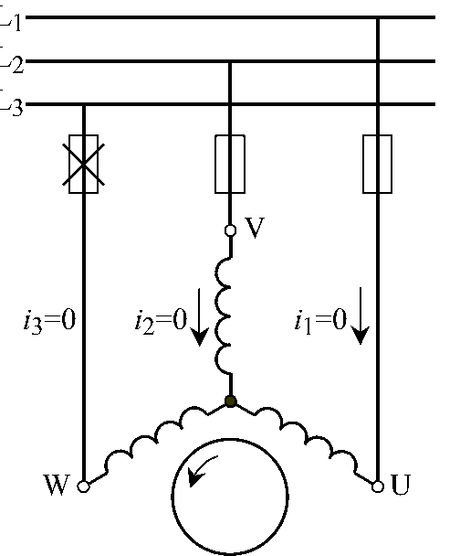
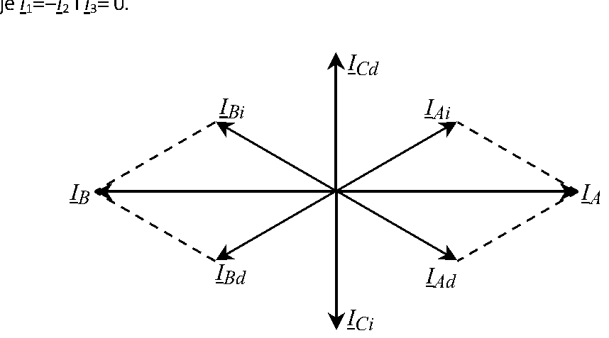
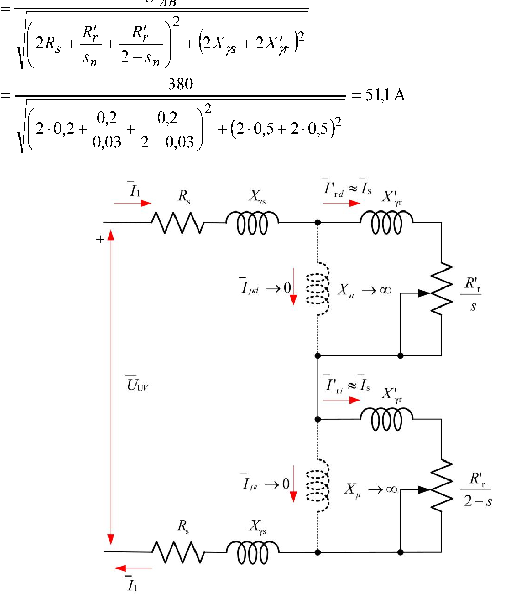
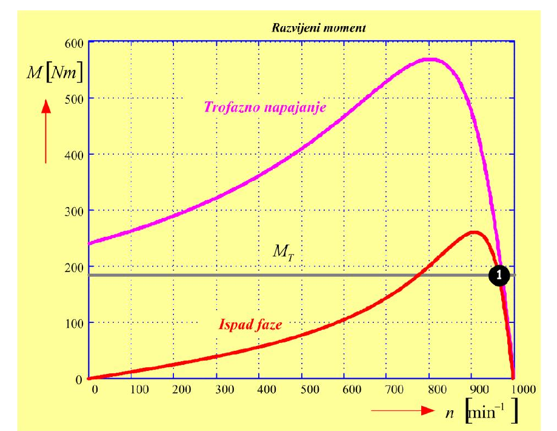
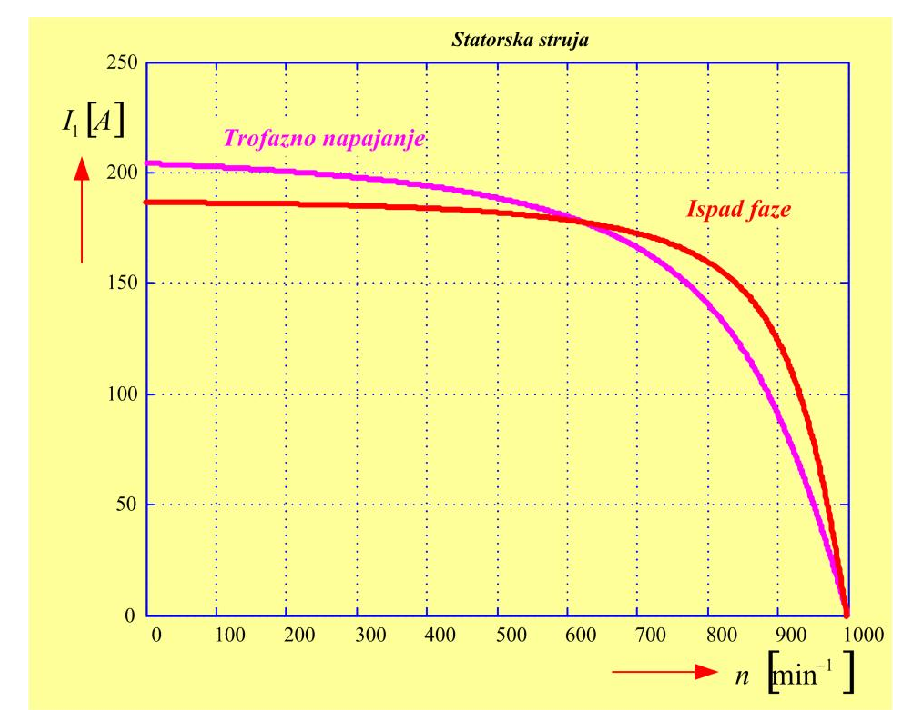

# Zadatak 57 — Ispad jedne faze napajanja: rad trofaznog motora u jednofaznom režimu (simetrične komponente)

## Postavka

Trofazni šestopolni asinhroni motor ima stator spregnut u zvezdu i sledeće podatke i parametre
ekvivalentne šeme: $R_s = 0{,}2\ \mathrm{\Omega}$, $R'_r = 0{,}2\ \mathrm{\Omega}$,
$X_{\gamma s} = X'_{\gamma r} = 0{,}5\ \mathrm{\Omega}$, napon $380\ \mathrm{V}$, učestanost
$50\ \mathrm{Hz}$, nazivno klizanje $s_{\mathrm{n}} = 3\ \%$. Motor je priključen na nazivni napon i
opterećen nazivnim momentom. Odrediti:

a) nazivni moment i nazivnu struju;

b) moment i struju motora kada nastane prekid jedne faze napajanja, pod pretpostavkom da
brzina obrtanja ostane nazivna;

c) brzinu i struju kada nastane prekid jedne faze, a moment opterećenja ostane jednak
nazivnom.

> **Prevod na običan jezik:** Imamo sasvim običan trofazni asinhroni motor koji vrti neki teret.
> U jednom trenutku *pregori osigurač u jednoj fazi* — motor ostaje priključen na mrežu samo
> preko dva provodnika, tj. napaja se **jednofazno**. Pitanje je: šta se tada dešava sa strujom
> koju motor vuče iz mreže i sa momentom koji razvija? Prvo (a) izračunamo „zdravo" stanje —
> nazivnu struju i nazivni moment pri trofaznom napajanju, da imamo sa čim da poredimo. Zatim (b)
> pretpostavimo da se brzina još nije stigla promeniti (mehanika je spora, struje su brze) i
> izračunamo novu struju i novi moment. Na kraju (c) pustimo da se motor „slegne" u novu radnu
> tačku: teret i dalje traži isti moment, pa motor mora malo da uspori (klizanje poraste) — tražimo
> tu novu brzinu i struju. Glavni alat za nesimetrični režim su **simetrične komponente**, koje u
> ovom poglavlju objašnjavamo od nule.

## Podaci

| Veličina | Oznaka | Vrednost | Šta ta veličina fizički znači |
|---|---|---|---|
| Otpornost statorskog namotaja (po fazi) | $R_s$ | $0{,}2\ \mathrm{\Omega}$ | Omska otpornost bakra jedne fazne grane statora; na njoj se gube džulovi gubici statora. |
| Svedena otpornost rotorskog namotaja | $R'_r$ | $0{,}2\ \mathrm{\Omega}$ | Otpornost rotorskog kola „preračunata" (svedena) na statorsku stranu, da bi se rotor i stator mogli crtati u istoj šemi; prim (′) označava svedenu veličinu. |
| Rasipna reaktansa statora (po fazi) | $X_{\gamma s}$ | $0{,}5\ \mathrm{\Omega}$ | Reaktansa od dela statorskog fluksa koji se „rasipa" — obuhvata samo statorski namotaj i ne stiže do rotora. |
| Svedena rasipna reaktansa rotora | $X'_{\gamma r}$ | $0{,}5\ \mathrm{\Omega}$ | Isto to za rotor, svedeno na stator. |
| Nazivni (linijski) napon | $U_{\mathrm{n}}$ | $380\ \mathrm{V}$ | Efektivna vrednost napona između dva fazna provodnika mreže; stator je u zvezdi, pa je fazni napon $U_{\mathrm{n}}/\sqrt{3} = 220\ \mathrm{V}$. |
| Učestanost mreže | $f$ | $50\ \mathrm{Hz}$ | Učestanost naizmeničnog napona napajanja. |
| Nazivno klizanje | $s_{\mathrm{n}}$ | $3\ \% = 0{,}03$ | Relativno zaostajanje rotora za obrtnim poljem pri nazivnom opterećenju. |
| Broj polova | $2p = 6$ | (tri para polova, $p=3$) | Određuje sinhronu brzinu: više polova → sporije obrtno polje. |
| Sprega statora | zvezda (Y) | — | Krajevi sve tri faze spojeni u zajedničku tačku (zvezdište); zvezdište **nije** izvedeno na mrežu. |
| Poprečna grana šeme | $R_m,\ X_m$ | $\to \infty$ (zanemarena) | Struja magnećenja se zanemaruje — pojednostavljenje koje original izričito uvodi. |

## Šta se traži i zašto

**1. Nazivna struja $I_{\mathrm{n}}$ i nazivni moment $M_{\mathrm{n}}$ (tačka a).**
Nazivna struja je struja koju motor vuče iz mreže kada radi tačno u nazivnoj radnoj tački; ona
diktira izbor osigurača, kablova i zaštite. Nazivni moment je mehanički moment na vratilu u toj
tački; on kaže koliki teret motor „normalno" nosi. Bez ta dva broja ne možemo proceniti koliko je
jednofazni režim gori od normalnog — oni su naša referentna tačka.

**2. Struja $I_{s1}$ i moment $M_1$ odmah po ispadu faze (tačka b).**
Kada pregori osigurač, struje se preurede praktično trenutno, a brzina (zbog inercije) ostane
ista. Inženjera zanima: da li struja skače (pregrevanje? okidanje zaštite?) i da li motor uopšte
još može da nosi teret. Račun ide preko simetričnih komponenti: nesimetrični režim rastavimo na
dva simetrična („direktni" koji vuče i „inverzni" koji koči), pa za svaki upotrebimo običnu
ekvivalentnu šemu.

**3. Novo klizanje $s'_{\mathrm{n}}$, brzina $n'$ i struja $I'$ u novoj ustaljenoj tački (tačka c).**
Ako teret i dalje traži nazivni moment, a motor u jednofaznom režimu pri staroj brzini daje manji
moment, motor usporava dok se momenti ne izjednače. Nova brzina i nova (još veća) struja govore da
li motor sme trajno ovako da radi — to je pitanje života i smrti za mašinu (pregrevanje namotaja).

**Plan rešavanja:**
1. Iz broja polova i učestanosti nađemo sinhronu brzinu $n_s$.
2. Iz ekvivalentne šeme (bez poprečne grane) pri $s = s_{\mathrm{n}}$ izračunamo $I_{\mathrm{n}}$, pa iz snage obrtnog polja $M_{\mathrm{n}}$.
3. Objasnimo šta se dešava pri prekidu faze i rastavimo struje na simetrične komponente; izvedemo ključni rezultat: motor se ponaša kao **redna veza** direktne i inverzne šeme.
4. Iz te redne šeme izračunamo $I_{s1}$ pri $s = s_{\mathrm{n}}$, pa preko snaga obrtnog polja moment $M_1$.
5. Linearizacijom momentne karakteristike nađemo novo klizanje $s'_{\mathrm{n}}$ (i brzinu $n'$) pri kome motor opet daje $M_{\mathrm{n}}$, pa novu struju $I'$.
6. Prokomentarišemo rezultate na momentnim i strujnim karakteristikama (slike 57.4 i 57.5) i izvučemo praktičan zaključak o dozvoljenom opterećenju.

## Potrebna teorija — mini-lekcije

### 1. Ekvivalentna šema asinhronog motora (po fazi) i njeno uprošćenje

Asinhroni motor se za ustaljeni režim predstavlja **ekvivalentnom šemom po jednoj fazi**, kao da
je transformator čiji se „sekundar" (rotor) obrće. Redna grana sadrži $R_s$ i $X_{\gamma s}$
(stator), zatim svedene rotorske veličine $X'_{\gamma r}$ i $R'_r/s$. Član $R'_r/s$ je ključan:
deljenjem rotorske otpornosti klizanjem $s$ u šemu je „upakovana" i mehanička snaga — snaga koja
se potroši na otporniku $R'_r/s$ jednaka je ukupnoj snazi koju obrtno polje predaje rotoru.
Poprečna (paralelna) grana $R_m,\ X_m$ predstavlja magnećenje gvožđa i gubitke u njemu; u ovom
zadatku se ona **zanemaruje** ($R_m \to \infty$, $X_m \to \infty$), što znači da kroz nju ne teče
struja, pa je statorska struja jednaka svedenoj rotorskoj: $I_s = I'_r$. To je uobičajeno i
dovoljno tačno pojednostavljenje kad nas zanimaju struje opterećenja, jer je struja magnećenja
mala prema struji opterećenja.

Ukupna impedansa jedne faze motora (bez poprečne grane) pri klizanju $s$ je:

$$\underline{Z}(s) = \left(R_s + \frac{R'_r}{s}\right) + \mathrm{j}\left(X_{\gamma s} + X'_{\gamma r}\right)$$

a njen moduo:

$$Z(s) = \sqrt{\left(R_s + \frac{R'_r}{s}\right)^2 + \left(X_{\gamma s} + X'_{\gamma r}\right)^2}$$

### 2. Sinhrona brzina i klizanje

Trofazne struje u statoru stvaraju **obrtno magnetno polje** koje se okreće sinhronom brzinom

$$n_s = \frac{60 f}{p}\ \left[\mathrm{min^{-1}}\right]$$

gde je $f$ učestanost mreže, a $p$ broj **pari** polova. Formula dolazi otud što polje za jednu
periodu napona pređe jedan par polova, tj. $1/p$ punog kruga; za $f$ perioda u sekundi to je $f/p$
obrtaja u sekundi, odnosno $60f/p$ u minuti. Rotor se obrće brzinom $n$, nešto sporijom od polja,
i to zaostajanje merimo **klizanjem**:

$$s = \frac{n_s - n}{n_s} \quad\Longleftrightarrow\quad n = (1-s)\,n_s$$

Pri polasku je $n=0$, tj. $s=1$; u praznom hodu $s \approx 0$; u nazivnoj tački tipično par
procenata (ovde $3\ \%$).

### 3. Snaga obrtnog polja i elektromagnetni moment

**Snaga obrtnog polja** $P_{ob}$ je snaga koju polje kroz vazdušni zazor preda rotoru. Za trofazni
motor sa zanemarenom poprečnom granom ona je snaga na sva tri otpornika $R'_r/s$:

$$P_{ob} = 3\, I'^{2}_{r}\,\frac{R'_r}{s}$$

Elektromagnetni moment je ta snaga podeljena **ugaonom brzinom polja** $\Omega_s$ (jer moment
puta ugaona brzina daje snagu, $P = M\,\Omega$, a polje je to koje „nosi" snagu preko zazora):

$$M = \frac{P_{ob}}{\Omega_s},\qquad
\Omega_s = \frac{2\pi n_s}{60} = \frac{\pi n_s}{30}\ \left[\mathrm{\frac{rad}{s}}\right]
\quad\Longrightarrow\quad
M = \frac{30}{\pi}\,\frac{P_{ob}}{n_s}$$

Pazite: u $\Omega_s$ ide $n_s$ u $\mathrm{min^{-1}}$, pa faktor $2\pi/60 = \pi/30$ pretvara
obrtaje u minuti u radijane u sekundi.

### 4. Simetrične komponente — rastavljanje nesimetričnog trofaznog sistema (od nule)

**Problem.** Sve standardne formule za asinhroni motor (ekvivalentna šema, obrtno polje) važe
samo za **simetričan** trofazni sistem: tri struje jednakih amplituda, pomerenih tačno za
$120^\circ$. Kad pregori osigurač, struje više nisu simetrične — jedna je nula, druge dve su u
protivfazi. Kako onda računati?

**Ideja (Fortesku, 1918).** Svaki skup od tri fazora $\underline{I}_1, \underline{I}_2,
\underline{I}_3$ (ma kako nesimetričan) može se **jednoznačno** napisati kao zbir tri simetrična
sistema:

- **direktni sistem** $(\underline{I}_{1d}, \underline{I}_{2d}, \underline{I}_{3d})$ — tri jednaka fazora sa redosledom faza $1 \to 2 \to 3$ (faza 2 *kasni* $120^\circ$ za fazom 1); takav sistem u mašini stvara obrtno polje u „normalnom" smeru;
- **inverzni sistem** $(\underline{I}_{1i}, \underline{I}_{2i}, \underline{I}_{3i})$ — tri jednaka fazora sa obrnutim redosledom $1 \to 3 \to 2$ (faza 2 *prednjači* $120^\circ$); stvara obrtno polje **suprotnog** smera;
- **nulti sistem** $\underline{I}_0$ — tri identična fazora u fazi; oni ne stvaraju obrtno polje uopšte.

Zašto ovo sme? Zato što tri kompleksna (nesimetrična) fazora nose tačno tri kompleksna podatka, a
tri simetrična sistema su takođe određena sa tačno tri kompleksna fazora (po jedan predstavnik za
svaki sistem) — broj nepoznatih se poklapa, pa rastavljanje uvek postoji i jedinstveno je.

**Operator $a$.** Da bismo pisali „zarotiraj fazor za $120^\circ$", uvodi se kompleksni operator

$$a = e^{\mathrm{j}120^\circ} = -\frac{1}{2} + \mathrm{j}\frac{\sqrt{3}}{2}$$

Množenje fazora sa $a$ okreće ga za $+120^\circ$ bez promene dužine. Ključne osobine (sve se
proveravaju direktnim računom):

$$a^2 = e^{\mathrm{j}240^\circ} = e^{-\mathrm{j}120^\circ},\qquad a^3 = 1,\qquad 1 + a + a^2 = 0$$

Poslednja jednakost kaže: tri jednaka fazora razmaknuta po $120^\circ$ se poništavaju (zato
simetričan sistem nema nultu komponentu).

**Zapis rastavljanja.** Pošto u direktnom sistemu faza 2 kasni $120^\circ$ (kašnjenje $=$
rotacija za $-120^\circ$ $=$ množenje sa $a^2$), a u inverznom prednjači (množenje sa $a$), važi:

$$\begin{aligned}
\underline{I}_1 &= \underline{I}_{1d} + \underline{I}_{1i} + \underline{I}_0\\
\underline{I}_2 &= a^2\,\underline{I}_{1d} + a\,\underline{I}_{1i} + \underline{I}_0 \;=\; \underline{I}_{2d} + \underline{I}_{2i} + \underline{I}_0\\
\underline{I}_3 &= a\,\underline{I}_{1d} + a^2\,\underline{I}_{1i} + \underline{I}_0 \;=\; \underline{I}_{3d} + \underline{I}_{3i} + \underline{I}_0
\end{aligned}$$

**Kako se komponente izračunavaju.** Saberimo sve tri jednačine: direktne komponente daju
$\underline{I}_{1d}(1 + a^2 + a) = 0$, inverzne isto tako $0$, a nulte $3\underline{I}_0$. Dakle:

$$\underline{I}_0 = \frac{1}{3}\left(\underline{I}_1 + \underline{I}_2 + \underline{I}_3\right)$$

Pomnožimo li drugu jednačinu sa $a$, treću sa $a^2$, pa saberemo sve tri, uz $a^3 = 1$ i
$a^4 = a$ dobijamo $\underline{I}_1 + a\underline{I}_2 + a^2\underline{I}_3 =
\underline{I}_{1d}(1+1+1) + \underline{I}_{1i}(1+a^2+a) + \underline{I}_0(1+a+a^2) = 3\underline{I}_{1d}$, tj.:

$$\underline{I}_{1d} = \frac{1}{3}\left(\underline{I}_1 + a\,\underline{I}_2 + a^2\,\underline{I}_3\right),
\qquad
\underline{I}_{1i} = \frac{1}{3}\left(\underline{I}_1 + a^2\,\underline{I}_2 + a\,\underline{I}_3\right)$$

**Zašto je ovo moćno.** Motor je (pri datoj brzini) linearno kolo, pa važi **superpozicija**:
svaki simetričan sistem struja/napona možemo računati **nezavisno**, običnom ekvivalentnom šemom,
pa rezultate sabrati. Direktni sistem „vidi" motor kao normalan motor; inverzni sistem „vidi"
motor koji se obrće *suprotno* od svog polja (o tome sledeća mini-lekcija); nulti sistem kod
zvezde bez izvedenog zvezdišta ne može ni da postoji (nema mu se kuda zatvoriti struja).

### 5. Inverzno polje i klizanje $2-s$

Inverzni sistem struja stvara polje koje se obrće brzinom $-n_s$ (isti iznos, suprotan smer).
Rotor se i dalje obrće brzinom $n = (1-s)\,n_s$ u „normalnom" smeru. Klizanje rotora **u odnosu na
inverzno polje** je, po definiciji klizanja (razlika brzina polja i rotora, podeljena brzinom
polja):

$$s_i = \frac{-n_s - n}{-n_s} = \frac{n_s + n}{n_s} = 1 + \frac{n}{n_s} = 1 + (1-s) = 2 - s$$

Dakle, za inverzni sistem važi ista ekvivalentna šema, samo se svuda umesto $s$ piše $2-s$:

$$\underline{Z}_d = \left(R_s + \frac{R'_r}{s}\right) + \mathrm{j}\left(X_{\gamma s} + X'_{\gamma r}\right),
\qquad
\underline{Z}_i = \left(R_s + \frac{R'_r}{2-s}\right) + \mathrm{j}\left(X_{\gamma s} + X'_{\gamma r}\right)$$

Primetite: pri malom $s$ (motor blizu sinhrone brzine) je $R'_r/s$ ogroman, a $R'_r/(2-s) \approx
R'_r/2$ mali — pa je $Z_d \gg Z_i$. Pri zakočenom rotoru ($s=1$) je $2-s = 1$, pa su obe
impedanse **jednake**. Inverzno polje na rotor deluje momentom u svom smeru obrtanja, tj.
**suprotno** od stvarnog obrtanja rotora — ono **koči**. Zato se rezultantni moment dobija kao
razlika direktnog i inverznog momenta.

### 6. Linearizacija momentne karakteristike za mala klizanja

Za mala klizanja ($s$ od nekoliko procenata) u imeniocu izraza za moment dominira član
$R'_r/s$ (npr. ovde $R'_r/s_{\mathrm{n}} = 6{,}67\ \mathrm{\Omega}$ prema $R_s = 0{,}2\ \mathrm{\Omega}$ i
$X = 1\ \mathrm{\Omega}$), pa je približno:

$$M \approx \frac{3\,U_f^2}{\Omega_s}\cdot\frac{R'_r/s}{\left(R'_r/s\right)^2} = \frac{3\,U_f^2}{\Omega_s\,R'_r}\, s
\qquad\Longrightarrow\qquad M \propto s$$

Dakle, u radnom delu karakteristike **moment je približno proporcionalan klizanju** — momentna
karakteristika je tu praktično prava linija kroz sinhronu tačku. To važi i za rezultantnu
karakteristiku u jednofaznom režimu u okolini malih klizanja. Praktična posledica koju koristimo u
tački c): ako motor pri klizanju $s_{\mathrm{n}}$ daje $M_1$, a treba mu moment $M_{\mathrm{n}}$, novo klizanje je
približno

$$s'_{\mathrm{n}} \approx s_{\mathrm{n}}\,\frac{M_{\mathrm{n}}}{M_1}$$

jer se na pravoj liniji kroz koordinatni početak ($M = k\,s$) klizanje i moment skaliraju
proporcionalno.

## Rešenje, korak po korak

### Korak 1: Sinhrona brzina

**Zašto ovaj korak:** sve formule za moment sadrže $n_s$, a klizanja se mere u odnosu na nju —
bez nje ne možemo ništa.

$$n_s = \frac{60 f}{p} = \frac{60 \cdot 50}{3} = 1000\ \mathrm{min^{-1}}$$

Motor je šestopolni, dakle $p = 6/2 = 3$ para polova. Ugaona brzina polja:

$$\Omega_s = \frac{\pi\, n_s}{30} = \frac{\pi \cdot 1000}{30} = 104{,}7\ \mathrm{\frac{rad}{s}}$$

**Šta smo dobili:** polje se obrće $1000\ \mathrm{min^{-1}}$; rotor u nazivnoj tački zaostaje
$3\ \%$, tj. obrće se $n_{\mathrm{n}} = (1-0{,}03)\cdot 1000 = 970\ \mathrm{min^{-1}}$.

### Korak 2: Nazivni fazni napon

**Zašto ovaj korak:** ekvivalentna šema je crtana *po fazi*, pa u nju ide fazni, a ne linijski
napon. Stator je u zvezdi, pa je fazni napon $\sqrt{3}$ puta manji od linijskog:

$$U_{f\mathrm{n}} = \frac{U_{\mathrm{n}}}{\sqrt{3}} = \frac{380}{\sqrt{3}} = 219{,}4\ \mathrm{V} \approx 220\ \mathrm{V}$$

**Šta smo dobili:** svaka fazna grana motora u normalnom radu „vidi" $220\ \mathrm{V}$.

### Korak 3: Nazivna struja (tačka a)

**Zašto ovaj korak:** nazivna struja je prosto fazni napon podeljen modulom impedanse jedne faze
pri nazivnom klizanju (poprečna grana je zanemarena, pa je kolo jedna prosta redna grana).

Opšti oblik (iz mini-lekcije 1):

$$I_{\mathrm{n}} = \frac{U_{f\mathrm{n}}}{\sqrt{\left(R_s + \dfrac{R'_r}{s_{\mathrm{n}}}\right)^2 + \left(X_{\gamma s} + X'_{\gamma r}\right)^2}}$$

Sračunajmo imenilac deo po deo:

$$\frac{R'_r}{s_{\mathrm{n}}} = \frac{0{,}2}{0{,}03} = 6{,}67\ \mathrm{\Omega}
\quad\Rightarrow\quad R_s + \frac{R'_r}{s_{\mathrm{n}}} = 0{,}2 + 6{,}67 = 6{,}87\ \mathrm{\Omega}$$

$$X_{\gamma s} + X'_{\gamma r} = 0{,}5 + 0{,}5 = 1\ \mathrm{\Omega}$$

$$Z_d(s_{\mathrm{n}}) = \sqrt{6{,}87^2 + 1^2} = \sqrt{47{,}15 + 1} = \sqrt{48{,}15} = 6{,}94\ \mathrm{\Omega}$$

pa je:

$$I_{\mathrm{n}} = \frac{380/\sqrt{3}}{\sqrt{\left(0{,}2 + \dfrac{0{,}2}{0{,}03}\right)^2 + \left(0{,}5+0{,}5\right)^2}}
= \frac{219{,}4}{6{,}94} = 31{,}6\ \mathrm{A}$$

**Šta smo dobili:** nazivna struja je $31{,}6\ \mathrm{A}$ po fazi. Pošto je poprečna grana
zanemarena, ista struja teče i kroz (svedeni) rotor: $I_s = I'_r = I_{\mathrm{n}}$. Uočite da je impedansa
skoro čisto „otporna" ($6{,}87$ prema $1$) — pri malom klizanju dominira $R'_r/s$, što je i
razlog dobrog faktora snage u nazivnoj tački.

### Korak 4: Nazivni moment (tačka a)

**Zašto ovaj korak:** moment dobijamo iz snage obrtnog polja (mini-lekcija 3) — prvo snagu koju
polje preda rotoru, pa je podelimo ugaonom brzinom polja.

$$M_{\mathrm{n}} = \frac{P_{ob}}{\Omega_s} = \frac{30}{\pi}\cdot\frac{3\,I'^{2}_r\,R'_r}{s_{\mathrm{n}}\, n_s}$$

Snaga obrtnog polja:

$$P_{ob} = 3\,I'^2_r\,\frac{R'_r}{s_{\mathrm{n}}} = 3 \cdot 31{,}6^2 \cdot \frac{0{,}2}{0{,}03}
= 3 \cdot 998{,}6 \cdot 6{,}67 = 19\,971\ \mathrm{W} \approx 20\ \mathrm{kW}$$

pa je:

$$M_{\mathrm{n}} = \frac{30}{\pi}\cdot\frac{3 \cdot 31{,}6^2 \cdot 0{,}2}{0{,}03 \cdot 1000}
= \frac{19\,971}{104{,}7} = 190{,}7\ \mathrm{Nm}$$

**Šta smo dobili:** nazivni moment je oko $191\ \mathrm{Nm}$. Kontrola reda veličine: mehanička
snaga je $P_{meh} = (1-s_{\mathrm{n}})P_{ob} \approx 0{,}97 \cdot 20 \approx 19{,}4\ \mathrm{kW}$ — razumna
snaga za motor koji vuče $31{,}6\ \mathrm{A}$ na $380\ \mathrm{V}$.

### Korak 5: Šta se fizički desi pri prekidu faze; nulta komponenta

**Zašto ovaj korak:** pre bilo kakvog računa moramo razumeti novu topologiju kola — ko je s čim
vezan i koje struje uopšte mogu da teku.

Kad pregori osigurač u jednoj fazi (na slici dole: u provodniku ka priključku $W$), motor ostaje
vezan na mrežu samo preko priključaka $U$ i $V$, tj. napaja se **linijskim naponom**
$U_{UV} = 380\ \mathrm{V}$, a kroz njega teče jedna jedina konturna struja: kroz fazni namotaj $U$,
kroz zvezdište, pa nazad kroz namotaj $V$. Sledeća slika prikazuje tu novu topologiju kola.

**Slika 57.1 —** Trofazni motor u jednofaznom režimu rada: osigurač faze ka namotaju $W$ je
pregoreo (precrtan), pa je $i_3 = 0$, a struja se zatvara kroz namotaje $U$ i $V$ redno
($i_1 = -i_2$).

> **Kako čitati sliku 57.1:** Ovo je šema veze (nema osa — čitaju se elementi i putanja struje).
> Tri vodoravne linije pri vrhu su tri fazna provodnika mreže $L_1$, $L_2$, $L_3$ (između njih je
> linijski napon $380\ \mathrm{V}$, $50\ \mathrm{Hz}$); iz njih se spuštaju tri vertikalna voda,
> svaki preko svog osigurača (uspravni pravougaonik). Levi osigurač, u vodu koji sa $L_3$ ide ka
> priključku $W$, precrtan je znakom „X" — on je pregoreo, taj vod je prekinut i kroz njega je
> struja zaista nula ($i_3 = 0$). Preostala dva voda su zdrava: desni sa $L_1$ vodi na stezaljku
> $U$, srednji sa $L_2$ na stezaljku $V$ (mali kružići su priključne stezaljke motora). Ispod
> stezaljki su tri statorska namotaja (simboli kalemova) koji se sastaju u zajedničkoj tački —
> zvezdištu (puna tačka u sredini); zvezdište nije izvedeno napolje, pa četvrtog provodnika nema.
> Krug sa zakrivljenom strelicom u dnu je rotor, koji se po inerciji i dalje obrće u naznačenom
> smeru. Put struje prati se ovako: iz $L_1$ kroz osigurač u stezaljku $U$, kroz namotaj $U$ do
> zvezdišta, pa kroz namotaj $V$ nazad na stezaljku $V$ i u $L_2$ — jedna jedina konturna struja,
> dakle $i_1 = -i_2$, dok namotaj $W$ ostaje bez struje. Pažnja na oznake: na originalnom crtežu
> uz sve tri strelice piše „$=0$" ($i_1{=}0$, $i_2{=}0$, $i_3{=}0$) — to je omaška crtača; nula
> je samo struja prekinute faze $i_3$, a $i_1$ i $i_2$ su različite od nule i u protivfazi, što
> uostalom kaže i sam tekst rešenja u zbirci. Šta treba da zaključiš: posle ispada faze motor je
> efektivno jednofazni potrošač između stezaljki $U$ i $V$ — na rednu vezu dva namotaja deluje
> linijski napon $380\ \mathrm{V}$, i upravo tu topologiju modeluje redna šema na slici 57.3.

Režim je **nesimetričan**, pa struje faznih namotaja rastavljamo na simetrične komponente
(mini-lekcija 4):

$$\begin{aligned}
\underline{I}_1 &= \underline{I}_{1d} + \underline{I}_{1i} + \underline{I}_0\\
\underline{I}_2 &= \underline{I}_{2d} + \underline{I}_{2i} + \underline{I}_0\\
\underline{I}_3 &= \underline{I}_{3d} + \underline{I}_{3i} + \underline{I}_0
\end{aligned}$$

Nulta komponenta je nula:

$$\underline{I}_0 = \frac{1}{3}\left(\underline{I}_1 + \underline{I}_2 + \underline{I}_3\right)
= \frac{1}{3}\left(\underline{I}_1 - \underline{I}_1 + 0\right) = 0$$

jer je $\underline{I}_1 = -\underline{I}_2$ (ista konturna struja kroz dva redno vezana namotaja,
sa suprotnim referentnim smerovima) i $\underline{I}_3 = 0$ (prekinut provodnik). Ovo je i
očekivano iz topologije: zvezdište nije izvedeno, pa zbir faznih struja u svakom trenutku mora
biti nula — nulta komponenta nema kuda da se zatvori.

**Šta smo dobili:** ostale su samo direktna i inverzna komponenta. Motor se, dakle, ponaša kao
zbir „normalnog motora" (direktni sistem) i „kočnice" (inverzni sistem).

### Korak 6: Simetrične komponente struja i fazorski dijagram

**Zašto ovaj korak:** da bismo izveli ekvivalentnu šemu jednofaznog režima, treba nam veza između
stvarne struje $\underline{I}_1$ i njenih komponenti.

Uvrstimo $\underline{I}_2 = -\underline{I}_1$ i $\underline{I}_3 = 0$ u formule za komponente:

$$\underline{I}_{1d} = \frac{1}{3}\left(\underline{I}_1 + a\,\underline{I}_2 + a^2\,\underline{I}_3\right)
= \frac{1}{3}\left(\underline{I}_1 - a\,\underline{I}_1\right) = \frac{1-a}{3}\,\underline{I}_1$$

$$\underline{I}_{1i} = \frac{1}{3}\left(\underline{I}_1 + a^2\,\underline{I}_2 + a\,\underline{I}_3\right)
= \frac{1}{3}\left(\underline{I}_1 - a^2\,\underline{I}_1\right) = \frac{1-a^2}{3}\,\underline{I}_1$$

Izračunajmo faktor $\dfrac{1-a}{3}$. Kako je $a = -\tfrac{1}{2} + \mathrm{j}\tfrac{\sqrt{3}}{2}$:

$$1 - a = \frac{3}{2} - \mathrm{j}\frac{\sqrt{3}}{2}
\quad\Rightarrow\quad |1-a| = \sqrt{\frac{9}{4} + \frac{3}{4}} = \sqrt{3},\quad \arg(1-a) = -30^\circ$$

pa je:

$$\underline{I}_{1d} = \frac{I_1}{\sqrt{3}}\,e^{-\mathrm{j}30^\circ},
\qquad
\underline{I}_{1i} = \frac{I_1}{\sqrt{3}}\,e^{+\mathrm{j}30^\circ}$$

(druga jednakost analogno, jer je $1-a^2$ konjugovano od $1-a$). Obe komponente su dakle po
modulu jednake, $I_1/\sqrt{3} \approx 0{,}577\,I_1$, i simetrično raspoređene $\pm 30^\circ$ oko
stvarne struje $\underline{I}_1$; njihov zbir vraća $\underline{I}_1$ (provera:
$\tfrac{1-a}{3} + \tfrac{1-a^2}{3} = \tfrac{2-a-a^2}{3} = \tfrac{2+1}{3} = 1$, jer je
$a + a^2 = -1$).

Sledeća slika prikazuje upravo to rastavljanje, na fazorskom dijagramu struja.

**Slika 57.2 —** Fazorski dijagram struja trofaznog motora kad radi u jednofaznom režimu:
stvarne struje $\underline{I}_A = -\underline{I}_B$ i njihove direktne ($d$) i inverzne ($i$)
komponente; komponente prekinute faze $C$ se poništavaju.

> **Kako čitati sliku 57.2:** Fazorski dijagram struja: dužina svakog fazora srazmerna je
> efektivnoj vrednosti struje, a uglovi između fazora su fazni pomaci. **Referentni fazor** je
> stvarna struja prve faze $\underline{I}_A$, nacrtana horizontalno udesno; njoj tačno suprotan
> (horizontalno ulevo) je $\underline{I}_B = -\underline{I}_A$ — ista konturna struja gledana sa
> suprotnim referentnim smerom. Podrazumeva se standardna konvencija da svi fazori rotiraju u
> pozitivnom (protivkazaljkinom) smeru, pa fazor nacrtan „iznad" referentnog **prednjači**, a
> onaj „ispod" **kasni**. Puni kraći fazori su simetrične komponente, svaki dužine
> $I_A/\sqrt{3} \approx 0{,}577\,I_A$ (izvedeno u ovom koraku): $\underline{I}_{Ad}$ leži
> $30^\circ$ ispod $\underline{I}_A$ (direktna komponenta kasni $30^\circ$), a
> $\underline{I}_{Ai}$ leži $30^\circ$ iznad (inverzna prednjači $30^\circ$); simetrično tome,
> $\underline{I}_{Bd}$ i $\underline{I}_{Bi}$ stoje po $30^\circ$ oko $\underline{I}_B$.
> Isprekidane linije su pomoćne stranice paralelograma: sabiranjem
> $\underline{I}_{Ad} + \underline{I}_{Ai}$ po pravilu paralelograma rekonstruiše se tačno
> $\underline{I}_A$ (i isto tako $\underline{I}_B$ iz svojih komponenti) — provera:
> $2\cdot\frac{I_A}{\sqrt{3}}\cos 30^\circ = I_A$. Vertikalni par fazora pripada prekinutoj fazi
> $C$: $\underline{I}_{Cd}$ gleda pravo naviše, $\underline{I}_{Ci}$ pravo naniže; jednaki su po
> dužini i suprotni, pa je njihov zbir $\underline{I}_C = 0$ — baš kako u prekinutom provodniku
> mora biti. Oznake faza: $A, B, C$ na slici su faze koje tekst zove $1, 2, 3$ (odnosno
> priključci $U, V, W$): $A \equiv 1 \equiv U$, $B \equiv 2 \equiv V$, $C \equiv 3 \equiv W$.
> Šta treba da zaključiš: nesimetričan skup struja $(\underline{I}_A, -\underline{I}_A, 0)$
> tačno se rastavlja na dva simetrična sistema jednakih modula $I_A/\sqrt{3}$ — direktni i
> inverzni — što nam dozvoljava da motor dalje računamo kao zbir dva „obična" simetrična motora.

**Šta smo dobili:** nesimetrični režim sa strujama $(\underline{I}_1, -\underline{I}_1, 0)$
ekvivalentan je zbiru dva simetrična sistema, svaki sa strujama po modulu $I_1/\sqrt{3}$ — jedan
direktnog, drugi inverznog redosleda.

### Korak 7: Izvođenje ekvivalentne šeme jednofaznog režima

**Zašto ovaj korak:** hoćemo jednu jedinu formulu „struja $=$ napon kroz impedansu" za jednofazni
režim. Do nje dolazimo sabiranjem napona po konturi $U \to$ zvezdište $\to V$, koristeći
superpoziciju po komponentama.

Za svaki simetričan sistem ponaosob važi obična ekvivalentna šema, pa je fazni napon svake faze
jednak zbiru „direktnog" i „inverznog" pada napona. Za faze $U$ (indeks 1) i $V$ (indeks 2):

$$\begin{aligned}
\underline{U}_U &= \underline{U}_{Ud} + \underline{U}_{Ui} = \underline{I}_{1d}\,\underline{Z}_d + \underline{I}_{1i}\,\underline{Z}_i\\
\underline{U}_V &= \underline{U}_{Vd} + \underline{U}_{Vi} = \underline{I}_{2d}\,\underline{Z}_d + \underline{I}_{2i}\,\underline{Z}_i
\end{aligned}$$

gde su $\underline{Z}_d$ i $\underline{Z}_i$ ukupne impedanse motora (po fazi) za direktni i
inverzni redosled pri datom klizanju (mini-lekcija 5).

> **Napomena o originalu:** u zbirci u prvoj od ovih jednačina stoji
> $\underline{U}_U = \underline{I}_{1d}\underline{Z}_d + \underline{I}_{2i}\underline{Z}_i$ —
> indeks $2$ u drugom sabirku je štamparska greška; napon faze $U$ (faza 1) gradi *njena*
> inverzna komponenta $\underline{I}_{1i}$, kako je i napisano ovde.

Linijski napon na stezaljkama na koje je motor ostao priključen (između $U$ i $V$) je razlika
faznih napona:

$$\underline{U}_{UV} = \underline{U}_U - \underline{U}_V
= \left(\underline{I}_{1d} - \underline{I}_{2d}\right)\underline{Z}_d
+ \left(\underline{I}_{1i} - \underline{I}_{2i}\right)\underline{Z}_i$$

Sad iskoristimo strukturu simetričnih sistema (korak 6 i mini-lekcija 4):
$\underline{I}_{2d} = a^2\,\underline{I}_{1d}$ i $\underline{I}_{2i} = a\,\underline{I}_{1i}$, pa:

$$\underline{I}_{1d} - \underline{I}_{2d} = (1-a^2)\,\underline{I}_{1d}
= (1-a^2)\cdot\frac{1-a}{3}\,\underline{I}_1$$

Izmnožimo zagrade, koristeći $a^3 = 1$ i $a + a^2 = -1$:

$$(1-a^2)(1-a) = 1 - a - a^2 + a^3 = 1 - (a + a^2) + 1 = 1 + 1 + 1 = 3$$

pa je $\underline{I}_{1d} - \underline{I}_{2d} = \dfrac{3}{3}\,\underline{I}_1 = \underline{I}_1$.
Potpuno isto, $\underline{I}_{1i} - \underline{I}_{2i} = (1-a)\,\underline{I}_{1i} =
(1-a)\cdot\frac{1-a^2}{3}\underline{I}_1 = \underline{I}_1$. Uvrštavanjem:

$$\boxed{\ \underline{U}_{UV} = \underline{I}_1\left(\underline{Z}_d + \underline{Z}_i\right)\ }$$

Ovo je ključni rezultat: **trofazni motor bez jedne faze ponaša se, gledano sa svoje dve žive
stezaljke, kao redna veza dve ekvivalentne šeme** — jedne sa klizanjem $s$ (motorski, direktni
deo, impedansa $\underline{Z}_d$) i jedne sa klizanjem $2-s$ (kočioni, inverzni deo, impedansa
$\underline{Z}_i$). Kroz obe teče ista struja $\underline{I}_1$, a napon na krajevima je linijski
napon $U_{UV}$.

Sledeća slika prikazuje tu rednu šemu.

**Slika 57.3 —** Ekvivalentna šema trofaznog motora kad radi u jednofaznom režimu: redna veza
direktne šeme (klizanje $s$) i inverzne šeme (klizanje $2-s$), napajana linijskim naponom
$U_{UV}$.

> **Kako čitati sliku 57.3:** Šema kola — prati struju od ulaza do izlaza. Crvenom bojom su
> nacrtane strelice struja i napona, crnom elementi kola. Na levoj strani je dugačka crvena
> dvostrana strelica: ukupni napon $\underline{U}_{UV}$ (linijskih $380\ \mathrm{V}$), sa znakom
> „+" na gornjem kraju — to je sve što je od mreže ostalo. Struja $\underline{I}_1$ ulazi gore
> levo (crvena strelica udesno) i prolazi redom kroz: otpornik $R_s$ ($0{,}2\ \mathrm{\Omega}$ —
> stator faze $U$), rasipnu reaktansu $X_{\gamma s}$ ($0{,}5\ \mathrm{\Omega}$), pa kroz rotorsku
> granu direktnog dela — reaktansu $X'_{\gamma r}$ ($0{,}5\ \mathrm{\Omega}$) i otpornik sa kosom
> strelicom $R'_r/s$ (kosa strelica označava da vrednost zavisi od klizanja; pri
> $s = s_{\mathrm{n}} = 0{,}03$ iznosi $6{,}67\ \mathrm{\Omega}$). To je gornja polovina —
> „direktna" šema, običan motor pri klizanju $s$. Ista struja zatim nastavlja kroz donju polovinu
> — „inverznu" šemu, identičnu po strukturi, samo sa otpornikom $R'_r/(2-s)$ (pri $s_{\mathrm{n}}$:
> svega $0{,}10\ \mathrm{\Omega}$) — pa kroz donje $X_{\gamma s}$ i $R_s$ (stator faze $V$) izlazi
> dole levo (crvena strelica $\underline{I}_1$ ulevo). Isprekidano nacrtane poprečne grane sa
> oznakama $X_\mu \to \infty$ i crvenim strelicama $\underline{I}_{\mu d} \to 0$,
> $\underline{I}_{\mu i} \to 0$ podsećaju da je magnećenje zanemareno: kroz njih ne teče ništa,
> pa je struja rotorskih grana jednaka statorskoj — otuda natpisi
> $\underline{I}'_{rd} \approx \underline{I}_s$ i $\underline{I}'_{ri} \approx \underline{I}_s$
> uz gornje grane. (Iznad same šeme na ovom isečku iz zbirke vidi se i deo formule — upravo izraz
> za $I_{s1} = 51{,}1\ \mathrm{A}$ koji iz ove šeme izvodimo u koraku 8.) Šta treba da zaključiš:
> motor bez jedne faze je, gledano sa stezaljki $U$–$V$, obično redno kolo ukupne impedanse
> $\underline{Z}_d + \underline{Z}_i$ (pri $s_{\mathrm{n}}$: $7{,}17 + \mathrm{j}2\ \mathrm{\Omega}$,
> modula $7{,}44\ \mathrm{\Omega}$), pa je sva dalja računica prosto Omov zakon.

Struja motora u jednofaznom režimu je dakle:

$$\underline{I}_1 = \frac{\underline{U}_{UV}}{\underline{Z}_d + \underline{Z}_i}$$

**Šta smo dobili:** umesto komplikovanog nesimetričnog problema — jedno obično redno kolo.
Preostaje samo da uvrstimo brojeve.

### Korak 8: Struja pri ispadu faze i nepromenjenoj brzini (tačka b)

**Zašto ovaj korak:** neposredno po ispadu faze brzina je još uvek nazivna (mehanička inercija),
pa je klizanje i dalje $s = s_{\mathrm{n}} = 0{,}03$; struju daje redna šema iz koraka 7.

Moduo zbira impedansi (realni delovi se sabiraju: dva $R_s$, pa $R'_r/s$ i $R'_r/(2-s)$;
imaginarni: po dva $X_{\gamma s}$ i $X'_{\gamma r}$):

$$I_{s1} = \frac{U_{UV}}{\sqrt{\left(2R_s + \dfrac{R'_r}{s_{\mathrm{n}}} + \dfrac{R'_r}{2-s_{\mathrm{n}}}\right)^2 + \left(2X_{\gamma s} + 2X'_{\gamma r}\right)^2}}$$

Sračunajmo član po član:

$$2R_s = 0{,}4\ \mathrm{\Omega};\qquad
\frac{R'_r}{s_{\mathrm{n}}} = \frac{0{,}2}{0{,}03} = 6{,}67\ \mathrm{\Omega};\qquad
\frac{R'_r}{2-s_{\mathrm{n}}} = \frac{0{,}2}{1{,}97} = 0{,}10\ \mathrm{\Omega}$$

$$\text{realni deo: } 0{,}4 + 6{,}67 + 0{,}10 = 7{,}17\ \mathrm{\Omega};\qquad
\text{imaginarni deo: } 2\cdot 0{,}5 + 2\cdot 0{,}5 = 2\ \mathrm{\Omega}$$

$$\left|\underline{Z}_d + \underline{Z}_i\right| = \sqrt{7{,}17^2 + 2^2} = \sqrt{51{,}4 + 4} = \sqrt{55{,}4} = 7{,}44\ \mathrm{\Omega}$$

$$I_{s1} = \frac{380}{\sqrt{\left(2\cdot 0{,}2 + \dfrac{0{,}2}{0{,}03} + \dfrac{0{,}2}{2-0{,}03}\right)^2 + \left(2\cdot 0{,}5 + 2\cdot 0{,}5\right)^2}}
= \frac{380}{7{,}44} = 51{,}1\ \mathrm{A}$$

**Šta smo dobili:** struja je skočila sa $31{,}6\ \mathrm{A}$ na $51{,}1\ \mathrm{A}$, tj. na
$1{,}62\,I_{\mathrm{n}}$ — iako se mehanički još ništa nije promenilo! Razlog: napon na rednoj vezi je
porastao sa faznog na linijski (faktor $\sqrt{3}$), a impedansa se povećala samo malo (dodatni
$R_s$, $X_{\gamma s}$, $X'_{\gamma r}$ i mali $R'_r/(2-s)$ inverznog dela), pa je količnik veći.

### Korak 9: Snage obrtnog polja direktnog i inverznog sistema

**Zašto ovaj korak:** moment ćemo (kao i u tački a) dobiti iz snage obrtnog polja; sada polja ima
dva — direktno i inverzno — pa računamo obe snage.

U rednoj šemi (slika 57.3) kroz otpornik $R'_r/s_{\mathrm{n}}$ direktnog dela i kroz otpornik
$R'_r/(2-s_{\mathrm{n}})$ inverznog dela teče ista struja $I'_{r1} = I_{s1}$ (struja magnećenja je
zanemarena). Snage obrtnog polja su snage na tim otpornicima:

$$P_{obd} = I'^2_{r1}\,\frac{R'_r}{s_{\mathrm{n}}} = 51{,}1^2 \cdot \frac{0{,}2}{0{,}03}
= 2611 \cdot 6{,}67 = 17\,408\ \mathrm{W}
\qquad\text{(direktni sistem)}$$

$$P_{obi} = I'^2_{r1}\,\frac{R'_r}{2-s_{\mathrm{n}}} = 51{,}1^2 \cdot \frac{0{,}2}{2-0{,}03}
= 2611 \cdot 0{,}1015 = 265\ \mathrm{W} \approx 266\ \mathrm{W}
\qquad\text{(inverzni sistem)}$$

Obratite pažnju: **nema faktora $3$** kao u trofaznom izrazu za $P_{ob}$! Zašto? U jednofaznom
režimu svaki simetrični sistem ima fazne struje modula $I_{s1}/\sqrt{3}$ (korak 6), pa je npr. za
direktni sistem, sabrano po sve tri faze:

$$P_{obd} = 3\left(\frac{I_{s1}}{\sqrt{3}}\right)^2\frac{R'_r}{s_{\mathrm{n}}} = 3\cdot\frac{I_{s1}^2}{3}\cdot\frac{R'_r}{s_{\mathrm{n}}} = I_{s1}^2\,\frac{R'_r}{s_{\mathrm{n}}}$$

— trojka iz „tri faze" tačno se potre sa $(\sqrt{3})^2$ iz modula komponente. Redna šema to
automatski „zna": u njoj cela struja $I_{s1}$ prolazi kroz jedan jedini otpornik $R'_r/s_{\mathrm{n}}$.

> **Napomena o originalu:** zbirka za $P_{obi}$ navodi $266\ \mathrm{W}$; tačan račun sa
> $I_{s1} = 51{,}1\ \mathrm{A}$ daje $265\ \mathrm{W}$ — razlika je čisto zaokruživanje i nema
> nikakav uticaj na dalje rezultate (moment ispada isti na tri decimale).

**Šta smo dobili:** direktno polje predaje rotoru oko $17{,}4\ \mathrm{kW}$, a inverzno svega
$0{,}27\ \mathrm{kW}$ — inverzna impedansa je pri malom klizanju mala, ali i njen otpornik
$R'_r/(2-s)$ je mali, pa inverzno polje pri radnoj brzini srećom slabo koči.

### Korak 10: Moment u jednofaznom režimu pri nazivnoj brzini (tačka b)

**Zašto ovaj korak:** rezultantni moment je razlika momenta direktnog polja (koje vuče u smeru
obrtanja) i inverznog polja (koje koči) — svaki od njih je odgovarajuća snaga obrtnog polja
podeljena sa $\Omega_s$.

$$M_1 = M_d - M_i = \frac{P_{obd}}{\Omega_s} - \frac{P_{obi}}{\Omega_s}
= \frac{30}{\pi}\cdot\frac{P_{obd} - P_{obi}}{n_s}$$

Uvrstimo brojeve:

$$M_1 = \frac{30}{\pi}\cdot\frac{17\,408 - 266}{1000}
= \frac{30}{\pi}\cdot 17{,}14 = \frac{514{,}3}{\pi} = 163{,}7\ \mathrm{Nm}$$

**Šta smo dobili:** pri nazivnoj brzini motor u jednofaznom režimu razvija $163{,}7\ \mathrm{Nm}$
— **manje od nazivnog momenta** ($190{,}7\ \mathrm{Nm}$), svega $86\ \%$ njega. Teret, međutim, i
dalje traži $190{,}7\ \mathrm{Nm}$: motor trenutno ima manjak momenta, pa počinje da usporava. To
nas vodi u tačku c).

### Korak 11: Novo klizanje i brzina pri nazivnom teretu (tačka c)

**Zašto ovaj korak:** motor usporava sve dok razvijeni moment ne poraste do momenta tereta. U
radnoj oblasti moment raste približno linearno sa klizanjem (mini-lekcija 6), pa novo klizanje
nalazimo prostom proporcijom.

Iz $M \approx k\,s$ sledi: pri klizanju $s_{\mathrm{n}}$ motor (jednofazno) daje $M_1$, a moment
$M_{\mathrm{n}}$ daće pri klizanju:

$$s'_{\mathrm{n}} = s_{\mathrm{n}}\cdot\frac{M_{\mathrm{n}}}{M_1} = 0{,}03 \cdot \frac{190{,}7}{163{,}7}
= 0{,}03 \cdot 1{,}165 = 0{,}035 = 3{,}5\ \%$$

Nova brzina obrtanja:

$$n' = \left(1 - s'_{\mathrm{n}}\right) n_s = (1 - 0{,}035)\cdot 1000 = 965\ \mathrm{min^{-1}}$$

**Šta smo dobili:** motor je usporio sa $970$ na oko $965\ \mathrm{min^{-1}}$ — jedva primetno
(pola procenta). Momentna karakteristika je u radnom delu strma, pa se manjak momenta nadoknađuje
malim porastom klizanja. Ali cena se plaća u struji — sledeći korak.

### Korak 12: Struja pri nazivnom teretu u jednofaznom režimu (tačka c)

**Zašto ovaj korak:** ista redna šema iz koraka 7, samo sa novim klizanjem $s'_{\mathrm{n}} = 0{,}035$;
veće klizanje znači manju impedansu direktnog dela, dakle još veću struju.

$$I' = \frac{U_{UV}}{\sqrt{\left(2R_s + \dfrac{R'_r}{s'_{\mathrm{n}}} + \dfrac{R'_r}{2-s'_{\mathrm{n}}}\right)^2 + \left(2X_{\gamma s} + 2X'_{\gamma r}\right)^2}}$$

Sračunajmo članove:

$$\frac{R'_r}{s'_{\mathrm{n}}} = \frac{0{,}2}{0{,}035} = 5{,}71\ \mathrm{\Omega};\qquad
\frac{R'_r}{2-s'_{\mathrm{n}}} = \frac{0{,}2}{1{,}965} = 0{,}10\ \mathrm{\Omega}$$

$$\text{realni deo: } 0{,}4 + 5{,}71 + 0{,}10 = 6{,}22\ \mathrm{\Omega};\qquad
\left|\underline{Z}_d + \underline{Z}_i\right| = \sqrt{6{,}22^2 + 2^2} = \sqrt{38{,}7 + 4} = \sqrt{42{,}7} = 6{,}53\ \mathrm{\Omega}$$

$$I' = \frac{380}{\sqrt{\left(2\cdot 0{,}2 + \dfrac{0{,}2}{0{,}035} + \dfrac{0{,}2}{2-0{,}035}\right)^2 + \left(2\cdot 0{,}5 + 2\cdot 0{,}5\right)^2}}
= \frac{380}{6{,}53} = 58{,}2\ \mathrm{A}$$

**Šta smo dobili:** struja je porasla na $58{,}2\ \mathrm{A} = 1{,}84\,I_{\mathrm{n}}$, dakle **približno
$2 I_{\mathrm{n}}$**. Motor koji trajno vuče skoro dvostruku nazivnu struju pregrevaće se (džulovi gubici
rastu sa kvadratom struje — ovde na $\approx 3{,}4$ puta veću vrednost), iako mehanički „sve
radi": brzina je pala jedva pola procenta i teret se uredno vrti. Baš zato je ispad faze podmukao
kvar. **Praktičan zaključak zbirke:** motor sme trajno da radi jednofazno bez pregrevanja samo
ako je opterećen sa oko $50 \div 60\ \%$ nazivnog momenta.

### Korak 13: Poređenje karakteristika — trofazno i jednofazno napajanje

**Zašto ovaj korak:** brojevi iz tačaka b) i c) su dve tačke; celu sliku ponašanja daju
karakteristike momenta i struje u funkciji brzine, koje zbirka prilaže i koje treba znati
pročitati.

Sledeća slika prikazuje momentne karakteristike za oba režima napajanja, sa ucrtanom linijom
tereta i nazivnom radnom tačkom.

**Slika 57.4 —** Razvijeni moment trofaznog asinhronog motora u zavisnosti od brzine obrtanja,
pri trofaznom napajanju i pri ispadu jedne faze.

> **Kako čitati sliku 57.4:** Dijagram momentnih karakteristika. Horizontalna osa: brzina
> obrtanja $n$ u $\mathrm{min^{-1}}$, od $0$ do $1000$ (krajnja desna tačka je sinhrona brzina
> $n_s = 1000\ \mathrm{min^{-1}}$); vertikalna osa: razvijeni moment $M$ u $\mathrm{Nm}$, od $0$
> do $600$. **Ljubičasta kriva** („Trofazno napajanje") je moment pri zdravom napajanju: kreće od
> polaznog momenta $\approx 240\ \mathrm{Nm}$ pri $n = 0$, raste do prevalnog maksimuma
> $\approx 565\ \mathrm{Nm}$ na oko $790\ \mathrm{min^{-1}}$, pa strmo pada kroz nulu u
> $n = n_s$. **Crvena kriva** („Ispad faze") je rezultantni moment u jednofaznom režimu: kreće iz
> **nule pri $n = 0$** — pri zakočenom rotoru je $s = 1$, pa je $2-s = 1$: direktno i inverzno
> polje su ravnopravni ($Z_d = Z_i$) i momenti im se tačno poništavaju, zbog čega motor kome je
> ispala faza **ne može sam da se zaleti**; maksimum joj je znatno niži, oko $255\ \mathrm{Nm}$
> na oko $900\ \mathrm{min^{-1}}$, a nulu seče tik ispod sinhrone brzine. **Siva horizontalna
> linija** je moment tereta $M_T = M_{\mathrm{n}} = 190{,}7\ \mathrm{Nm}$; crni kružić sa oznakom
> „1" na njoj je nazivna radna tačka — presek ljubičaste krive i linije tereta na
> $n_{\mathrm{n}} = 970\ \mathrm{min^{-1}}$. Sam događaj ispada faze čita se ovako: iz tačke „1"
> motor „propadne" vertikalno naniže na crvenu krivu (brzina se u prvom trenutku ne menja; crvena
> kriva tu daje $M_1 = 163{,}7\ \mathrm{Nm} < M_T$), pa pošto momenta nedostaje, klizi po crvenoj
> krivoj ulevo dok je linija tereta ponovo ne preseče — u novoj radnoj tački na
> $n' = 965\ \mathrm{min^{-1}}$. Primeti još da su u okolini radne brzine obe krive strme i
> približno prave — to opravdava linearizaciju iz koraka 11. Šta treba da zaključiš: ispad faze
> spušta celu momentnu krivu (rezerva momenta pada sa $\approx 565$ na $\approx 255\ \mathrm{Nm}$),
> polazni moment postaje nula, a nazivni teret motor nosi samo uz nešto veće klizanje.

Sledeća slika prikazuje statorsku struju u funkciji brzine za oba napajanja.

**Slika 57.5 —** Zavisnost struje statora od brzine obrtanja pri trofaznom i jednofaznom
napajanju.

> **Kako čitati sliku 57.5:** Dijagram strujnih karakteristika. Horizontalna osa: brzina $n$ u
> $\mathrm{min^{-1}}$ ($0$–$1000$); vertikalna osa: efektivna vrednost statorske struje $I_1$ u
> $\mathrm{A}$ ($0$–$250$). **Ljubičasta kriva** („Trofazno napajanje") je struja po fazi pri
> zdravom napajanju: pri $n = 0$ (zakočen rotor) iznosi $\approx 204\ \mathrm{A}$ (provera iz
> šeme po fazi: $219{,}4/\sqrt{0{,}4^2 + 1^2} = 204\ \mathrm{A}$, tj. $6{,}4\,I_{\mathrm{n}}$),
> vrlo blago opada do oko $600\ \mathrm{min^{-1}}$, a zatim sve strmije pada ka nuli u
> $n_s = 1000\ \mathrm{min^{-1}}$; u nazivnoj tački ($970\ \mathrm{min^{-1}}$) prolazi kroz
> $I_{\mathrm{n}} = 31{,}6\ \mathrm{A}$. **Crvena kriva** („Ispad faze") je struja $I_1$ kroz dve
> redno vezane faze u jednofaznom režimu: pri $n = 0$ počinje čak nešto **niže** (na crtežu
> $\approx 185\ \mathrm{A}$; redna šema daje $380/2{,}154 = 176\ \mathrm{A}$), ali opada znatno
> sporije. Karakteristična tačka je **presek krivih na oko $600\ \mathrm{min^{-1}}$** (pri
> $\approx 178\ \mathrm{A}$): levo od preseka jednofazna struja je malo manja od trofazne, a
> desno — u celoj radnoj oblasti — crvena je iznad ljubičaste: na $970\ \mathrm{min^{-1}}$ očitava
> se $51\ \mathrm{A}$ prema $31{,}6\ \mathrm{A}$ (tačka b), a u novoj radnoj tački i
> $58\ \mathrm{A}$ (tačka c). Obe krive na slici teže nuli kad $n \to n_s$ zato što je u modelu
> zanemarena struja magnećenja; kod stvarnog motora struja bi pri $s \to 0$ težila struji
> magnećenja, a ne nuli. Šta treba da zaključiš: u radnoj oblasti se ispad faze plaća strujom
> većom $1{,}6$–$1{,}8$ puta — mašina termički strada iako mehanički naizgled „sve radi".

**Šta smo dobili:** kompletnu sliku — jednofazni režim znači manji raspoloživi moment, veću
struju u radnoj tački i nemogućnost samostalnog zaleta.

## Česte greške i zamke

1. **Fazni umesto linijskog napona u jednofaznoj šemi.** U trofaznom računu (korak 3) koristi se
   fazni napon $220\ \mathrm{V}$, ali u jednofaznom režimu motor visi između dve linije, pa u
   rednu šemu ide **linijski** napon $380\ \mathrm{V}$. Ko uvrsti $220\ \mathrm{V}$, dobije
   struju manju $\sqrt{3}$ puta i pogrešan zaključak da je ispad faze bezopasan.
2. **Zaboravljeno dupliranje statorskih elemenata.** U rednoj šemi struja prolazi kroz **dva**
   fazna namotaja, pa figurišu $2R_s$, $2X_{\gamma s}$ i $2X'_{\gamma r}$ — ne jednostruke
   vrednosti.
3. **Faktor 3 u snazi obrtnog polja jednofaznog režima.** Trofazna formula ima trojku
   ($P_{ob} = 3I'^2_r R'_r/s$), jednofazna nema ($P_{obd} = I_{s1}^2 R'_r/s$) — trojka se potre sa
   $(\sqrt{3})^2$ iz modula simetrične komponente (korak 9). Ko stavi trojku, dobija tri puta
   preveliki moment.
4. **Pogrešno klizanje inverznog sistema.** Za inverzno polje klizanje je $2-s$, ne $s$ i ne
   $-s$. Brza provera: pri $s = 1$ (zakočen rotor) mora biti $2-s = 1$, tj. obe impedanse
   jednake.
5. **Sabiranje umesto oduzimanja momenata.** Inverzno polje **koči**: $M_1 = M_d - M_i$. Znak
   se najlakše pamti fizički — inverzno polje vuče rotor unazad.
6. **Očekivanje nulte komponente.** Kod sprege zvezda bez izvedenog zvezdišta zbir faznih struja
   je uvek nula, pa je $\underline{I}_0 = 0$ ma kakva nesimetrija bila. Nulta komponenta može
   postojati samo ako postoji četvrti (nulti) provodnik kroz koji bi se zatvorila.
7. **Zaboravljena brzina u tački c).** Zadatak traži *brzinu i struju* — posle klizanja
   $s'_{\mathrm{n}} = 3{,}5\ \%$ treba izračunati i $n' = (1-s'_{\mathrm{n}})\,n_s = 965\ \mathrm{min^{-1}}$.

## Rezime rezultata

| Tražena veličina | Oznaka | Vrednost |
|---|---|---|
| a) Nazivna struja | $I_{\mathrm{n}}$ | $31{,}6\ \mathrm{A}$ |
| a) Nazivni moment | $M_{\mathrm{n}}$ | $190{,}7\ \mathrm{Nm}$ |
| b) Struja pri ispadu faze, $n = n_{\mathrm{n}}$ | $I_{s1}$ | $51{,}1\ \mathrm{A}\ (= 1{,}62\,I_{\mathrm{n}})$ |
| b) Snaga obrtnog polja — direktni sistem | $P_{obd}$ | $17\,408\ \mathrm{W}$ |
| b) Snaga obrtnog polja — inverzni sistem | $P_{obi}$ | $\approx 266\ \mathrm{W}$ |
| b) Moment pri ispadu faze, $n = n_{\mathrm{n}}$ | $M_1$ | $163{,}7\ \mathrm{Nm}\ (= 0{,}86\,M_{\mathrm{n}})$ |
| c) Novo klizanje pri $M = M_{\mathrm{n}}$ | $s'_{\mathrm{n}}$ | $0{,}035 = 3{,}5\ \%$ |
| c) Nova brzina | $n'$ | $965\ \mathrm{min^{-1}}$ |
| c) Struja pri $M = M_{\mathrm{n}}$ | $I'$ | $58{,}2\ \mathrm{A}\ (\approx 1{,}84\,I_{\mathrm{n}} \approx 2\,I_{\mathrm{n}})$ |
| Praktičan zaključak | — | jednofazno sme trajno samo uz opterećenje $\approx 50 \div 60\ \%$ nazivnog |

## Provera smisla

**1. Granični slučaj $\underline{Z}_i \to 0$.** Da inverzna impedansa ne postoji, jednofazna
struja pri $s_{\mathrm{n}}$ bila bi $I = U_{UV}/Z_d = \sqrt{3}\,U_{f\mathrm{n}}/Z_d = \sqrt{3}\,I_{\mathrm{n}} =
54{,}7\ \mathrm{A}$. Dobili smo $51{,}1\ \mathrm{A}$ — nešto manje, jer inverzni deo ipak dodaje
malu impedansu ($\approx 0{,}1 + \mathrm{j}1\ \mathrm{\Omega}$). Rezultat je dakle tačno tamo gde
mora biti: malo ispod $\sqrt{3}\,I_{\mathrm{n}}$.

**2. Dimenziona provera momenta.** $[P_{ob}/\Omega_s] = \mathrm{W}/(\mathrm{rad/s}) =
\mathrm{W\,s} = \mathrm{J} = \mathrm{Nm}$ — moment izlazi u njutn-metrima, kako treba; faktor
$30/\pi$ je samo pretvaranje $\mathrm{min^{-1}}$ u $\mathrm{rad/s}$.

**3. Provera linearizacije u tački c).** Rešimo li jednačinu $M_1(s) = 190{,}7\ \mathrm{Nm}$
numerički (bez pretpostavke o linearnosti), dobija se $s \approx 3{,}8\ \%$ i struja
$\approx 62\ \mathrm{A}$ — blizu linearizovanih $3{,}5\ \%$ i $58{,}2\ \mathrm{A}$. Linearna
aproksimacija je dakle razumna (greška klizanja $\sim 0{,}3$ procentna poena), a stvarno stanje
je čak malo *gore* od izračunatog — što samo pojačava zaključak o pregrevanju.

**4. Provera pravila „50–60 %".** Pri kom teretu jednofazna struja padne na $I_{\mathrm{n}} =
31{,}6\ \mathrm{A}$? Iz redne šeme to se dešava pri $s \approx 1{,}76\ \%$, kada motor razvija
$M_1 \approx 107\ \mathrm{Nm}$, tj. $107/190{,}7 \approx 56\ \%$ nazivnog momenta — tačno unutar
opsega $50 \div 60\ \%$ koji zbirka navodi kao granicu bezbednog trajnog jednofaznog rada.
