# Zadatak 58 — Monofazni kondenzatorski motor: kompletna teorija monofaznog motora i proračun startnog kondenzatora

## Postavka

Monofazni kondenzatorski motor snage $2{,}5\ \mathrm{kW}$, napona $220\ \mathrm{V}$, učestanosti $50\ \mathrm{Hz}$, ima sledeće impedanse namotaja pri startu (pri zakočenom rotoru):

- glavna faza: $\underline{Z}_g = R_g + jX_g = 15{,}1 + j\,12{,}4\ \mathrm{\Omega}$,
- pomoćna faza: $\underline{Z}_p = R_p + jX_p = 31{,}9 + j\,11{,}7\ \mathrm{\Omega}$.

Kolika je kapacitivnost kondenzatora koji treba vezati na red (redno) sa pomoćnom fazom da bi se pri startu imao fazni pomeraj između struja glavne i pomoćne faze od $90^\circ$ (da bi se dobilo približno simetrično obrtno polje)?

> **Prevod na običan jezik:** Imamo mali motor koji se priključuje na običnu kućnu monofaznu mrežu (220 V, 50 Hz). Takav motor ima **dva namotaja na statoru**: glavni i pomoćni. Problem monofaznih motora je što sami od sebe **ne mogu da krenu** — zato se u pomoćni namotaj dodaje kondenzator, koji "zakrivi" struju pomoćnog namotaja tako da ona vremenski prednjači. Ako struje kroz dva namotaja budu pomerene za tačno $90^\circ$ jedna prema drugoj, u motoru nastaje obrtno polje slično onome u trofaznom motoru, i motor kreće sam. Za oba namotaja nam je izmereno koliko "koče" struju (impedansa) dok rotor još stoji. Treba da izračunamo **koliki kondenzator** (koliko mikrofarada) da stavimo na red sa pomoćnim namotajem pa da se ta razlika od $90^\circ$ zaista dobije u trenutku starta.

Šemu veze ovakvog motora prikazuje slika 58.1: sa mreže napona $\underline{U}$ uzima se ukupna struja $\underline{I}$, koja se grana na struju glavne faze $\underline{I}_g$ (kroz impedansu $\underline{Z}_g$) i struju pomoćne grane; u pomoćnoj grani su kondenzator $C$ — sa prekidačem vezanim **paralelno** kondenzatoru, čijim se zatvaranjem kondenzator premošćava — i, redno sa tom kombinacijom, namotaj pomoćne faze $\underline{Z}_p$. Dok je prekidač otvoren (stanje pri startu, koje računamo), kroz kondenzator i namotaj teče ista struja $\underline{I}_{p,C}$.

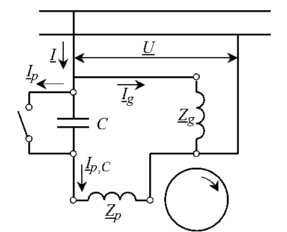

**Slika 58.1 —** Šema veze jednofaznog motora: paralelno na mrežni napon $\underline{U}$ vezane su glavna faza ($\underline{Z}_g$) i pomoćna faza ($\underline{Z}_p$) sa redno vezanim kondenzatorom $C$; prekidač je vezan paralelno kondenzatoru i njegovim zatvaranjem kondenzator se premošćava.

> **Kako čitati sliku 58.1:** Ovo je električna šema (crno-bela), pa nema osa — prati se put struje od mreže do namotaja. Dve debele horizontalne linije na vrhu su provodnici monofazne mreže; strelica $\underline{U}$ između njih označava mrežni napon ($220\ \mathrm{V}$, $50\ \mathrm{Hz}$), a strelica $\underline{I}$ nadole ukupnu struju koju motor uzima iz mreže (crta ispod slova = kompleksna veličina, fazor). U prvom čvoru struja se grana: udesno teče struja glavne faze $\underline{I}_g$ kroz kalem označen $\underline{Z}_g = 15{,}1 + j\,12{,}4\ \mathrm{\Omega}$ (glavni namotaj, vezan direktno na mrežu), a nadole struja pomoćne grane. U pomoćnoj grani su kondenzator $C$ (dve paralelne crte; upravo njegovu kapacitivnost tražimo, $\approx 63\ \mathrm{\mu F}$) i, paralelno njemu, prekidač (dva kružića sa kosom polugom, nacrtan otvoren): dok je otvoren — a takav je pri startu — sva struja pomoćne grane, označena $\underline{I}_{p,C}$, prolazi kroz kondenzator i dalje kroz namotaj pomoćne faze $\underline{Z}_p = 31{,}9 + j\,11{,}7\ \mathrm{\Omega}$ (donji kalem); zatvaranjem prekidača kondenzator bi bio premošćen (izbačen iz kola). Strelica $\underline{I}_p$ uz levi vod označava struju kroz granu prekidača. Kružić sa strelicom dole desno je rotor sa naznačenim smerom obrtanja. Šta treba da zaključiš: obe grane vise na istom naponu $\underline{U}$, pa fazna razlika njihovih struja može poteći jedino od različitog karaktera impedansi dve grane — upravo to podešavamo kondenzatorom $C$.

## Podaci

| Veličina | Oznaka | Vrednost | Šta ta veličina fizički znači |
|---|---|---|---|
| Nazivna snaga | $P_{\mathrm{n}}$ | $2{,}5\ \mathrm{kW}$ | Mehanička snaga koju motor trajno daje na vratilu; ovde služi samo za orijentaciju o "veličini" motora. |
| Nazivni napon | $U$ | $220\ \mathrm{V}$ | Efektivna vrednost monofaznog mrežnog napona na koji se motor priključuje. |
| Učestanost mreže | $f$ | $50\ \mathrm{Hz}$ | Broj perioda naizmeničnog napona u sekundi; određuje kružnu učestanost $\omega = 2\pi f$. |
| Impedansa glavne faze (zakočen rotor) | $\underline{Z}_g = R_g + jX_g$ | $15{,}1 + j\,12{,}4\ \mathrm{\Omega}$ | Ukupno "protivljenje" glavnog namotaja proticanju naizmenične struje u trenutku starta: $R_g = 15{,}1\ \mathrm{\Omega}$ je aktivna (omska) otpornost, $X_g = 12{,}4\ \mathrm{\Omega}$ induktivna reaktansa. |
| Impedansa pomoćne faze (zakočen rotor) | $\underline{Z}_p = R_p + jX_p$ | $31{,}9 + j\,11{,}7\ \mathrm{\Omega}$ | Isto to za pomoćni namotaj: $R_p = 31{,}9\ \mathrm{\Omega}$, $X_p = 11{,}7\ \mathrm{\Omega}$. Pomoćni namotaj je namerno "otporniji" (tanja žica, više navojaka). |
| Traženi fazni pomeraj struja | $\varphi_{gp}$ | $90^\circ$ | Ugao za koji struja pomoćne faze treba vremenski da prednjači struji glavne faze pri startu, da bi polje bilo približno kružno (simetrično). |

**Traži se:** kapacitivnost $C$ kondenzatora u rednoj vezi sa pomoćnom fazom.

Napomena o oznakama: crta ispod slova ($\underline{Z}$, $\underline{I}$, $\underline{U}$) označava **kompleksnu veličinu** (fazor ili kompleksnu impedansu). Impedanse su date "pri zakočenom rotoru" — to je upravo stanje u trenutku starta, jer rotor još ne rotira; zato ove vrednosti smemo da koristimo direktno za proračun startnog kondenzatora.

## Šta se traži i zašto

Traži se samo jedna veličina, ali je put do nje popločan celokupnom teorijom monofaznog asinhronog motora, koju ćemo zato detaljno izložiti.

**Kapacitivnost kondenzatora $C$.** Zašto bi to inženjera zanimalo? Monofazni motor bez pomoćne faze **nema polazni moment** — priključen na mrežu, zuji i stoji u mestu. Kondenzator u pomoćnoj fazi je najjeftiniji i najčešći način da se motor "prevari" da vidi obrtno polje i krene sam (mašina za veš, frižider, mala pumpa, ventilator — svi oni imaju ovakav kondenzator). Ako kondenzator izaberemo pogrešno, motor kreće slabo, trza ili uopšte ne kreće, a kondenzator može i da pregori. Dakle, dimenzionisanje kondenzatora je standardan, praktičan inženjerski zadatak.

**Plan rešavanja (4 koraka):**

1. Iz impedanse glavne faze izračunamo ugao $\varphi_g$ za koji struja glavne faze **kasni** za naponom (jer je glavni namotaj otporno-induktivan).
2. Iz uslova simetričnog polja ($\varphi_{gp} = \varphi_g - \varphi_p = 90^\circ$) izračunamo koliki mora biti fazni stav $\varphi_p$ struje pomoćne faze — ispašće negativan, tj. struja pomoćne faze mora da **prednjači** naponu.
3. Napišemo ukupnu impedansu pomoćne grane sa kondenzatorom, $\underline{Z}_u = R_p + j(X_p + X_C)$, i iz zahtevanog ugla $\varphi_p$ izračunamo potrebnu reaktansu kondenzatora $X_C$ (biće negativna — kapacitivna).
4. Iz $X_C$ i poznate učestanosti mreže izračunamo kapacitivnost $C = -1/(\omega X_C)$.

## Potrebna teorija — mini-lekcije

Originalna zbirka u okviru ovog zadatka izlaže celu teoriju monofaznog asinhronog motora. Prenosimo je u celini, pojednostavljenu, jer bez nje ni uslov "$90^\circ$ između struja" ni sam smisao kondenzatora nisu jasni.

### Mini-lekcija 1: Fazori, impedansa i fazni stav struje

U kolu naizmenične struje učestanosti $f$ sve struje i naponi su sinusoide iste učestanosti, pa se svaka veličina može opisati sa samo dva podatka: **amplitudom** (odnosno efektivnom vrednošću) i **početnom fazom** (uglom). Takav zapis se zove **fazor** i piše se kao kompleksan broj, npr. $\underline{I} = I e^{j\alpha}$, gde je $I$ efektivna vrednost, a $\alpha$ fazni ugao.

**Impedansa** rednog kola sa otpornikom $R$ i reaktansom $X$ je kompleksan broj

$$\underline{Z} = R + jX,$$

gde je $R$ aktivna (omska) otpornost (troši energiju, pretvara je u toplotu), a $X$ **reaktansa** — "protivljenje" koje potiče od magnetnog polja kalema ($X_L = \omega L > 0$, induktivna) ili od električnog polja kondenzatora ($X_C = -1/(\omega C) < 0$, kapacitivna; znak minus je stvar konvencije koju ovde dosledno koristimo — kapacitivna reaktansa se u zbir $X$ unosi kao negativan broj).

Struja kroz impedansu priključenu na napon $\underline{U}$ je $\underline{I} = \underline{U}/\underline{Z}$. Ako napon uzmemo za referencu (fazni ugao nula), onda struja ima fazni ugao $-\varphi$, gde je

$$\varphi = \arctan\!\frac{X}{R}$$

ugao (argument) impedanse. Tumačenje koje ćemo stalno koristiti:

- $X > 0$ (pretežno induktivno kolo) $\Rightarrow \varphi > 0 \Rightarrow$ struja **kasni** za naponom za ugao $\varphi$;
- $X < 0$ (pretežno kapacitivno kolo) $\Rightarrow \varphi < 0 \Rightarrow$ struja **prednjači** naponu za ugao $|\varphi|$.

Intuicija: kalem se "opire" promeni struje, pa struja kroz njega uvek "zaostaje" za naponom; kondenzator mora prvo da se napuni strujom da bi se na njemu pojavio napon, pa struja kroz njega "žuri" ispred napona. Upravo tu osobinu kondenzatora ćemo iskoristiti: dodavanjem dovoljno velike kapacitivne reaktanse u pomoćnu granu, njena struja će iz "kasni" preći u "prednjači".

### Mini-lekcija 2: Pulsirajuće polje i Leblanova teorema — zašto čist monofazni motor ne kreće sam

Krenimo od najprostijeg slučaja: motor koji na statoru ima **samo jedan** namotaj, priključen na monofazni napon. Takav "čist" jednofazni asinhroni motor prikazuje slika 58.2: levo je električna šema, a desno poprečni presek statora sa razlaganjem magnetopobudne sile.

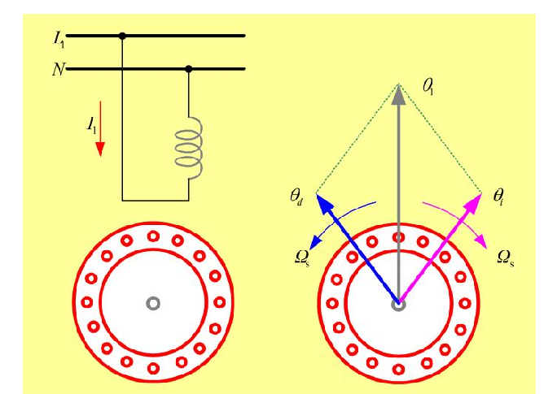

**Slika 58.2 —** Principijelna šema čistog jednofaznog asinhronog motora: jedan statorski namotaj stvara pulsirajuću mps $\theta_1$, koja se razlaže na direktnu ($\theta_d$) i inverznu ($\theta_i$) obrtnu komponentu, svaka upola manje amplitude, koje rotiraju brzinom $\Omega_s$ u suprotnim smerovima.

> **Kako čitati sliku 58.2:** Slika nema ose — sastoji se od tri crteža. **Gore levo** je šema: dve horizontalne linije su fazni provodnik $L_1$ i nula $N$ monofazne mreže, između njih je vezan jedan jedini statorski namotaj (sivi kalem), a crvena strelica $I_1$ označava njegovu struju. **Dole levo** je poprečni presek statora: crveni prsten sa kružićima predstavlja statorsko gvožđe sa žlebovima u kojima leži taj namotaj (u sredini je samo vratilo — rotor je radi preglednosti izostavljen). **Desno** je isti presek sa vektorima magnetopobudne sile (mps): sivi vertikalni vektor $\theta_1$ je trenutna mps namotaja — ona **pulsira** duž jedne jedine, vertikalne ose (raste, opada i menja znak, ali nikad ne menja pravac); plavi vektor $\theta_d$ (gore levo) i ružičasti vektor $\theta_i$ (gore desno) su dve **obrtne** komponente na koje se pulsirajuća mps razlaže po Leblanovoj teoremi — svaka ima **polovinu** amplitude $\theta_1$. Lučne strelice uz njih, obe označene $\Omega_s$, pokazuju smerove rotacije: plava komponenta rotira suprotno kazaljci na satu (direktno polje), ružičasta u smeru kazaljke (inverzno polje) — obe sinhronom brzinom. Zelene tačkaste linije obrazuju paralelogram sabiranja: u svakom trenutku je $\theta_d + \theta_i = \theta_1$. Šta treba da zaključiš: jedan namotaj neizbežno pravi **dva** jednaka obrtna polja suprotnih smerova, pa na zakočen rotor deluju dva jednaka i suprotna momenta — zato ovakav motor ne može sam da krene.

To razlaganje je **Leblanova teorema** i nije nikakva magija, nego obična trigonometrija. Mps jednog namotaja raspoređena je duž vazdušnog zazora kao $\cos x$ (gde je $x$ električni ugao položaja duž obima), a u vremenu pulsira kao $\cos\omega t$, dakle:

$$\Theta(x,t) = \Theta_m \cos(\omega t)\cos(x).$$

Primenimo identitet za proizvod kosinusa, $\cos a \cos b = \tfrac{1}{2}\big[\cos(a-b) + \cos(a+b)\big]$:

$$\Theta(x,t) = \underbrace{\frac{\Theta_m}{2}\cos(x - \omega t)}_{\text{direktni talas}} + \underbrace{\frac{\Theta_m}{2}\cos(x + \omega t)}_{\text{inverzni talas}}.$$

Prvi sabirak je talas koji putuje u smeru porasta $x$ (**direktno polje**), drugi talas putuje u suprotnom smeru (**inverzno polje**); oba imaju **polovinu** amplitude prvobitnog pulsirajućeg polja i rotiraju sinhronom brzinom. Ovaj faktor $\tfrac{1}{2}$ zapamti — pojaviće se u ekvivalentnoj šemi (Mini-lekcija 4).

**Zašto motor ne kreće?** Svako od ta dva obrtna polja "vuče" rotor za sobom kao kod običnog asinhronog motora, ali u suprotnim smerovima. Dok rotor **stoji**, on je prema oba polja u potpuno istom položaju (oba klize preko njega istom relativnom brzinom), pa su momenti jednaki po intenzitetu i suprotni po smeru — rezultantni moment je **nula**. Motor zuji i stoji.

**Zašto nastavi da se okreće ako ga gurnemo?** Ako rotor mehanički pokrenemo u jednu stranu, situacija prestaje da bude simetrična. Za polje koje rotira u istom smeru kao rotor (**direktno polje**) relativna brzina klizanja rotora opada, pa opada i učestanost struja koje to polje indukuje u rotoru; sa manjom učestanošću opada induktivna otpornost rotorskog kola, pa raste **aktivna komponenta** rotorske struje — a baš ta komponenta pravi moment. Za polje suprotnog smera (**inverzno polje**) dešava se sve obrnuto: učestanost rotorskih struja raste, induktivna otpornost raste, aktivna komponenta struje opada, moment slabi. Zaključak: čim se rotor pokrene, direktno polje "pobedi", javlja se neto moment u smeru pokretanja, motor ubrzava i može da savlada opterećenje. Problem je, dakle, samo **polazak** — i ceo ostatak ovog zadatka bavi se time kako polazak obezbediti.

### Mini-lekcija 3: Monofazni motor kao dva trofazna motora na istom vratilu; klizanje prema direktnom i inverznom polju

Prethodna slika sugeriše korisnu misaonu konstrukciju: pošto u monofaznom motoru istovremeno postoje **dva** obrtna polja suprotnih smerova, monofazni motor se može predstaviti kao **dva trofazna motora čiji su rotori kruto spojeni istim vratilom**, a statorski namotaji su priključeni na trofaznu mrežu sa **različitim redosledom faza** (zamena redosleda dve faze obrće smer obrtnog polja). To prikazuje slika 58.3.

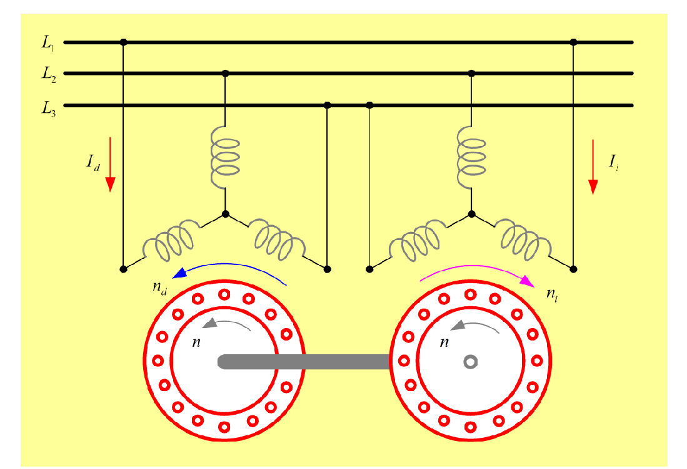

**Slika 58.3 —** Predstavljanje monofaznog asinhronog motora sa dva trofazna: rotori su mehanički spojeni vratilom (zajednička brzina $n$), a statori su priključeni na mrežu sa suprotnim redosledom faza, pa jedan stvara direktno polje ($n_d$), a drugi inverzno ($n_i$). Pri mirovanju su njihovi momenti jednaki i suprotni, pa se sklop ne može sam pokrenuti.

> **Kako čitati sliku 58.3:** Gore su tri debele horizontalne linije — fazni provodnici trofazne mreže $L_1$, $L_2$ i $L_3$. Na njih su priključena dva identična trofazna statorska namotaja u sprezi zvezda (sivi kalemovi sa zajedničkim zvezdištem): levi motor uzima struju $I_d$ (leva crvena strelica), desni struju $I_i$ (desna crvena strelica). Ključna razlika je u redosledu priključenja: kod desnog motora su dve faze međusobno zamenjene (na slici se vidi ukrštanje provodnika ka mreži), a zamena redosleda dve faze obrće smer obrtnog polja. Zato plava lučna strelica $n_d$ nad levim statorom pokazuje jedan smer obrtanja polja (direktno polje), a ružičasta lučna strelica $n_i$ nad desnim statorom suprotan smer (inverzno polje). Dole su poprečni preseci dva statora (crveni prstenovi sa žlebovima), čiji su rotori kruto spojeni debelim sivim vratilom; sive lučne strelice $n$ u oba preseka pokazuju isti smer — rotori se, prinuđeni zajedničkim vratilom, obrću istom brzinom $n$. Šta treba da zaključiš: monofazni motor se ponaša kao ova dva trofazna na istom vratilu — jedno polje rotor "vuče" (klizanje $s$), drugo ga koči (klizanje $2-s$), a pri mirovanju su im momenti jednaki i suprotni, pa sklop ne može sam da krene.

Za svaki od ta dva fiktivna motora definiše se **klizanje** — relativna razlika brzine polja i brzine rotora. Podsetnik: klizanje je mera "koliko rotor zaostaje za poljem"; za polje brzine $n_s$ i rotor brzine $n$ klizanje je $(n_s - n)/n_s$.

**Klizanje prema direktnom polju** (polje brzine $+n_s$, isti smer kao usvojeni pozitivan smer obrtanja rotora):

$$s_d = \frac{n_s - n}{n_s} = s.$$

To je obično, "školsko" klizanje $s$, isto kao kod trofaznog motora.

**Klizanje prema inverznom polju** (polje brzine $-n_s$, suprotan smer): u istu definiciju uvrstimo $-n_s$ umesto $n_s$:

$$s_i = \frac{-n_s - n}{-n_s}.$$

Izvedimo dokle god se ne pojavi $s$. Podelimo brojilac i imenilac sa $-n_s$:

$$s_i = \frac{-n_s - n}{-n_s} = \frac{n_s + n}{n_s} = 1 + \frac{n}{n_s}.$$

Iz definicije direktnog klizanja je $n = n_s(1-s)$, pa je $n/n_s = 1-s$, i konačno:

$$s_i = 1 + (1 - s) = 2 - s.$$

Provera na dva granična slučaja: pri mirovanju ($n=0$, tj. $s=1$) oba klizanja su jednaka, $s_d = s_i = 1$ — rotor je prema oba polja u istom položaju, što je tačno slika situacije "motor ne može sam da krene". Pri sinhronoj brzini direktnog polja ($s=0$) inverzno klizanje je $s_i = 2$ — rotor "seče" inverzno polje dvostrukom sinhronom brzinom, pa su učestanosti struja koje inverzno polje indukuje u rotoru veoma visoke (blizu $2f$), njihova aktivna komponenta mala, i inverzno polje tada pravi samo mali kočioni moment i dodatne gubitke.

### Mini-lekcija 4: Ekvivalentna šema monofaznog asinhronog motora

Kod trofaznog asinhronog motora jedna faza se predstavlja poznatom ekvivalentnom šemom: redno statorska otpornost $R_s$ i statorska rasipna reaktansa $X_{\gamma s}$, zatim paralelna magnetizaciona grana $X_\mu$ (grana koja "pravi" obrtno polje), i rotorska grana sa svedenom rasipnom reaktansom $X'_{\gamma r}$ i svedenom otpornošću $R'_r/s$ (kroz koju se modeluju i gubici u bakru rotora i mehanička snaga; apostrof označava da su rotorske veličine svedene na statorsku stranu).

Pošto smo monofazni motor predstavili kao **redno vezana dva trofazna motora** — jedan koji kliže prema direktnom polju sa klizanjem $s$, i jedan koji kliže prema inverznom polju sa klizanjem $2-s$ — njegova ekvivalentna šema se dobija **rednim vezivanjem dve trofazne ekvivalentne šeme**, s tim što svaka od njih nosi faktor $\tfrac{1}{2}$: svako od dva obrtna polja ima po **polovinu** amplitude ukupnog pulsirajućeg polja (Leblanova teorema iz Mini-lekcije 2), pa se svakom polju pripisuje po polovina parametara.

To prikazuje slika 58.4. Suština: kroz oba pod-kola (direktno i inverzno) teče ista statorska struja $\underline{I}_1$; napon na direktnom pod-kolu je $\underline{U}_{1d} = \tfrac{1}{2}\underline{Z}_d\,\underline{I}_1$, gde je $\underline{Z}_d$ ukupna impedansa trofazne ekvivalentne šeme pri klizanju $s$, napon na inverznom je $\underline{U}_{1i} = \tfrac{1}{2}\underline{Z}_i\,\underline{I}_1$ (isto, ali pri klizanju $2-s$), pa je ukupan napon na motoru

$$\underline{U}_1 = \underline{U}_{1d} + \underline{U}_{1i} = \frac{1}{2}\big(\underline{Z}_d + \underline{Z}_i\big)\,\underline{I}_1.$$

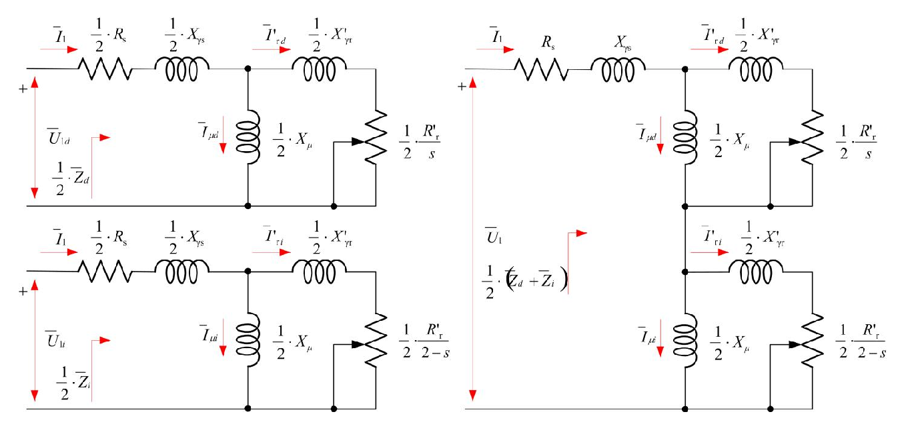

**Slika 58.4 —** Ekvivalentna šema jednofaznog asinhronog motora: redna veza polovina ekvivalentnih šema dva trofazna motora — direktnog (rotorska otpornost $\tfrac{1}{2}R'_r/s$) i inverznog (rotorska otpornost $\tfrac{1}{2}R'_r/(2-s)$). Levo: razdvojeno na dva pod-kola sa naponima $\underline{U}_{1d}$ i $\underline{U}_{1i}$; desno: sažeta šema sa objedinjenim statorskim elementima $R_s$, $X_{\gamma s}$.

> **Kako čitati sliku 58.4:** Ekvivalentna šema (kolo po jednoj fazi); struje i naponi označeni su crvenim strelicama, a kompleksne veličine crtom **iznad** slova ($\overline{I}_1$ — isto što i naše $\underline{I}_1$). **Leva polovina:** dva pod-kola vezana na red, kroz oba teče ista statorska struja $\overline{I}_1$. Gornje pod-kolo je "direktna mašina": redno cik-cak simbol $\tfrac{1}{2}R_s$ (polovina statorske otpornosti, u $\mathrm{\Omega}$) i kalem $\tfrac{1}{2}X_{\gamma s}$ (polovina statorske rasipne reaktanse); zatim paralelna magnetizaciona grana — kalem $\tfrac{1}{2}X_\mu$ kroz koji teče struja magnećenja $\overline{I}_{\mu d}$ (ona "pravi" direktno obrtno polje); i rotorska grana — kalem $\tfrac{1}{2}X'_{\gamma r}$ pa promenljivi otpornik (simbol sa kosom strelicom) $\tfrac{1}{2}\,R'_r/s$, kroz koje teče svedena rotorska struja $\overline{I}'_{rd}$. Napon na celom gornjem pod-kolu označen je $\overline{U}_{1d}$, a njegova impedansa $\tfrac{1}{2}\overline{Z}_d$. Donje pod-kolo ("inverzna mašina") potpuno je isto, samo sa indeksom $i$ ($\overline{I}_{\mu i}$, $\overline{I}'_{ri}$, $\overline{U}_{1i}$, $\tfrac{1}{2}\overline{Z}_i$) i rotorskim otpornikom $\tfrac{1}{2}\,R'_r/(2-s)$ — to je **jedina** razlika između dva pod-kola. **Desna polovina:** ista šema, sažeta — statorski elementi dva pod-kola sabrani su u $R_s$ i $X_{\gamma s}$ (smemo, jer kroz oba teče ista struja $\overline{I}_1$), na ulazu je ukupan napon $\overline{U}_1$ i ukupna impedansa $\tfrac{1}{2}(\overline{Z}_d + \overline{Z}_i)$. Karakteristične vrednosti: pri startu ($s=1$) oba rotorska otpornika imaju istu vrednost $\tfrac{1}{2}R'_r$ — pod-kola su identična (potpuna simetrija, nula momenta); pri malom $s$ direktni otpornik $\tfrac{1}{2}R'_r/s$ postaje velik (tu se "troši" mehanička snaga), a inverzni teži $\tfrac{1}{4}R'_r$ — mali, pravi samo gubitke i kočenje. Šta treba da zaključiš: monofazni motor je, električno gledano, redna veza "pola direktnog" i "pola inverznog" trofaznog motora; faktor $\tfrac{1}{2}$ svuda potiče od Leblanovog razlaganja pulsirajućeg polja na dva obrtna upola manje amplitude.

Fizičko čitanje šeme: pri mirovanju ($s=1$) obe rotorske otpornosti su jednake ($R'_r/1 = R'_r/(2-1)$), obe polušeme su identične — potpuna simetrija, nula momenta. Kako motor ubrzava ($s \to 0$), otpornost direktne grane $\tfrac{1}{2}R'_r/s$ raste (velika aktivna snaga se "predaje" mehanici), a inverzne $\tfrac{1}{2}R'_r/(2-s) \to \tfrac{1}{2}R'_r/2$ postaje mala — inverzna polušema se ponaša skoro kao kratak spoj koji samo pravi gubitke i mali kočioni moment.

### Mini-lekcija 5: Mehanička (momentna) karakteristika monofaznog motora

Elektromagnetni moment monofaznog motora dobija se **sabiranjem** momenata koje prave direktno i inverzno polje:

$$M(s) = M_d(s) + M_i(s),$$

za ceo opseg klizanja od $s=0$ (rotor na sinhronoj brzini direktnog polja) do $s=2$ (rotor na sinhronoj brzini inverznog polja, tj. obrće se "unazad" punom brzinom). $M_d(s)$ je obična momentna karakteristika trofaznog motora; $M_i(s)$ je ista takva karakteristika, ali za polje suprotnog smera, pa deluje suprotnim (negativnim) momentom.

Rezultat prikazuje slika 58.5.

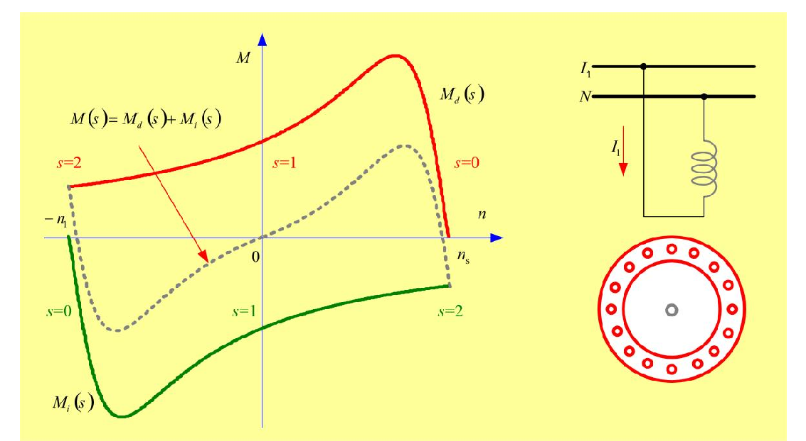

**Slika 58.5 —** Mehanička karakteristika jednofaznog asinhronog motora: $M(s) = M_d(s) + M_i(s)$. U tački $n=0$ ($s=1$) rezultantni moment je nula — **motor nema polazni moment**; čim se zavrti u bilo koju stranu, javlja se neto moment u tom smeru.

> **Kako čitati sliku 58.5:** Na horizontalnoj osi (plava strelica udesno) je brzina obrtanja rotora $n$, na vertikalnoj moment $M$; obe bez brojčanih podeoka — bitan je oblik krivih. Osa brzine ide od $-n_s$ na levom kraju (na slici otisnuto kao $-n_1$ — nedoslednost obeležavanja u originalu; reč je o istoj sinhronoj brzini koja je na desnom kraju označena sa $n_s$) do $+n_s$ na desnom kraju. Uz krive su upisane vrednosti klizanja, i to u dve boje: **crvenim** slovima klizanje prema direktnom polju ($s=2$ na levom kraju, $s=1$ pri $n=0$, $s=0$ pri $n=n_s$), a **zelenim** klizanje prema inverznom polju (obrnuto: $0$ levo, $1$ u sredini, $2$ desno — u skladu sa vezom $s_i = 2-s$ iz Mini-lekcije 3). Tri krive: **crvena** $M_d(s)$ je momentna karakteristika direktnog polja — obična karakteristika trofaznog motora, sa pozitivnim prevalom nedaleko od $n_s$; **zelena** $M_i(s)$ je karakteristika inverznog polja — ista takva, ali sa negativnim momentom i prevalnom "jamom" blizu $-n_s$ (ona uvek koči obrtanje u pozitivnom smeru); **siva isprekidana** je njihov zbir $M(s) = M_d(s) + M_i(s)$ — stvarna karakteristika monofaznog motora (crvena kosa strelica sa formulom pokazuje baš na nju). Karakteristične tačke sive krive: prolazi kroz koordinatni početak ($n=0$, $M=0$ — nema polaznog momenta) i seče nulu momenta malo **pre** desnog kraja ose (pri $s=0$ je $M_d = 0$, a $M_i < 0$ i dalje koči, pa je zbir negativan). Desno na slici su podsetnici: šema (jedan namotaj između $L_1$ i $N$, struja $I_1$) i presek statora — reč je o čistom monofaznom motoru bez pomoćne faze. Šta treba da zaključiš: rezultantni moment je nula baš pri mirovanju, ali čim se rotor zavrti u bilo koju stranu, zbir postaje različit od nule u tom smeru — motor ne kreće sam, ali "prihvata" guranje i dalje ubrzava.

Dva ključna zapažanja sa slike (oba iz originala):

1. **Odsustvo polaznog momenta**: siva kriva prolazi kroz nulu baš pri $n=0$ ($s=1$), jer su tamo $M_d$ i $M_i$ jednaki i suprotni. To je grafička potvrda zaključka iz Mini-lekcije 2.
2. **Veće nazivno klizanje nego kod trofaznog motora iste snage**: primeti da rezultantna kriva seče nulu momenta **pre** sinhrone brzine — pri $s=0$ direktno polje više ne pravi moment ($M_d = 0$), ali inverzno i dalje koči ($M_i < 0$), pa je ukupan moment negativan. Radna tačka sa pozitivnim momentom mora zato biti na nešto nižoj brzini (većem klizanju) nego kod trofaznog motora; uz to inverzno polje stalno pravi dodatne gubitke, pa je i stepen iskorišćenja manji.

### Mini-lekcija 6: Pomoćna faza — kako se pravi obrtno polje iz monofazne mreže

Monofazni motor će moći sam da krene ako u njemu pri startu nastane **rezultantno obrtno polje** (a ne čisto pulsirajuće). Da se motor ne bi pokretao mehanički (rukom!), na stator se, pored glavnog, postavlja **pomoćni namotaj (pomoćna faza)**, koji je **prostorno pomeren** u odnosu na glavni (tipično za $90^\circ$ električnih — smešten je u žlebove "između" glavnog namotaja). Ali prostorni pomeraj sam po sebi nije dovoljan: da bi dva namotaja napravila obrtno polje, njihove struje moraju biti pomerene i **vremenski** (fazno). Pošto su oba namotaja priključena na isti napon, fazna razlika struja se pravi tako što se u pomoćnu fazu redno doda element drugačijeg karaktera — **otpornik, kondenzator ili prigušnica** (zajednički naziv: **predspojna naprava**).

To prikazuje slika 58.6.

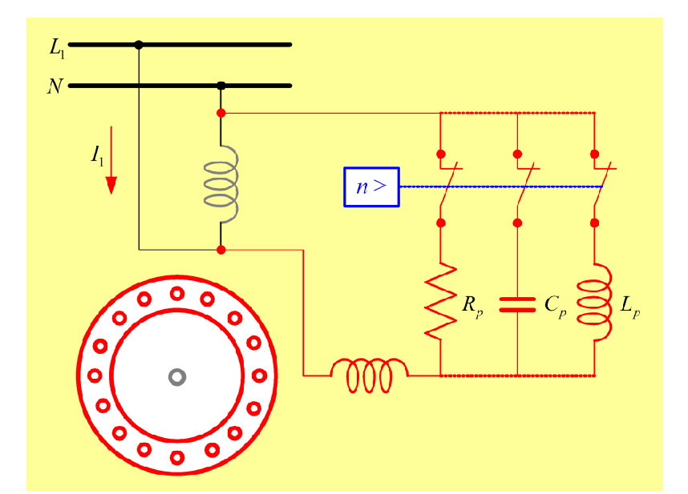

**Slika 58.6 —** Jednofazni asinhroni motor sa dodatim otpornikom ($R_p$), kondenzatorom ($C_p$) ili prigušnicom ($L_p$) u kolu pomoćne faze; "$n>$" je centrifugalni prekidač koji pomoćnu granu isključuje po zaletu.

> **Kako čitati sliku 58.6:** Električna šema u boji, bez osa. Gore su fazni provodnik $L_1$ i nula $N$ monofazne mreže; na njih je direktno vezan glavni namotaj (sivi kalem), kroz koji teče struja $I_1$ (crvena strelica). Pomoćni namotaj je nacrtan **crveno** (kalem dole, u sredini slike) i na mrežu se vezuje preko jedne od tri **predspojne naprave**, nacrtane kao tri paralelne grane desno: otpornik $R_p$ (cik-cak simbol), kondenzator $C_p$ (dve paralelne crte) ili prigušnica $L_p$ (kalem); u svakoj grani je i po jedan prekidački kontakt. Tačkaste crvene linije koje tri grane spajaju gore i dole znače da su to tri *alternative* — u stvarnoj mašini ugrađena je samo jedna od njih. Plavi pravougaonik sa natpisom "$n>$", povezan plavom isprekidanom linijom sa kontaktima, jeste **centrifugalni prekidač**: kada brzina pređe zadatu vrednost, on automatski otvara kontakt i isključuje pomoćnu granu (o startnoj i pogonskoj varijanti više u Mini-lekciji 7). Dole levo je poprečni presek statora. Šta treba da zaključiš: fazni pomeraj struje pomoćne faze pravi se rednim elementom drugačijeg karaktera od namotaja — a od tri ponuđene naprave jedino kondenzator može da natera struju da *prednjači* naponu, pa se u praksi (i u ovom zadatku) bira on.

Od tri mogućnosti kondenzator je ubedljivo najbolji: samo on može da struju pomoćne faze pomeri tako da ona **prednjači** naponu, pa se između struja dve faze može postići razlika do punih $90^\circ$. Otpornik i prigušnica samo *smanjuju* zaostajanje pomoćne struje (razlika ostaje znatno manja od $90^\circ$), daju slabije polazno polje, a otpornik uz to i greje. Zato se u praksi (i u ovom zadatku) koristi **kondenzatorski motor**.

**Šta se dobije kad struje nisu baš "idealne"?** Struje glavnog i pomoćnog namotaja koje su međusobno fazno pomerene (za bilo koji ugao različit od $0^\circ$ i $180^\circ$) proizvode **elipsoidno (eliptično) polje**: rezultantni vektor polja rotira, ali mu se pri rotaciji menja intenzitet — vrh vektora opisuje elipsu umesto kružnice. Elipsoidno polje je i dalje *obrtno* polje: ono se može razložiti na kružnu (direktnu) i inverznu komponentu, i njegova kružna komponenta obrće rotor — dakle motor sa pomoćnom fazom **kreće sam**, samo slabije nego da je polje idealno kružno. To prikazuje slika 58.7.

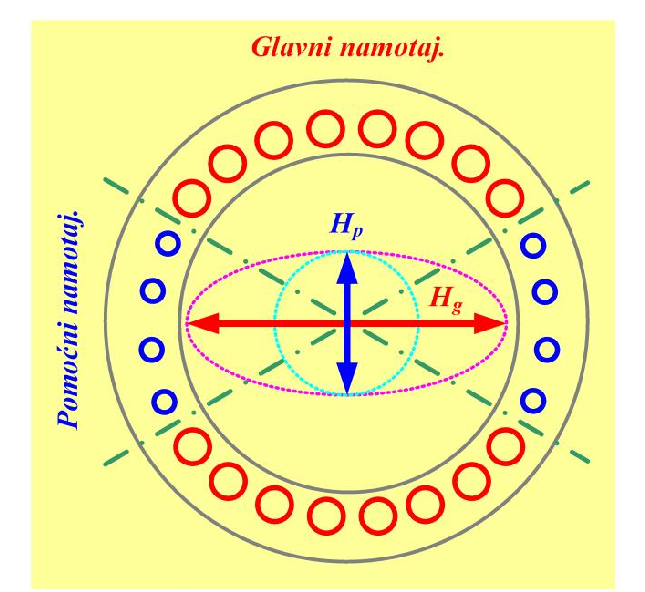

**Slika 58.7 —** Stvaranje rezultantnog elipsoidnog polja kod jednofaznog asinhronog motora: prostorno upravna polja glavnog ($H_g$) i pomoćnog ($H_p$) namotaja, sa fazno pomerenim strujama, daju obrtno polje promenljivog intenziteta (elipsa) koje sadrži kružnu komponentu.

> **Kako čitati sliku 58.7:** Poprečni presek statora sa oba namotaja i vektorima polja; slika nema ose — pravci na crtežu su prostorne (magnetne) ose namotaja. Između dva siva kruga (magnetno kolo statora) leže žlebovi sa provodnicima: **crveni** kružići, grupisani gore i dole, jesu provodnici **glavnog namotaja** (crveni natpis "Glavni namotaj." na vrhu) — magnetna osa mu je zato horizontalna; **plavi** kružići, grupisani levo i desno, jesu provodnici **pomoćnog namotaja** (plavi natpis levo) — osa mu je vertikalna, dakle prostorno pomerena za $90^\circ$ od glavne. Zelene crta-tačka linije su pomoćne ose žlebova. Crvena horizontalna strelica sa vrhovima na **obe** strane je polje glavnog namotaja $H_g$, plava vertikalna dvostrana strelica polje pomoćnog $H_p$ — obe su dvosmerne jer svako od tih polja *pulsira* duž svoje ose; $H_g$ je nacrtano duže (veća amplituda mps). Ružičasta tačkasta **elipsa** je putanja vrha rezultantnog vektora $H_g + H_p$ tokom jedne periode: pošto su struje fazno pomerene, vektor rotira, ali mu se intenzitet menja — od velike poluose (duž $H_g$) do male (duž $H_p$); to je elipsoidno polje. Svetloplava tačkasta **kružnica** u sredini predstavlja kružnu (direktnu) komponentu tog elipsoidnog polja — deo koji se obrće konstantnim intenzitetom i koji jedini pravi polazni moment. Šta treba da zaključiš: čim su struje dva prostorno upravna namotaja i vremenski fazno pomerene, polje postaje obrtno (elipsa) i motor kreće sam; savršenu kružnicu (elipsa prelazi u krug) dobijamo tek kada su amplitude mps jednake i pomeraj struja tačno $90^\circ$ — a taj pomeraj u ovom zadatku podešavamo kondenzatorom.

**Kada je polje savršeno kružno (simetrično)?** Mala računica koja objašnjava ceo zadatak. Neka je glavni namotaj postavljen duž ose $x$, pomoćni duž ose $y$ (prostorni pomeraj $90^\circ$), i neka su im mps jednakih amplituda, a struje pomerene za $90^\circ$ u vremenu:

$$\Theta_x(t) = \Theta_m \cos(\omega t), \qquad \Theta_y(t) = \Theta_m \cos(\omega t - 90^\circ) = \Theta_m \sin(\omega t).$$

Intenzitet rezultantnog vektora je

$$\sqrt{\Theta_x^2 + \Theta_y^2} = \Theta_m\sqrt{\cos^2\omega t + \sin^2\omega t} = \Theta_m = \mathrm{const},$$

a njegov ugao prema osi $x$ je $\arctan(\Theta_y/\Theta_x) = \omega t$ — vektor konstantne dužine koji rotira ugaonom brzinom $\omega$: **kružno obrtno polje**, potpuno isto kao u trofaznom motoru. Dakle, uslovi savršene simetrije su: (1) prostorni pomeraj namotaja $90^\circ$, (2) **vremenski pomeraj struja $90^\circ$**, (3) jednake amplitude mps oba namotaja. Uslov (1) je stvar konstrukcije; uslov (2) je ono što u ovom zadatku podešavamo kondenzatorom; uslov (3) se podešava brojem navojaka i u ovom zadatku nije obuhvaćen — zato postavka kaže "**približno** simetrično polje".

Dakle: strujno kolo pomoćnog namotaja mora imati **drugačiji karakter impedanse** od glavnog, i to takav da fazna razlika struja bude što bliža $90^\circ$. Fazorski dijagram struja kondenzatorskog motora prikazuje slika 58.8.

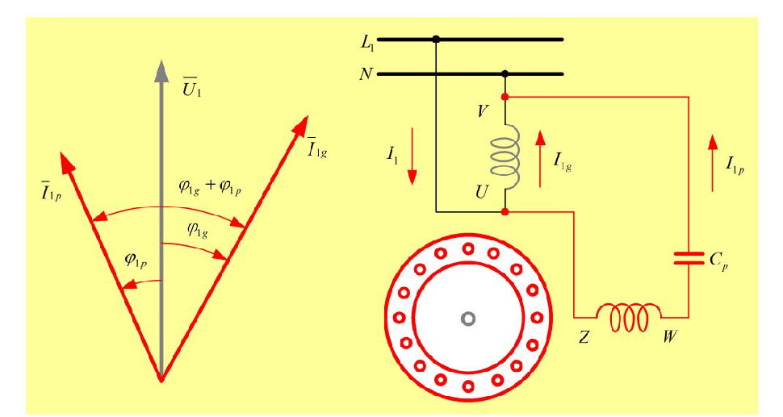

**Slika 58.8 —** Fazorski dijagram struja kondenzatorskog motora: struja glavne faze $\underline{I}_{1g}$ kasni za naponom $\underline{U}_1$ (induktivan karakter), struja pomoćne faze $\underline{I}_{1p}$ prednjači (kapacitivan karakter); ukupan međusobni ugao struja je $\varphi_{1g}+\varphi_{1p}$.

> **Kako čitati sliku 58.8:** Slika ima dva dela. **Levo je fazorski dijagram struja.** Referentni fazor je mrežni napon $\overline{U}_1$ — sivi vertikalni vektor; svi fazori rotiraju suprotno kazaljci na satu, pa fazor zakrenut od napona ulevo (suprotno kazaljci) *prednjači*, a zakrenut udesno *kasni*. Crveni fazor $\overline{I}_{1g}$ (desno od napona) je struja glavne faze — kasni za naponom za ugao $\varphi_{1g}$, jer je glavni namotaj otporno-induktivan; u našem zadatku pri startu $\varphi_{1g} = 39{,}39^\circ$. Crveni fazor $\overline{I}_{1p}$ (levo od napona) je struja pomoćne faze sa kondenzatorom — prednjači naponu za $\varphi_{1p}$; kod nas $\varphi_{1p} = 50{,}61^\circ$. Mali lukovi uz napon označavaju ta dva ugla, a najveći luk njihov zbir $\varphi_{1g}+\varphi_{1p}$ — ugao između samih struja, koji izborom kondenzatora teramo na tačno $90^\circ$ ($39{,}39^\circ + 50{,}61^\circ = 90^\circ$). **Desno je šema veze** sa obeleženim krajevima namotaja: glavni namotaj (sivi kalem) između krajeva U i V, vezan direktno između $L_1$ i $N$, sa strujom $I_{1g}$; pomoćna grana (crveno) sa namotajem između krajeva Z i W i rednim kondenzatorom $C_p$, sa strujom $I_{1p}$; $I_1$ je ukupna struja iz mreže, a dole je presek statora. Šta treba da zaključiš: kondenzator prebacuje struju pomoćne faze "na drugu stranu" napona, pa se između struja dveju faza može dobiti punih $90^\circ$ — vremenski uslov (približno) kružnog obrtnog polja.

### Mini-lekcija 7: Startni i pogonski kondenzator; poređenje sa trofaznim motorom

Pomoćna faza može da radi na dva načina:

- **Startni (polazni) kondenzator i startna pomoćna faza:** pomoćni namotaj sa kondenzatorom je uključen samo tokom zaleta, a zatim ga centrifugalni prekidač ("$n>$" sa slike 58.6) isključi. Kondenzator se tada bira da dâ simetrično polje **pri startu** ($s=1$, zakočen rotor) — **upravo to se traži u ovom zadatku.** Pomoćni namotaj tada ne mora biti dimenzionisan za trajan rad (sme da bude tanji).
- **Pogonski (radni) kondenzator i pomoćna radna faza:** kondenzator je trajno uključen; tada popravlja i radne (ne samo polazne) karakteristike i približava ih trofaznom motoru. Kapacitivnost se tada bira da polje bude simetrično **pri nazivnom opterećenju**.

Šta se dešava sa momentnom karakteristikom, prikazuje slika 58.9.

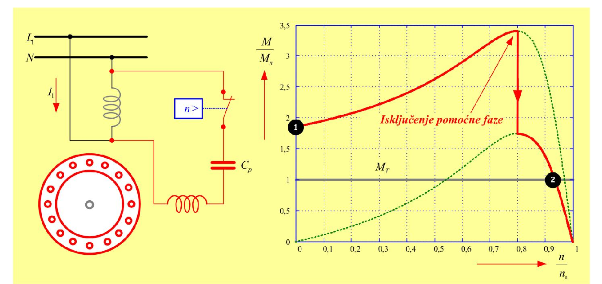

**Slika 58.9 —** Mehanička karakteristika jednofaznog motora sa dodatnim kondenzatorom u pomoćnoj fazi: zalet po kondenzatorskoj karakteristici od tačke 1, isključenje pomoćne faze pri oko $0{,}8\,n_s$, nastavak rada po karakteristici čistog monofaznog motora do radne tačke 2 (presek sa momentom tereta $M_T$).

> **Kako čitati sliku 58.9:** **Levo** je šema veze: glavni namotaj (siv) direktno na $L_1$–$N$ sa strujom $I_1$; pomoćna grana (crvena) sa rednim kondenzatorom $C_p$ i prekidačkim kontaktom kojim komanduje centrifugalni prekidač "$n>$" (plavi blok, plava isprekidana veza) — ovde je kontakt vezan **na red** u pomoćnoj grani, pa njegovo otvaranje isključuje celu pomoćnu fazu; dole levo je presek statora. **Desno** je grafik: na horizontalnoj osi relativna brzina $n/n_s$ (od 0 do 1, podeoci po $0{,}1$; bezdimenzionalno), na vertikalnoj relativni moment $M/M_n$ (od 0 do $3{,}5$, podeoci po $0{,}5$). Puna **crvena** kriva je karakteristika sa uključenom pomoćnom fazom i kondenzatorom: počinje u tački **1** (crni kružić) pri $n=0$ sa polaznim momentom blizu $2\,M_n$ — motor sigurno kreće i pod opterećenjem — i raste do prevala od oko $3{,}4\,M_n$ pri $n \approx 0{,}75\,n_s$. Pri $n \approx 0{,}8\,n_s$ centrifugalni prekidač otvara pomoćnu granu: debela crvena vertikalna strelica nadole (uz crveni natpis "Isključenje pomoćne faze") označava trenutni pad momenta sa kondenzatorske krive na **zelenu tačkastu** krivu — karakteristiku čistog monofaznog motora bez pomoćne faze (počinje iz koordinatnog početka, tj. pri $n=0$ daje nulti moment — uporedi sa slikom 58.5; preval joj je oko $1{,}8\,M_n$). Motor zatim nastavlja po toj karakteristici i ustali se u tački **2** (crni kružić pri $n \approx 0{,}94\,n_s$), gde opadajuća grana seče horizontalnu sivu liniju momenta tereta $M_T$ (nacrtanu na visini $1{,}0\,M_n$) — tu je moment motora jednak momentu tereta. Šta treba da zaključiš: pomoćna faza sa kondenzatorom služi za zalet (velik polazni i prevalni moment), a ustaljeni rad teče po karakteristici čistog monofaznog motora — zato startni kondenzator i startni pomoćni namotaj smeju biti dimenzionisani samo za kratkotrajan rad.

Koliko se kondenzatorski motor približi trofaznom, pokazuje uporedni prikaz na slici 58.10.

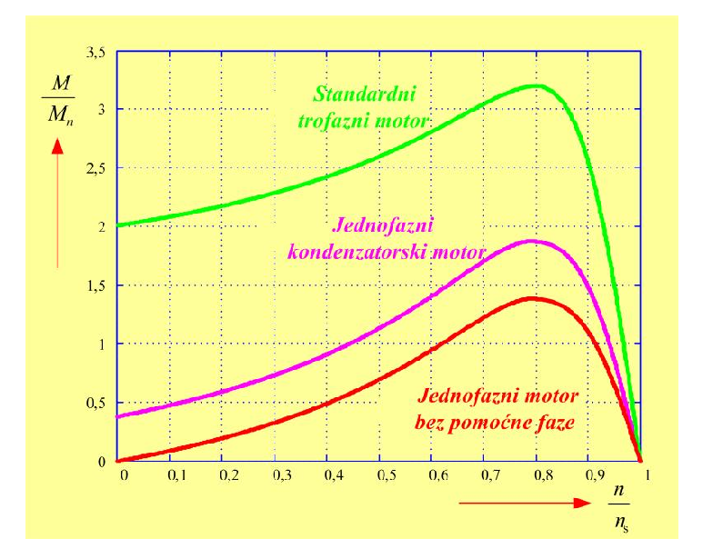

**Slika 58.10 —** Uporedni prikaz mehaničkih karakteristika: standardni trofazni motor (najveći momenti), jednofazni kondenzatorski motor (srednja kriva), jednofazni motor bez pomoćne faze (bez polaznog momenta).

> **Kako čitati sliku 58.10:** Na horizontalnoj osi je relativna brzina $n/n_s$ (od 0 do 1, podeoci po $0{,}1$), na vertikalnoj relativni moment $M/M_n$ (od 0 do $3{,}5$, podeoci po $0{,}5$) — obe bezdimenzionalne, pa se motori različitih snaga mogu pošteno porediti. Tri krive, odozgo nadole: **zelena** — standardni trofazni motor: polazni moment oko $2\,M_n$ (kriva pri $n=0$ počinje na visini 2), prevalni preko $3\,M_n$ (vrh $\approx 3{,}2$ pri $n \approx 0{,}8\,n_s$), nula momenta tačno pri sinhronoj brzini $n/n_s = 1$; **ružičasta** — jednofazni kondenzatorski motor: polazni moment oko $0{,}4\,M_n$ (dovoljno da krene sam), prevalni oko $1{,}9\,M_n$, oblik sličan trofaznom ali sa svuda nižim vrednostima; **crvena** — jednofazni motor bez pomoćne faze: polazni moment tačno **nula** (kriva izlazi iz koordinatnog početka — sam ne može da krene), prevalni oko $1{,}4\,M_n$, a nulu momenta dostiže malo *pre* $n/n_s = 1$ (inverzno polje koči i pre sinhrone brzine, pa je i nazivno klizanje veće — zapažanje 2 uz sliku 58.5). Šta treba da zaključiš: kondenzator "podiže" monofazni motor od neupotrebljivog (crvena kriva) do skoro-trofaznog (ružičasta), ali trofazni motor (zelena) ostaje najbolji po polaznom, prevalnom i nazivnom momentu.

**Praktična pravila za izbor kondenzatora** (iz originala, vredna pamćenja):

- Kapacitivnost pogonskog (trajno uključenog) kondenzatora bira se tako da polje bude simetrično najčešće pri **nazivnom opterećenju**; pri svakom drugom opterećenju polje nije simetrično (javlja se inverzna komponenta i njeni gubici). Startni kondenzator se bira za simetriju **pri polasku** (zakočen rotor) — kao u ovom zadatku.
- Orijentaciona vrednost za trajan rad: oko $25\!-\!55\ \mathrm{\mu F}$ **po kilovatu** snage motora, za mrežu $230\ \mathrm{V}$.
- Kapacitivnost (uz odgovarajuće dimenzionisanje namotaja) treba da obezbedi: napone glavne i pomoćne faze međusobno pomerene za $90^\circ$; da struje obe faze prave **istu magnetopobudnu silu**; da struje u obe faze imaju isti fazni stav prema svojim naponima; i da obe faze budu dimenzionisane za jednaku snagu (za trajan rad).

### Mini-lekcija 8: Napon na kondenzatoru je veći od mrežnog!

Neočekivana, ali za praksu presudna činjenica: **napon na kondenzatoru je znatno veći od napona mreže**. Za motor priključnog napona $230\ \mathrm{V}$ mora se odabrati kondenzator nazivnog napona $450\!-\!550\ \mathrm{V}$ — ko ugradi kondenzator "na 230 V", brzo će ga proburiti proboj.

Zašto je to tako, vidi se iz fazorskog dijagrama napona i struja na slici 58.11 (levo šema sa pogonskim kondenzatorom, desno dijagram). Ključna jednačina pomoćne grane: mrežni napon, koji je ujedno napon na glavnom namotaju ($\underline{U}_{1g} = \underline{U}_1$), u pomoćnoj grani se **deli** na napon namotaja pomoćne faze $\underline{U}_{1p}$ i napon kondenzatora $\underline{U}_C$:

$$\underline{U}_1 = \underline{U}_{1p} + \underline{U}_C.$$

Pri simetričnom polju napon pomoćnog namotaja $\underline{U}_{1p}$ stoji pod $90^\circ$ prema $\underline{U}_{1g}$. Pošto fazori $\underline{U}_{1p}$ i $\underline{U}_C$ sa fazorom $\underline{U}_1$ zatvaraju trougao u kome je $\underline{U}_C$ hipotenuzasta "duga" stranica, intenzitet $U_C$ ispada **veći od $U_1$**. Fizički: kroz kondenzator teče cela struja pomoćne grane, a njegova reaktansa je velika (mora da "preokrene" karakter grane iz induktivnog u kapacitivni), pa je proizvod $U_C = I_{1p}\,|X_C|$ velik.

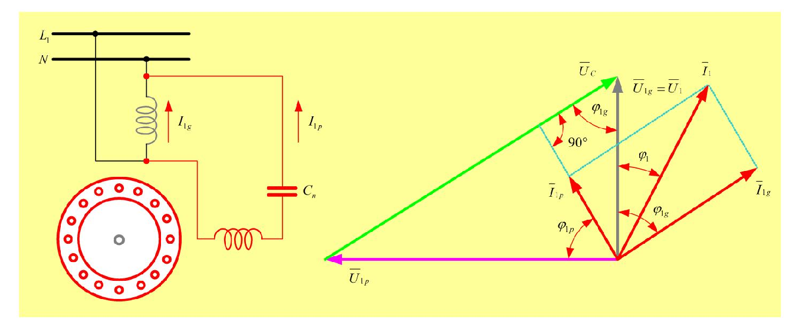

**Slika 58.11 —** Fazorski dijagram napona i struja jednofaznog motora sa kondenzatorom u pomoćnoj fazi: mrežni napon $\underline{U}_1 = \underline{U}_{1g}$ deli se na napon pomoćnog namotaja $\underline{U}_{1p}$ (pod $90^\circ$ prema $\underline{U}_{1g}$ pri simetriji) i napon kondenzatora $\underline{U}_C$, koji je po intenzitetu **veći** od mrežnog — zato se biraju kondenzatori nazivnog napona $450\!-\!550\ \mathrm{V}$ za mrežu $230\ \mathrm{V}$.

> **Kako čitati sliku 58.11:** **Levo** je šema: glavni namotaj (sivi kalem, struja $I_{1g}$) vezan direktno na mrežu $L_1$–$N$; pomoćna grana (crvena, struja $I_{1p}$) sa namotajem i rednim kondenzatorom koji je na ovoj slici označen $C_n$ (trajno uključen, pogonski kondenzator); dole je presek statora. **Desno** je fazorski dijagram — referentni fazor je sivi vertikalni $\overline{U}_{1g} = \overline{U}_1$ (mrežni napon = napon glavnog namotaja); fazori rotiraju suprotno kazaljci na satu, pa fazori levo od napona prednjače, a desno kasne. **Struje (crveno):** $\overline{I}_{1g}$ (dole desno) kasni za naponom za ugao $\varphi_{1g}$; $\overline{I}_{1p}$ (gore levo) prednjači naponu; $\overline{I}_1$ je njihov zbir — svetloplavi tačkasti paralelogram desno je konstrukcija sabiranja $\overline{I}_1 = \overline{I}_{1g} + \overline{I}_{1p}$, a luk $\varphi_1$ označava ugao ukupne struje prema naponu. Luk $\varphi_{1p}$ dole levo je ugao između napona pomoćnog namotaja $\overline{U}_{1p}$ i njegove struje $\overline{I}_{1p}$ — pri simetriji jednak unutrašnjem uglu glavne faze (uslov "isti fazni stav struja prema svojim naponima" iz Mini-lekcije 7). **Naponi pomoćne grane:** ružičasti horizontalni fazor $\overline{U}_{1p}$ (napon namotaja pomoćne faze) upravan je na $\overline{U}_1$ — to je uslov simetrije; zeleni fazor $\overline{U}_C$ (napon kondenzatora) zatvara trougao $\overline{U}_1 = \overline{U}_{1p} + \overline{U}_C$ i ubedljivo je **najduži** fazor na dijagramu — duži i od samog mrežnog napona (u našem računu: već pri startu $U_C \approx 221\ \mathrm{V}$ uz $U_1 = 220\ \mathrm{V}$). Uz vrh zelenog fazora ucrtani su pomoćna konstrukcija sa pravim uglom ("$90^\circ$") i luk $\varphi_{1g}$ — ugao pod kojim $\overline{U}_C$ prednjači mrežnom naponu. Šta treba da zaključiš: kondenzator u pomoćnoj fazi trajno radi pod naponom većim od mrežnog — zato se za mrežu $230\ \mathrm{V}$ biraju kondenzatori nazivnog napona $450\!-\!550\ \mathrm{V}$, nikako "na 230 V".

Time je teorijski uvod zaokružen i možemo na račun.

## Rešenje, korak po korak

### Korak 1: Fazni stav struje glavne faze pri startu

**Zašto ovaj korak:** Uslov zadatka je fazni pomeraj od $90^\circ$ **između struja** dve faze. Da bismo znali gde treba da "stoji" struja pomoćne faze, prvo moramo da utvrdimo gde stoji struja glavne faze — a nju određuje impedansa glavnog namotaja, jer je on vezan direktno na mrežni napon.

Glavna faza je otporno-induktivno kolo ($R_g$, $X_g > 0$), pa njena struja **kasni** za naponom (Mini-lekcija 1) za ugao jednak argumentu impedanse:

$$\varphi_g = \arctan\!\frac{X_g}{R_g}.$$

Ovde je $\varphi_g$ ugao kašnjenja struje glavne faze za naponom, $X_g$ induktivna reaktansa, a $R_g$ aktivna otpornost glavnog namotaja pri zakočenom rotoru. Uvrstimo brojeve:

$$\varphi_g = \arctan\!\left(\frac{12{,}4}{15{,}1}\right) = \arctan(0{,}82119) = 39{,}3925^\circ.$$

Međukorak za proveru: $12{,}4 / 15{,}1 = 0{,}82119$, a $\arctan(0{,}82119) = 39{,}3925^\circ$ (kalkulator u režimu stepeni!).

**Šta smo dobili:** Struja glavne faze pri startu kasni za mrežnim naponom za oko $39{,}4^\circ$. To je razuman broj: namotaj pri zakočenom rotoru ima $R_g$ i $X_g$ istog reda veličine, pa je ugao "negde između" $0^\circ$ (čist otpornik) i $90^\circ$ (čist kalem). Na slici 58.8 to je ugao $\varphi_{1g}$ kojim crveni fazor $\underline{I}_{1g}$ zaostaje za naponom.

### Korak 2: Potreban fazni stav struje pomoćne faze

**Zašto ovaj korak:** Sada uslov simetričnog polja prevodimo u konkretan broj — ugao koji struja pomoćne faze mora da ima prema naponu.

Dogovor o znaku (isti kao u Mini-lekciji 1): fazni stav $\varphi$ merimo kao ugao **kašnjenja struje za naponom** — pozitivan $\varphi$ znači da struja kasni, negativan da prednjači. Uslov zadatka, "fazni pomeraj između struja glavne i pomoćne faze pri startu iznosi $90^\circ$", tada glasi:

$$\varphi_{gp} = \varphi_g - \varphi_p = 90^\circ.$$

Zašto baš $\varphi_g - \varphi_p$, a ne obrnuto? Zato što struja pomoćne faze mora da **prednjači** struji glavne faze: pomoćni namotaj je prostorno postavljen "ispred" glavnog u smeru željenog obrtanja, pa njegova struja mora i vremenski da stigne "ranije" — tada polje rotira od pomoćne ka glavnoj osi i motor kreće u željenom smeru (to je i geometrija slike 58.8: $\underline{I}_{1p}$ je levo od napona, $\underline{I}_{1g}$ desno, a ukupni ugao između njih je $90^\circ$). Rešimo po $\varphi_p$: prebacimo $\varphi_g$ na desnu stranu sa promenom znaka... tačnije, iz $\varphi_g - \varphi_p = 90^\circ$ sledi $\varphi_p = \varphi_g - 90^\circ$:

$$\varphi_p = \varphi_g - 90^\circ = 39{,}3925^\circ - 90^\circ = -50{,}6074^\circ.$$

**Šta smo dobili:** Negativan ugao — struja pomoćne faze mora da **prednjači naponu** za $50{,}6^\circ$. To je ključni fizički zaključak: nikakav otpornik ni prigušnica ne mogu naterati struju da prednjači naponu (kod njih struja uvek kasni ili je u fazi); za ovo je **neophodan kondenzator**, i to dovoljno velik da "preokrene" karakter cele pomoćne grane iz induktivnog u kapacitivni.

### Korak 3: Impedansa pomoćne grane sa kondenzatorom i uslov na njen ugao

**Zašto ovaj korak:** Fazni stav struje pomoćne grane diktira ukupna impedansa te grane. Zato prvo zapišemo tu impedansu sa kondenzatorom, pa iz zahtevanog ugla izvučemo jednačinu za nepoznatu reaktansu kondenzatora.

Pomoćna grana je redna veza namotaja pomoćne faze ($R_p + jX_p$) i kondenzatora (reaktansa $X_C = -1/(\omega C) < 0$; podsetnik iz Mini-lekcije 1 — kapacitivnu reaktansu unosimo kao negativan broj). Kod redne veze impedanse se sabiraju, pa je ukupna impedansa pomoćnog kola:

$$\underline{Z}_u = R_p + j\big(X_p + X_C\big).$$

Ovde je $\underline{Z}_u$ ukupna impedansa pomoćne grane, $R_p$ i $X_p$ su otpornost i reaktansa pomoćnog namotaja, a $X_C$ (nepoznata, negativna) reaktansa dodatog kondenzatora. Struja ove grane, $\underline{I}_p = \underline{U}/\underline{Z}_u$, treba prema naponu da ima fazni stav izračunat u Koraku 2, tj. da **prednjači** za $50{,}6074^\circ$. Fazni stav struje jednak je (sa našim dogovorom o znaku) argumentu impedanse:

$$\varphi_p = \arctan\!\left(\frac{X_p + X_C}{R_p}\right) = -50{,}6074^\circ.$$

**Šta smo dobili:** Jednu jednačinu sa jednom nepoznatom $X_C$. Odmah vidimo i šta mora da ispadne: da bi arkus tangens bio negativan, mora biti $X_p + X_C < 0$, tj. $|X_C| > X_p = 11{,}7\ \mathrm{\Omega}$ — kondenzator mora ne samo da poništi induktivnost pomoćnog namotaja, nego i da je **prekompenzuje**.

### Korak 4: Potrebna reaktansa kondenzatora

**Zašto ovaj korak:** Rešavamo jednačinu iz Koraka 3 po $X_C$.

Primenimo tangens na obe strane jednačine (tangens i arkus tangens se poništavaju):

$$\frac{X_p + X_C}{R_p} = \tan(\varphi_p) = \tan(-50{,}6074^\circ) = -1{,}21774.$$

Broj $-1{,}21774$ je bezdimenzionalan (količnik dve reaktanse/otpornosti). Sada raspletimo jednačinu po $X_C$, korak po korak. Pomnožimo obe strane sa $R_p$:

$$X_p + X_C = R_p \cdot \tan(\varphi_p),$$

pa prebacimo $X_p$ na desnu stranu (oduzmemo $X_p$ od obe strane):

$$X_C = R_p \cdot \tan(\varphi_p) - X_p.$$

Uvrstimo brojeve, sa međukoracima:

$$X_C = 31{,}9 \cdot (-1{,}21774) - 11{,}7 = -38{,}8459 - 11{,}7 = -50{,}5459\ \mathrm{\Omega}.$$

**Šta smo dobili:** Reaktansa kondenzatora je negativna, kako i mora biti (kapacitivna), i po modulu ($50{,}5\ \mathrm{\Omega}$) znatno veća od reaktanse samog pomoćnog namotaja ($11{,}7\ \mathrm{\Omega}$) — kondenzator zaista prekompenzuje granu, tačno kako smo predvideli u Koraku 3. Ukupna reaktansa grane je $X_p + X_C = 11{,}7 - 50{,}5459 = -38{,}8459\ \mathrm{\Omega}$: grana je sada izrazito kapacitivna.

### Korak 5: Kapacitivnost kondenzatora

**Zašto ovaj korak:** Reaktansa je "otpor" kondenzatora na jednoj konkretnoj učestanosti; podatak koji se kupuje u prodavnici je kapacitivnost u mikrofaradima. Prevodimo $X_C$ u $C$ koristeći poznatu učestanost mreže.

Veza reaktanse i kapacitivnosti (Mini-lekcija 1, sa našom konvencijom znaka):

$$X_C = -\frac{1}{\omega C}, \qquad \omega = 2\pi f,$$

gde je $\omega$ kružna učestanost mreže u $\mathrm{rad/s}$, a $f = 50\ \mathrm{Hz}$. Rešimo po $C$: pomnožimo obe strane sa $C$ i podelimo sa $X_C$ (smemo, jer je $X_C \neq 0$):

$$C = -\frac{1}{\omega \, X_C} = -\frac{1}{2\pi f \, X_C}.$$

Minus ispred razlomka i negativno $X_C$ daju pozitivnu kapacitivnost, kako i mora biti. Uvrstimo brojeve, sa svim međukoracima:

$$C = -\frac{1}{2\pi \cdot 50 \cdot (-50{,}5459)} = \frac{1}{314{,}159 \cdot 50{,}5459} = \frac{1}{15879{,}5\ \mathrm{\Omega/s}}$$

$$C = 62{,}9743 \cdot 10^{-6}\ \mathrm{F} = 62{,}9743\ \mathrm{\mu F} \approx 63\ \mathrm{\mu F}.$$

**Šta smo dobili:** Kondenzator od oko $63\ \mathrm{\mu F}$ — sasvim uobičajena kataloška vrednost za motorske kondenzatore ovog reda snage (u praksi bi se uzela najbliža standardna vrednost). Ovim je zadatak rešen.

> **Napomena o originalu:** U štampanom rešenju u zbirci međukorak glasi $C = -\dfrac{1}{2\pi\, X_C}$ — u imeniocu je ispuštena učestanost $f = 50\ \mathrm{Hz}$ (štamparska greška: bez nje bi ispalo $C \approx 3149\ \mathrm{\mu F}$, što je besmisleno veliko). Konačan rezultat u zbirci, $62{,}9743\ \mathrm{\mu F}$, ipak je izračunat sa $f = 50\ \mathrm{Hz}$ i on je ispravan — greška je samo u zapisu međukoraka, ne u računu.

Za kraj, važna napomena iz originala o dometu ovakvog rešenja: izborom (jedne, fiksne) kapacitivnosti kondenzatora simetrično obrtno polje se može podesiti **samo u jednom režimu rada** — na primer u polaznom (kao ovde) ili u nazivnom. U svim ostalim režimima polje nije savršeno kružno: javlja se inverzna komponenta polja i pripadajući dodatni gubici i kočioni moment. Zato ozbiljniji kondenzatorski motori imaju i startni i pogonski kondenzator (startni, veći, isključi se po zaletu).

## Česte greške i zamke

1. **Pogrešan znak: $\varphi_p = \varphi_g + 90^\circ$ umesto $\varphi_g - 90^\circ$.** Ko sabere umesto da oduzme, dobije $\varphi_p = 129{,}39^\circ$ — a fazni stav pasivnog rednog $RLC$ kola ne može biti veći od $90^\circ$ (jednačina tada nema rešenje, ili se, uz slepo guranje brojeva, dobije besmislen kondenzator). Fizika je jednoznačna: struja pomoćne faze mora da **prednjači**, dakle njen ugao kašnjenja mora biti **manji** (negativan), pa se $90^\circ$ oduzima.
2. **Ispuštanje znaka kapacitivne reaktanse.** Ako se piše $\underline{Z}_u = R_p + j(X_p - X_C)$ sa "pozitivnim" $X_C$, ili $X_C = -1/(\omega C)$ pomeša sa $X_C = +1/(\omega C)$, lako se izgubi minus i dobije pogrešna vrednost (npr. $X_C = 27{,}1\ \mathrm{\Omega}$ umesto $-50{,}5\ \mathrm{\Omega}$). Najsigurnije je dosledno držati konvenciju iz ovog poglavlja: kapacitivna reaktansa je **negativan broj** koji se **sabira** sa induktivnom, a na kraju formula $C = -1/(\omega X_C)$ sama vrati pozitivnu kapacitivnost.
3. **Zaboravljena učestanost u prelasku sa $X_C$ na $C$** (baš kao u štamparskoj grešci originala): $C = 1/(2\pi |X_C|)$ umesto $C = 1/(2\pi f |X_C|)$ daje rezultat $50$ puta veći ($\approx 3149\ \mathrm{\mu F}$). Brza kontrola: motorski kondenzatori za male motore su reda desetina, najviše stotina mikrofarada.
4. **Kalkulator u radijanima.** $\arctan(0{,}82119)$ u radijanima iznosi $0{,}6875$ — ko to pročita kao stepene, sav dalji račun propada. Uvek proveri režim (DEG/RAD).
5. **Uverenje da $90^\circ$ između struja samo po sebi daje savršeno kružno polje.** Ne — potrebna je i jednakost magnetopobudnih sila oba namotaja (Mini-lekcija 6). Ovde su moduli struja različiti ($I_g \approx 11{,}3\ \mathrm{A}$, $I_p \approx 4{,}4\ \mathrm{A}$ — vidi Proveru smisla), pa jednakost mps mora da obezbedi različit broj navojaka; zato postavka govori o **približno** simetričnom polju.
6. **Korišćenje ovih impedansi van starta.** $\underline{Z}_g$ i $\underline{Z}_p$ su date **pri zakočenom rotoru** i važe samo za $s=1$. U radu (malo $s$) impedanse motora su bitno drugačije, pa isti kondenzator više ne daje simetriju — to je upravo poenta razlike između startnog i pogonskog kondenzatora.

## Rezime rezultata

| Tražena veličina | Oznaka | Vrednost |
|---|---|---|
| Fazni stav struje glavne faze pri startu (kašnjenje za naponom) | $\varphi_g$ | $39{,}3925^\circ$ |
| Potreban fazni stav struje pomoćne faze (negativno = prednjačenje) | $\varphi_p$ | $-50{,}6074^\circ$ |
| Potrebna reaktansa kondenzatora | $X_C$ | $-50{,}5459\ \mathrm{\Omega}$ |
| **Kapacitivnost startnog kondenzatora** | $C$ | $62{,}9743\ \mathrm{\mu F} \approx 63\ \mathrm{\mu F}$ |

## Provera smisla

**1. Dimenziona provera formule za $C$:** $\dfrac{1}{\omega X_C}$ ima jedinicu $\dfrac{1}{(\mathrm{rad/s}) \cdot \mathrm{\Omega}} = \dfrac{\mathrm{s}}{\mathrm{\Omega}} = \dfrac{\mathrm{s\cdot A}}{\mathrm{V}} = \dfrac{\mathrm{C}}{\mathrm{V}} = \mathrm{F}$ — farad, kako i treba (iskoristili smo $\Omega = \mathrm{V/A}$ i $\mathrm{A \cdot s} = \mathrm{C}$, kulon).

**2. Direktna kontrola ugla između struja.** Izračunajmo obe struje pri startu sa dobijenim kondenzatorom. Glavna faza: $|\underline{Z}_g| = \sqrt{15{,}1^2 + 12{,}4^2} = 19{,}54\ \mathrm{\Omega}$, pa je $I_g = 220/19{,}54 = 11{,}26\ \mathrm{A}$, sa faznim stavom $-39{,}39^\circ$ (kasni). Pomoćna grana: $\underline{Z}_u = 31{,}9 + j(11{,}7 - 50{,}5459) = 31{,}9 - j\,38{,}8459\ \mathrm{\Omega}$, $|\underline{Z}_u| = \sqrt{31{,}9^2 + 38{,}8459^2} = 50{,}27\ \mathrm{\Omega}$, pa je $I_p = 220/50{,}27 = 4{,}38\ \mathrm{A}$, sa faznim stavom $+50{,}61^\circ$ (prednjači). Ugao između struja: $50{,}61^\circ - (-39{,}39^\circ) = 90{,}00^\circ$ — **tačno traženih $90^\circ$**, dakle račun je zatvoren i iznutra konzistentan.

**3. Poređenje sa praktičnim pravilom iz Mini-lekcije 7:** pravilo "$25\!-\!55\ \mathrm{\mu F}$ po kilovatu za trajan rad" za motor od $2{,}5\ \mathrm{kW}$ daje opseg $62{,}5\!-\!137{,}5\ \mathrm{\mu F}$. Naš rezultat $63\ \mathrm{\mu F}$ upada tačno u taj opseg (uz njegovu donju ivicu) — red veličine je nesumnjivo pogođen.

**4. Napon na kondenzatoru (veza sa Mini-lekcijom 8):** $U_C = I_p \cdot |X_C| = 4{,}38 \cdot 50{,}55 \approx 221\ \mathrm{V}$ — već pri startu je napon na kondenzatoru praktično jednak punom mrežnom naponu (a fazorski se sa naponom namotaja slaže tako da grana ukupno "vidi" 220 V). Ovo lepo potvrđuje pouku sa slike 58.11: kondenzator se nikako ne bira na nazivni napon mreže, nego na $450\!-\!550\ \mathrm{V}$.
