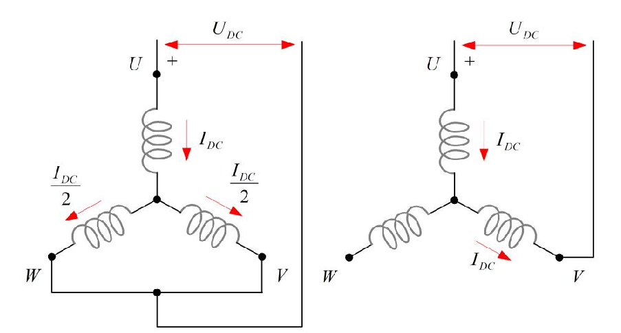
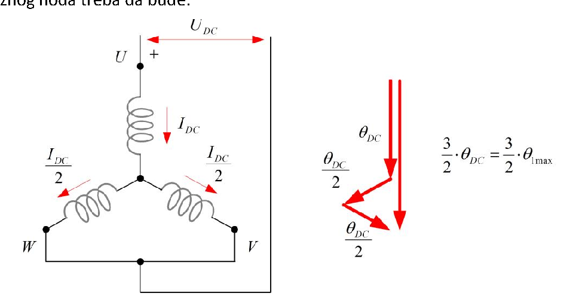
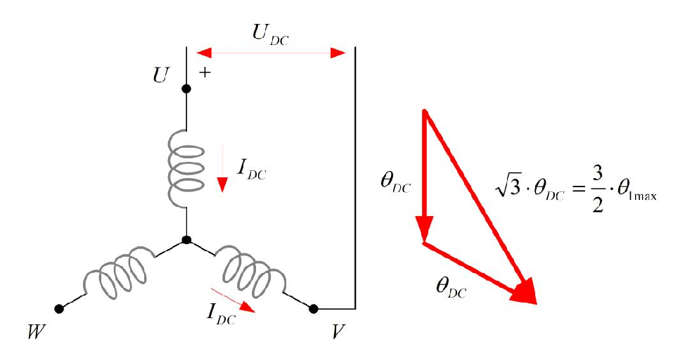

# Zadatak 59 (u zbirci odštampan kao Zadatak 69) — Kočenje asinhronog motora jednosmernom strujom: potreban napon izvora za dva spoja namotaja

> **Napomena o originalu:** U zbirci je ovaj zadatak odštampan pod brojem **69**, ali je to očigledna štamparska greška: po redosledu u knjizi dolazi odmah posle Zadatka 58, a sve njegove slike i formule nose numeraciju **59** (Slika 59.1, 59.2, 59.3, formula (59.1)). Zato ga ovde vodimo kao **Zadatak 59**.

## Postavka

Odrediti napon izvora potreban da se ostvari **kočenje asinhronog motora jednosmernom strujom** u spojevima datim na slici 59.1 (varijanta a i varijanta b), ako se želi postići **ista vrednost magnetne indukcije kao u praznom hodu motora**. Parametri motora su:

- nazivni napon $380\ \mathrm{V}$, frekvencija $50\ \mathrm{Hz}$, sprega statora Y (zvezda);
- otpornost statorskog namotaja $R_s = 0{,}227\ \Omega$;
- svedena otpornost rotorskog namotaja $R'_r = 0{,}125\ \Omega$;
- rasipna reaktansa statora $X_{\gamma s} = 0{,}512\ \Omega$;
- svedena rasipna reaktansa rotora $X'_{\gamma r} = 0{,}769\ \Omega$;
- reaktansa magnećenja $X_m = 9{,}86\ \Omega$.

Da li će takvim izborom napona vrednost indukcije **tokom kočenja zaista biti jednaka** onoj koja se ima u radu motora u režimu praznog hoda?

Slika 59.1 prikazuje dve šeme priključenja jednosmernog izvora na statorski namotaj spregnut u zvezdu. Čitaj je ovako: tri kalema su tri fazna namotaja statora (U, V, W), spojena u zajedničku zvezdanu tačku u sredini; $U_{DC}$ je jednosmerni izvor sa označenim polaritetom (+), a crvene strelice pokazuju kuda i u kom smeru teče jednosmerna struja. **Levo (spoj a):** izvor je vezan između kraja faze U i kratko spojenih krajeva faza V i W — struja $I_{DC}$ ulazi kroz fazu U, pa se u zvezdištu deli na dve jednake polovine $I_{DC}/2$ koje izlaze kroz faze V i W. **Desno (spoj b):** izvor je vezan između krajeva faza U i V, dok je faza W neiskorišćena (visi u vazduhu) — ista struja $I_{DC}$ teče redno kroz fazu U pa kroz fazu V.

**Slika 59.1 —** Šeme spoja statorskih namotaja kod kočenja jednosmernom strujom (levo: spoj a, desno: spoj b).

> **Prevod na običan jezik:** Motor hoćemo da zakočimo tako što ćemo ga isključiti sa trofazne mreže i kroz njegove statorske namotaje pustiti običnu jednosmernu struju iz nekog izvora (baterije, ispravljača...). Jednosmerna struja pravi nepokretno magnetno polje; rotor koji se još okreće "seče" to polje, u njemu se indukuju struje i nastaje moment koji ga koči. Pitanje je praktično: **koliki jednosmerni napon** treba da ima taj izvor — za dva različita načina vezivanja namotaja (slika 59.1a i b) — ako želimo da jačina magnetnog polja (indukcija) u mašini bude ista kao kada motor normalno radi neopterećen (u praznom hodu)? Na kraju treba kritički prodiskutovati: da li će polje tokom kočenja stvarno biti baš toliko, ili nam nešto kvari račun?

> **Napomena o originalu:** U originalnom rešenju se za fazni napon koristi vrednost $U_{sf} = 230\ \mathrm{V}$, iako iz podataka sledi $U_{sf} = 380/\sqrt{3} = 219{,}4\ \mathrm{V}$. Autor je očigledno računao sa standardnim evropskim faznim naponom $230\ \mathrm{V}$ (koji odgovara mreži $400\ \mathrm{V}$), a ne sa $380\ \mathrm{V}$ iz postavke. Da bismo reprodukovali brojeve iz zbirke, i mi ćemo računati sa $U_{sf} = 230\ \mathrm{V}$, a na kraju rešenja dajemo i vrednosti koje bi se dobile sa doslednih $219{,}4\ \mathrm{V}$ — sve formule i ceo postupak ostaju potpuno isti.

## Podaci

| Veličina | Oznaka | Vrednost | Šta ta veličina fizički znači |
|---|---|---|---|
| Nazivni (linijski) napon | $U_n$ | $380\ \mathrm{V}$ | Efektivna vrednost napona između dva fazna provodnika mreže na koju se motor normalno priključuje. |
| Nazivna frekvencija | $f$ | $50\ \mathrm{Hz}$ | Frekvencija mrežnog napona; na njoj važe sve navedene reaktanse. |
| Sprega statora | Y | zvezda | Sva tri fazna namotaja imaju jedan kraj spojen u zajedničku (zvezdanu) tačku. |
| Fazni napon (korišćen u zbirci) | $U_{sf}$ | $230\ \mathrm{V}$ | Efektivna vrednost napona na jednom faznom namotaju (vidi napomenu o originalu iznad). |
| Otpornost statorskog namotaja | $R_s$ | $0{,}227\ \Omega$ | Omska (termogena) otpornost jednog faznog namotaja statora; na njoj se struja pretvara u toplotu. |
| Svedena otpornost rotora | $R'_r$ | $0{,}125\ \Omega$ | Otpornost rotorskog namotaja preračunata ("svedena") na statorsku stranu, kao kod transformatora. |
| Rasipna reaktansa statora | $X_{\gamma s}$ | $0{,}512\ \Omega$ | Reaktansa od onog dela statorskog fluksa koji se "rasipa" i ne obuhvata rotor. |
| Svedena rasipna reaktansa rotora | $X'_{\gamma r}$ | $0{,}769\ \Omega$ | Rasipna reaktansa rotorskog namotaja, svedena na statorsku stranu. |
| Reaktansa magnećenja | $X_m$ | $9{,}86\ \Omega$ | Reaktansa koja predstavlja glavni (korisni) fluks u vazdušnom zazoru; struja kroz nju "magneti" mašinu. |

Primeti odmah nešto važno: $R'_r$ i $X'_{\gamma r}$ su dati u postavci, ali ih u računu **nećemo upotrebiti**. Zašto? Struju praznog hoda računamo pri klizanju $s \approx 0$, kada kroz rotorsku granu praktično ne teče struja (mini-lekcija 4), a kroz jednosmerno kolo izvora rotor uopšte i ne postoji — izvor "vidi" samo statorske namotaje. Rotorski parametri bi zatrebali tek ako bismo računali sam kočioni moment, što ovde nije traženo.

## Šta se traži i zašto

**1. Jednosmerna struja $I_{DC}$ i napon izvora $U_{DC}$ za spoj a (slika 59.1 levo).** Napon izvora je podatak koji inženjeru direktno treba da bi izabrao ili podesio ispravljač/bateriju za kočenje. Da bismo ga našli, prvo moramo da odredimo koliku struju izvor treba da protera kroz namotaje — a nju diktira zahtev da magnetno polje bude isto kao u praznom hodu.

**2. Jednosmerna struja $I_{DC}$ i napon izvora $U_{DC}$ za spoj b (slika 59.1 desno).** Isti zahtev, drugačija veza namotaja — pa struje kroz faze prave magnetopobudne sile pod drugačijim uglovima i rezultat je drugačiji. Poređenje dva spoja pokazuje kako izbor šeme utiče na potreban izvor.

**3. Snaga jednosmernog izvora $P_{DC}$ (za oba spoja).** Govori koliki ispravljač treba nabaviti i koliko se toplote razvija u statoru tokom kočenja.

**4. Diskusija: da li će indukcija tokom kočenja zaista biti jednaka onoj iz praznog hoda?** Ovo je konceptualno najvažniji deo zadatka — proverava da li razumemo da rotor tokom kočenja nije pasivan posmatrač.

**Plan rešavanja:**
1. Iz ekvivalentne šeme praznog hoda izračunamo struju praznog hoda $I_0$ — to je (efektivna) struja koja u normalnom radu stvara traženu indukciju.
2. Za spoj a saberemo magnetopobudne sile (MPS) tri faze sa jednosmernim strujama i uporedimo ih sa MPS obrtnog polja u praznom hodu → uslov daje $I_{DC}$.
3. Iz Omovog zakona za jednosmerno kolo (izvor vidi samo otpornosti!) dobijemo $U_{DC}$, pa i $P_{DC} = U_{DC} \cdot I_{DC}$.
4. Ponovimo korake 2–3 za spoj b, gde MPS dve faze zaklapaju ugao od $60°$.
5. Prodiskutujemo uticaj rotorskog polja na stvarnu indukciju tokom kočenja.

## Potrebna teorija — mini-lekcije

### Mini-lekcija 1: Šta je kočenje jednosmernom strujom (dinamičko kočenje)?

Kada asinhroni motor treba brzo zaustaviti, jedna od najjednostavnijih metoda je **dinamičko kočenje jednosmernom strujom**: stator se isključi sa trofazne mreže i na njegove namotaje se priključi **jednosmerni izvor**. Jednosmerna struja kroz statorske namotaje stvara magnetno polje koje je **nepokretno u prostoru** (ne obrće se, jer se struja ne menja u vremenu). Rotor, koji se po inerciji i dalje okreće, svojim provodnicima "seče" to nepokretno polje — u njima se indukuju elektromotorne sile i struje, a te struje u polju stvaraju **moment koji se protivi obrtanju** (Lencov zakon: indukovane struje se uvek protive uzroku koji ih stvara, a uzrok je ovde obrtanje rotora kroz polje). Motor se tako ponaša kao generator koji svoju mehaničku (kinetičku) energiju pretvara u toplotu u sopstvenom rotoru — otuda naziv *dinamičko* kočenje. Kad se rotor zaustavi, indukovanja više nema, momenta više nema — mašina mirno stoji, bez opasnosti da se zavrti u suprotnu stranu (što je prednost u odnosu na kočenje protivstrujanjem).

### Mini-lekcija 2: Magnetopobudna sila (MPS) jedne faze

**Magnetopobudna sila** (skraćeno MPS; u zbirci označena sa $\Theta$, u literaturi se sreće i oznaka *mms* — magnetomotorna sila) je mera "magnetnog napora" koji struja kroz namotaj ulaže da protera fluks kroz magnetno kolo. Za namotaj sa $N$ efektivnih navojaka kroz koji teče struja $i$, MPS je po veličini srazmerna proizvodu $N \cdot i$. Ključno svojstvo za ovaj zadatak: MPS jedne faze možemo predstaviti **vektorom u prostoru** koji leži **u osi te faze** (osa faze = pravac u kome namotaj te faze najjače magneti mašinu). Kod trofazne mašine ose faza U, V i W su međusobno pomerene za $120°$ po obimu statora. Intenzitet vektora je srazmeran **trenutnoj vrednosti struje** te faze, a smer vektora se obrće (pokazuje "napred" ili "nazad" duž ose) prema znaku struje: ako je struja negativna (teče suprotno od referentnog smera), vektor MPS pokazuje **suprotno** od ose faze. Rezultantna MPS mašine je **vektorski zbir** MPS svih faza — i upravo ona određuje magnetnu indukciju $B$ u vazdušnom zazoru: veća rezultantna MPS → veća indukcija (dok god gvožđe nije zasićeno, veza je praktično linearna).

### Mini-lekcija 3: Obrtno polje trofaznog namotaja i faktor 3/2

Kada tri fazna namotaja napajamo simetričnim trofaznim strujama (iste amplitude $I_m$, fazno pomerene po $120°$), rezultantna MPS je vektor **stalne veličine koji se obrće** konstantnom (sinhronom) brzinom — to je čuveno **obrtno polje**. Njegova veličina iznosi:

$$\Theta_r = \frac{3}{2} \cdot \Theta_{1\max}$$

gde je $\Theta_{1\max}$ maksimalna MPS **jedne** faze, tj. MPS koju jedna faza stvori u trenutku kada je njena struja na vrhuncu $I_m$. Odakle faktor $\frac{3}{2}$? Najlakše ga je videti u jednom zgodnom trenutku — **baš kada struja faze U dostiže maksimum** $+I_m$. Pošto je zbir tri simetrične struje uvek nula, a druge dve struje u tom trenutku prolaze kroz vrednost $\cos(\pm 120°) = -\tfrac{1}{2}$ svog maksimuma, važi $i_V = i_W = -\tfrac{I_m}{2}$. MPS faze U je tada pun vektor $\Theta_{1\max}$ duž ose U; MPS faza V i W su vektori veličine $\tfrac{\Theta_{1\max}}{2}$ okrenuti **suprotno** od svojih osa (jer su im struje negativne), pa svaki od njih zaklapa ugao od $60°$ sa osom U i njegova projekcija na osu U iznosi $\tfrac{\Theta_{1\max}}{2}\cos 60° = \tfrac{\Theta_{1\max}}{4}$. Zbir: $\Theta_{1\max} + 2 \cdot \tfrac{\Theta_{1\max}}{4} = \tfrac{3}{2}\Theta_{1\max}$, usmeren duž ose U (poprečne komponente V i W se poništavaju iz simetrije). Ovaj "zamrznuti snimak" obrtnog polja je tačno ono što ćemo jednosmernom strujom oponašati u spoju a.

### Mini-lekcija 4: Struja praznog hoda $I_0$

**Prazan hod** je režim u kome motor radi priključen na mrežu, ali bez ikakvog tereta na vratilu. Rotor se tada obrće praktično sinhronom brzinom, klizanje je $s \approx 0$, pa je otpornost rotorske grane u ekvivalentnoj šemi $R'_r/s \to \infty$ — kroz rotorsku granu **ne teče struja** i ona se ponaša kao otvorena. Sva struja koju motor vuče iz mreže je tada **struja magnećenja**: ona teče kroz redno vezane $R_s$, $X_{\gamma s}$ i $X_m$ i stvara glavni fluks, tj. indukciju $B_0$ u mašini. Zato je:

$$I_0 = \frac{U_{sf}}{\sqrt{R_s^2 + (X_{\gamma s} + X_m)^2}}$$

Ovo je efektivna vrednost; brojilac je fazni napon, a imenilac moduo redne impedanse $R_s + \mathrm{j}(X_{\gamma s} + X_m)$ (otpornost i reaktansa se ne sabiraju algebarski nego "pitagorejski", jer su pad napona na otpornosti i pad napona na reaktansi fazno pomereni za $90°$). Struja $I_0$ je za nas ključna referenca: **to je struja koja pravi indukciju praznog hoda** — istu tu indukciju hoćemo da napravimo jednosmernom strujom.

### Mini-lekcija 5: Sprega zvezda — fazni i linijski napon

Kod sprege Y svaki fazni namotaj je vezan između jednog priključka mreže i zvezdišta, pa je napon na jednom namotaju (fazni napon) $\sqrt{3}$ puta manji od napona između dva priključka (linijskog napona): $U_{sf} = U_n/\sqrt{3}$. Za $U_n = 380\ \mathrm{V}$ to daje $219{,}4\ \mathrm{V}$; zbirka, kako smo napomenuli, računa sa zaokruženih $230\ \mathrm{V}$ (fazni napon mreže $400\ \mathrm{V}$).

### Mini-lekcija 6: Jednosmerni izvor "ne vidi" reaktanse

U ustaljenom jednosmernom režimu struja je konstantna, pa je $\mathrm{d}i/\mathrm{d}t = 0$ i napon na svakoj induktivnosti je nula ($u_L = L\,\mathrm{d}i/\mathrm{d}t = 0$). Drugim rečima: **za jednosmernu struju sve reaktanse iščezavaju** ($X = 2\pi f L$, a $f = 0$), i izvor vidi samo **omske otpornosti** namotaja. Zato će potreban jednosmerni napon ispasti vrlo mali — nekoliko volti umesto stotina volti: struju više ne ograničava velika reaktansa $X_{\gamma s} + X_m \approx 10{,}4\ \Omega$, nego samo mala otpornost reda $0{,}2$–$0{,}5\ \Omega$.

Za dva spoja sa slike 59.1 ukupna otpornost koju izvor vidi je:

- **Spoj a:** faza U ($R_s$) redno sa paralelnom vezom faza V i W ($R_s \parallel R_s = \tfrac{R_s}{2}$), ukupno $R_{ekv} = R_s + \tfrac{R_s}{2} = \tfrac{3}{2}R_s$. (Paralelna veza dva jednaka otpornika daje polovinu jednog — struja ima dva jednaka puta, pa joj je "dvostruko lakše".)
- **Spoj b:** faze U i V redno, ukupno $R_{ekv} = 2R_s$; faza W ne učestvuje.

### Mini-lekcija 7: Kuda odlazi koja energija pri dinamičkom kočenju?

Snaga koju daje jednosmerni izvor troši se **isključivo na toplotu u statorskom namotaju** ($P_{DC} = R_{ekv} I_{DC}^2$): polje koje izvor stvara je nepokretno i ne prenosi nikakvu snagu na rotor (nema obrtnog polja → nema snage obrtnog polja). A gde onda završava kinetička energija zamajca i rotora koju kočenjem oduzimamo? Ona se, preko indukovanih struja, pretvara u **toplotu u rotorskom namotaju (kavezu)**. Dakle: izvor plaća samo "režiju" statora, a sav "posao kočenja" plaća rotor sopstvenom kinetičkom energijom. Ovo je i praktična poruka: pri čestim kočenjima rotor se greje i to je termički kriterijum za dimenzionisanje.

## Rešenje, korak po korak

### Korak 1: Fazni napon statora

**Zašto ovaj korak:** Struja praznog hoda računa se po jednom faznom namotaju, pa nam treba napon na jednoj fazi, ne linijski napon.

Kod sprege Y (mini-lekcija 5):

$$U_{sf} = \frac{U_n}{\sqrt{3}} = \frac{380\ \mathrm{V}}{\sqrt{3}} = 219{,}4\ \mathrm{V}$$

U skladu sa originalnim rešenjem (vidi napomenu u Postavci), dalje računamo sa vrednošću koju koristi zbirka:

$$U_{sf} = 230\ \mathrm{V}$$

**Šta smo dobili:** Napon na jednom namotaju — polaznu tačku za struju magnećenja.

### Korak 2: Struja praznog hoda $I_0$

**Zašto ovaj korak:** $I_0$ je struja koja u normalnom radu stvara indukciju praznog hoda $B_0$ — a upravo tu indukciju hoćemo da reprodukujemo jednosmernom strujom. Sve dalje se poredi sa $I_0$.

Po mini-lekciji 4 (rotorska grana otvorena jer je $s \approx 0$):

$$I_0 = \frac{U_{sf}}{\sqrt{R_s^2 + (X_{\gamma s} + X_m)^2}}$$

Prvo imenilac, deo po deo:

$$X_{\gamma s} + X_m = 0{,}512\ \Omega + 9{,}86\ \Omega = 10{,}372\ \Omega$$

$$\sqrt{R_s^2 + (X_{\gamma s} + X_m)^2} = \sqrt{0{,}227^2 + 10{,}372^2} = \sqrt{0{,}0515 + 107{,}578} = \sqrt{107{,}63} = 10{,}374\ \Omega$$

pa je:

$$I_0 = \frac{230\ \mathrm{V}}{10{,}374\ \Omega} = 22{,}17\ \mathrm{A}$$

**Šta smo dobili:** Efektivnu vrednost struje magnećenja. Primeti da je otpornost $R_s$ u imeniocu potpuno zanemarljiva ($0{,}0515$ prema $107{,}6$ pod korenom) — struju praznog hoda ograničava gotovo isključivo reaktansa magnećenja, što je tipično za asinhrone mašine.

### Korak 3 (spoj a): Rezultantna MPS jednosmernih struja

**Zašto ovaj korak:** Da bismo izjednačili indukciju sa onom iz praznog hoda, moramo znati koliku rezultantnu MPS prave jednosmerne struje u spoju a — pa ćemo je uporediti sa MPS obrtnog polja.

U spoju a struja $I_{DC}$ ulazi kroz fazu U, a kroz faze V i W izlazi po $\tfrac{I_{DC}}{2}$ (slika 59.1 levo). Struje faza su dakle:

$$i_U = I_{DC}, \qquad i_V = i_W = -\frac{I_{DC}}{2}$$

(minus, jer struja kroz V i W teče **suprotno** od referentnog smera — izlazi iz zvezdišta ka priključcima). Ovaj raspored struja je **identičan** "zamrznutom snimku" normalnog trofaznog rada u trenutku kada je struja faze U maksimalna, $i_U = I_m$, a $i_V = i_W = -\tfrac{I_m}{2}$ (mini-lekcija 3) — samo što se ovde slika ne obrće, nego stoji.

Sledeća slika prikazuje vektorski dijagram MPS za ovaj spoj. Čitaj je ovako: vertikalni vektor $\theta_{DC}$ je MPS faze U (puna struja $I_{DC}$, duž ose U); dva kraća vektora $\tfrac{\theta_{DC}}{2}$ su MPS faza V i W — zbog negativnih struja okrenuti su suprotno od svojih osa, pa svaki zaklapa ugao od $60°$ sa osom U; debeli rezultantni vektor je njihov zbir $\tfrac{3}{2}\theta_{DC}$, koji leži u osi faze U i treba da bude jednak amplitudi MPS obrtnog polja $\tfrac{3}{2}\theta_{1\max}$.

**Slika 59.2 —** Vektorski dijagram magnetopobudnih sila za prvi spoj (a) sa slike 59.1.

Označimo sa $\Theta_U$ MPS faze U; zbog jednakih namotaja pri istoj struji važi $\Theta_U = \Theta_V = \Theta_W$ (po veličini za istu struju). Saberimo projekcije na osu U (poprečne komponente V i W se poništavaju iz simetrije dijagrama):

$$\Theta_r = \Theta_{DC} + 2 \cdot \frac{\Theta_{DC}}{2} \cdot \cos 60° = \Theta_{DC} + 2 \cdot \frac{\Theta_{DC}}{2} \cdot \frac{1}{2} = \Theta_{DC} + \frac{\Theta_{DC}}{2}$$

$$\boxed{\Theta_r = \frac{3}{2} \cdot \Theta_U} \qquad (59.1)$$

gde je $\Theta_{DC} \equiv \Theta_U$ MPS faze U pri struji $I_{DC}$.

**Šta smo dobili:** Jednosmerne struje u spoju a prave nepokretnu rezultantnu MPS u osi faze U, veličine $\tfrac{3}{2}$ MPS jedne faze — potpuno isti faktor kao kod obrtnog polja.

### Korak 4 (spoj a): Uslov jednake indukcije → jednosmerna struja $I_{DC}$

**Zašto ovaj korak:** Indukcija je (u linearnom režimu) srazmerna rezultantnoj MPS. Ista indukcija kao u praznom hodu ⇔ ista rezultantna MPS kao u praznom hodu — iz te jednakosti izlazi tražena struja.

U praznom hodu obrtno polje pravi MPS amplitude $\tfrac{3}{2}\Theta_{1\max}$, gde $\Theta_{1\max}$ odgovara **maksimalnoj (temenoj)** vrednosti fazne struje $I_m = \sqrt{2} \cdot I_0$ ($I_0$ je efektivna vrednost, a MPS u svakom trenutku prati trenutnu struju — vrh sinusoide je $\sqrt{2}$ puta viši od efektivne vrednosti). Pošto je MPS srazmerna struji preko iste konstante namotaja (isti broj navojaka, isti namotaj), uslov jednakosti MPS:

$$\frac{3}{2}\,\Theta_{DC} = \frac{3}{2}\,\Theta_{1\max} \quad\Longrightarrow\quad \Theta_{DC} = \Theta_{1\max} \quad\Longrightarrow\quad I_{DC} = I_m$$

daje:

$$I_{DC} = \sqrt{2} \cdot I_0$$

Uvrstimo formulu za $I_0$ iz Koraka 2:

$$I_{DC} = \frac{\sqrt{2} \cdot U_{sf}}{\sqrt{R_s^2 + (X_{\gamma s} + X_m)^2}} = \frac{\sqrt{2} \cdot 230}{\sqrt{0{,}227^2 + (0{,}512 + 9{,}86)^2}} = \sqrt{2} \cdot 22{,}17\ \mathrm{A}$$

$$I_{DC} = 1{,}414 \cdot 22{,}17\ \mathrm{A} = 31{,}35\ \mathrm{A}$$

**Šta smo dobili:** Jednosmernu struju veću od efektivne struje praznog hoda tačno $\sqrt{2}$ puta. To je logično: jednosmerna struja mora da "gađa" vrh naizmenične sinusoide, a ne njenu efektivnu vrednost, jer polje u svakom trenutku pravi trenutna struja.

### Korak 5 (spoj a): Napon jednosmernog izvora $U_{DC}$

**Zašto ovaj korak:** Ovo je prva veličina koju zadatak eksplicitno traži — napon koji izvor mora da ima da bi kroz namotaje proterao upravo izračunatu struju.

Jednosmerni izvor vidi samo otpornosti (mini-lekcija 6). U spoju a to je faza U redno sa paralelom faza V i W:

$$R_{ekv} = R_s + \frac{R_s}{2} = \frac{3}{2} R_s$$

Po Omovom zakonu:

$$U_{DC} = I_{DC} \cdot \left( R_s + \frac{R_s}{2} \right) = I_{DC} \cdot \frac{3}{2} R_s = 31{,}35 \cdot \frac{3}{2} \cdot 0{,}227\ \mathrm{V}$$

Račun po delovima: $31{,}35 \cdot 1{,}5 = 47{,}03$, pa $47{,}03 \cdot 0{,}227 = 10{,}68$:

$$U_{DC} \approx 10{,}7\ \mathrm{V}$$

> **Napomena o originalu:** U zbirci u ovoj formuli piše "$31{,}35 \cdot \frac{3}{2} \cdot 0{,}277$" — vrednost $0{,}277$ je štamparska greška (zamenjene cifre), jer je zadato $R_s = 0{,}227\ \Omega$. Sa pogrešnih $0{,}277\ \Omega$ dobilo bi se $13{,}0\ \mathrm{V}$, a u zbirci je rezultat ispravno $10{,}7\ \mathrm{V}$ — dakle sam račun je izveden sa tačnom vrednošću $0{,}227\ \Omega$, samo je u štampi broj iskvaren.

**Šta smo dobili:** Svega desetak volti! Uporedi sa $380\ \mathrm{V}$ mreže — jednosmerni izvor za kočenje može biti mala, jeftina naprava, jer struju više ne ograničava reaktansa nego samo sitna otpornost bakra.

### Korak 6 (spoj a): Snaga jednosmernog izvora $P_{DC}$

**Zašto ovaj korak:** Snaga određuje koliki ispravljač treba i koliko se stator greje tokom kočenja.

Snaga jednosmernog izvora je proizvod njegovog napona i struje, a to je istovremeno Džulova toplota u statorskom namotaju:

$$P_{DC} = U_{DC} \cdot I_{DC} = I_{DC}^2 \cdot \frac{3}{2} R_s$$

Zgodno je uočiti i treći oblik: pošto je $I_{DC}^2 = (\sqrt{2}I_0)^2 = 2I_0^2$, imamo

$$P_{DC} = 2 I_0^2 \cdot \frac{3}{2} R_s = 3 \cdot I_0^2 R_s$$

— tačno koliki su **gubici u bakru statora u praznom hodu** (tri faze, svaka $R_s I_0^2$). Jednosmerni izvor, dakle, pokriva samo gubitke toplote u namotaju statora, jednake bakarnim gubicima statora praznog hoda. Brojčano:

$$P_{DC} = 10{,}7 \cdot 31{,}35\ \mathrm{W} \approx 335\ \mathrm{W}$$

(Sa nezaokruženim vrednostima: $P_{DC} = 3 \cdot 22{,}17^2 \cdot 0{,}227 = 334{,}7\ \mathrm{W}$; zbirka množi zaokružene brojeve i dobija $335{,}5\ \mathrm{W}$ — razlika je čisto zaokruživanje.)

**Šta smo dobili:** Snagu od svega ~335 W za kočenje motora čija je prividna snaga reda desetina kVA — još jedna potvrda da je metoda "jeftina" sa strane izvora.

### Korak 7 (spoj b): Rezultantna MPS — dva vektora pod $60°$

**Zašto ovaj korak:** U spoju b učestvuju samo dve faze i geometrija sabiranja MPS je drugačija — moramo je izvesti iznova pre nego što postavimo uslov jednake indukcije.

U spoju b (slika 59.1 desno) ista struja teče redno kroz faze U i V, a faza W je otkačena:

$$i_U = I_{DC}, \qquad i_V = -I_{DC}, \qquad i_W = 0$$

(struja u fazi V je negativna jer kroz nju teče **suprotno** od referentnog smera — ulazi kroz zvezdište, izlazi na priključak V.)

Pod kojim uglom su vektori MPS? Ose faza U i V zaklapaju $120°$. Ali vektor MPS faze V je zbog negativne struje okrenut **suprotno od svoje ose**, dakle zarotiran za još $180°$: ugao između vektora MPS faza U i V je $180° - 120° = 60°$, **a ne** $120°$. Upravo na ovo upozorava i originalno rešenje: ugao nije $120°$ jer je smer jedne struje suprotan referentnom smeru struje faze.

Sledeća slika prikazuje vektorski dijagram za ovaj spoj: dva jednaka vektora $\theta_{DC}$ (MPS faza U i V) pod međusobnim uglom od $60°$ i njihova rezultanta $\sqrt{3}\,\theta_{DC}$, koja treba da bude jednaka amplitudi MPS obrtnog polja $\tfrac{3}{2}\theta_{1\max}$.

**Slika 59.3 —** Vektorski dijagram magnetopobudnih sila za drugi spoj (b) sa slike 59.1.

Rezultanta dva jednaka vektora veličine $\Theta_{DC}$ pod uglom $60°$ (pravilo paralelograma; koristimo kosinusnu teoremu u obliku za zbir vektora):

$$\Theta_r = \sqrt{\Theta_{DC}^2 + \Theta_{DC}^2 + 2\,\Theta_{DC}^2 \cos 60°} = \Theta_{DC}\sqrt{1 + 1 + 2 \cdot \tfrac{1}{2}} = \Theta_{DC}\sqrt{3}$$

$$\Theta_r = \sqrt{3} \cdot \Theta_U$$

pri čemu je $\Theta_U = \Theta_V = \Theta_{DC}$ (ista struja, jednaki namotaji). Rezultanta leži na simetrali ugla između dva vektora.

**Šta smo dobili:** Dve faze pod $60°$ daju rezultantu $\sqrt{3} \approx 1{,}73$ puta veću od MPS jedne faze. Uporedi sa spojem a: tamo je faktor bio $\tfrac{3}{2} = 1{,}5$, jer faze V i W nose samo po **pola** struje. Ovde obe aktivne faze nose **punu** struju, pa je "iskorišćenje" struje bolje ($1{,}73 > 1{,}5$) — zato će, videćemo odmah, za isto polje trebati manja struja izvora.

### Korak 8 (spoj b): Uslov jednake indukcije → jednosmerna struja $I_{DC}$

**Zašto ovaj korak:** Isti zahtev kao u Koraku 4 — rezultantna MPS mora biti jednaka amplitudi MPS obrtnog polja praznog hoda, formula (59.1) — samo sa novom geometrijom.

Uslov:

$$\sqrt{3} \cdot \Theta_{DC} = \frac{3}{2} \cdot \Theta_{1\max}$$

MPS su srazmerne strujama (ista konstanta namotaja), a $\Theta_{1\max}$ odgovara temenoj struji $I_m = \sqrt{2} I_0$, pa:

$$\sqrt{3} \cdot I_{DC} = \frac{3}{2} \cdot \sqrt{2} \cdot I_0 \quad\Longrightarrow\quad I_{DC} = \frac{3}{2\sqrt{3}} \cdot \sqrt{2} \cdot I_0$$

Sredimo razlomak $\frac{3}{2\sqrt{3}}$: proširimo ga sa $\sqrt{3}$, tj. pomnožimo brojilac i imenilac sa $\sqrt{3}$:

$$\frac{3}{2\sqrt{3}} = \frac{3\sqrt{3}}{2 \cdot 3} = \frac{\sqrt{3}}{2}$$

pa je:

$$I_{DC} = \frac{\sqrt{3}}{2} \cdot \sqrt{2} \cdot I_0 = \frac{\sqrt{6}}{2} \cdot I_0 = \sqrt{\frac{6}{4}} \cdot I_0 = \sqrt{\frac{3}{2}} \cdot I_0$$

Brojčano ($\sqrt{3/2} = 1{,}2247$):

$$I_{DC} = \sqrt{\frac{3}{2}} \cdot 22{,}17\ \mathrm{A} = 1{,}2247 \cdot 22{,}17\ \mathrm{A} = 27{,}15\ \mathrm{A}$$

**Šta smo dobili:** Struju manju nego u spoju a ($27{,}15$ prema $31{,}35\ \mathrm{A}$). Ima smisla: u spoju b **cela** struja prolazi kroz dva namotaja (u spoju a kroz dva od tri namotaja teče samo polovina), pa je za istu rezultantnu MPS potrebna manja struja izvora.

### Korak 9 (spoj b): Napon jednosmernog izvora $U_{DC}$

**Zašto ovaj korak:** Tražena veličina za drugi spoj — Omov zakon za novo jednosmerno kolo.

Izvor sada vidi dva fazna namotaja redno (mini-lekcija 6):

$$R_{ekv} = 2 R_s$$

pa je:

$$U_{DC} = I_{DC} \cdot 2 R_s = 27{,}15 \cdot 2 \cdot 0{,}227\ \mathrm{V} = 27{,}15 \cdot 0{,}454\ \mathrm{V} = 12{,}3\ \mathrm{V}$$

**Šta smo dobili:** Opet mali napon, nešto veći nego u spoju a ($12{,}3$ prema $10{,}7\ \mathrm{V}$): struja je manja, ali je otpornost kola veća ($2R_s$ prema $\tfrac{3}{2}R_s$), i drugi efekat preteže.

### Korak 10 (spoj b): Snaga jednosmernog izvora $P_{DC}$

**Zašto ovaj korak:** Zaokružujemo drugi spoj i dobijamo lepu unakrsnu proveru sa spojem a.

$$P_{DC} = U_{DC} \cdot I_{DC} = I_{DC}^2 \cdot 2 R_s$$

i opet preko $I_0$: pošto je $I_{DC}^2 = \tfrac{3}{2} I_0^2$,

$$P_{DC} = \frac{3}{2} I_0^2 \cdot 2 R_s = 3 \cdot I_0^2 R_s$$

— **identično** kao u spoju a! Brojčano:

$$P_{DC} = 12{,}3 \cdot 27{,}15\ \mathrm{W} \approx 334\ \mathrm{W}$$

(Sa nezaokruženim vrednostima opet $334{,}7\ \mathrm{W}$; zbirka množenjem zaokruženih brojeva dobija $334\ \mathrm{W}$.)

**Šta smo dobili:** Oba spoja troše istu snagu $3 I_0^2 R_s$ — jednaku bakarnim gubicima statora u praznom hodu. To nije slučajnost: oba spoja prave **isto polje**, a snaga izvora u oba slučaja pokriva samo Džulove gubitke koji uz to polje idu.

### Korak 11: Da li će indukcija tokom kočenja zaista biti jednaka onoj iz praznog hoda?

**Zašto ovaj korak:** Ovo je poslednje (i konceptualno najvažnije) pitanje postavke — proveravamo skrivenu pretpostavku celog dotadašnjeg računa.

**Odgovor: neće.** Ceo naš račun je izjednačio MPS **statora** sa MPS praznog hoda i prećutno pretpostavio da je stator jedini izvor polja. Ali tokom kočenja rotor se okreće kroz nepokretno statorsko polje, pa se u rotorskim provodnicima indukuju struje (upravo one koje i koče!). Te rotorske struje prave **sopstvenu MPS rotora** koja se, po Lencovom zakonu, protivi uzroku — dakle **slabi rezultantno polje** u mašini (sasvim analogno reakciji indukta kod mašina jednosmerne struje, ili sekundarnoj struji transformatora koja poništava deo fluksa primara). Rezultat: pri izračunatim strujama $I_{DC}$ stvarna indukcija tokom kočenja biće **manja** od indukcije praznog hoda.

Ako želimo da tokom kočenja stvarno održimo indukciju praznog hoda (npr. da bismo imali pun kočioni moment), struje kočenja moraju biti **veće od izračunatih — čak i iznad nazivne struje** motora. To je dopustivo jer kočenje kratko traje, ali o zagrevanju se mora voditi računa.

Praktični zaključak (iz originala): kinetička energija rotora pri kočenju prelazi u toplotu u rotorskim namotajima (mini-lekcija 7), a potrebni jednosmerni naponi su vrlo mali (reda $10$–$12\ \mathrm{V}$) — zato je ovakvo kočenje **vrlo jednostavno za realizaciju, naročito u invertorima** (frekventnim pretvaračima): pretvarač samo pusti jednosmernu struju kroz dva-tri svoja ventila, bez ikakve dodatne opreme.

**Šta smo dobili:** Kritički pogled na sopstveni rezultat — izračunati naponi su tačni za zadati uslov "ista MPS statora", ali stvarna indukcija u pogonu biće niža zbog reakcije rotora; za pun efekat kočenja struje se u praksi biraju veće.

## Česte greške i zamke

1. **Zaboravljen faktor $\sqrt{2}$.** Najčešća greška: izjednačiti $I_{DC}$ sa efektivnom strujom $I_0$. Ali MPS u svakom trenutku pravi **trenutna** struja, a obrtno polje odgovara **vrhu** sinusoide $I_m = \sqrt{2} I_0$ — jednosmerna struja mora da dostigne taj vrh, pa je $I_{DC} = \sqrt{2} I_0$ (spoj a), odnosno $\sqrt{3/2}\,I_0$ (spoj b).

2. **Pogrešan ugao između MPS u spoju b: $120°$ umesto $60°$.** Ose faza U i V jesu pod $120°$, ali struja kroz fazu V teče suprotno od referentnog smera, pa je njen vektor MPS okrenut naopako — ugao između vektora je $180° - 120° = 60°$. Sa pogrešnih $120°$ rezultanta bi ispala $\Theta_{DC}$ umesto $\sqrt{3}\,\Theta_{DC}$ i struja bi bila pogrešna za faktor $\sqrt{3}$.

3. **Računanje jednosmernog kola sa reaktansama.** Reaktanse ($X_{\gamma s}$, $X_m$...) postoje samo za naizmeničnu struju; za jednosmernu struju u ustaljenom stanju induktivnosti su "nevidljive" ($f = 0 \Rightarrow X = 0$). Ko u imenilac za $U_{DC}$ stavi impedansu $\sqrt{R^2 + X^2}$, dobiće besmisleno velik napon (stotine volti).

4. **Pogrešna ekvivalentna otpornost.** U spoju a izvor vidi $R_s + \tfrac{R_s}{2} = \tfrac{3}{2}R_s$ (jedan namotaj redno sa paralelom druga dva), a ne $2R_s$ niti $R_s$. U spoju b vidi $2R_s$. Skica kola pre računa rešava stvar.

5. **Uslov postavljen sa nazivnom strujom umesto sa strujom praznog hoda.** Tražena je indukcija **praznog hoda**, koju pravi struja magnećenja $I_0$, a ne nazivna struja motora. Nazivna struja sadrži i veliku "radnu" komponentu koja s poljem magnećenja nema veze.

6. **Linijski umesto faznog napona u računu $I_0$.** Kod sprege Y kroz jedan namotaj "gura" fazni napon $U_n/\sqrt{3}$, ne linijskih $380\ \mathrm{V}$ — greška daje $I_0$ (pa i sve ostalo) uvećano $\sqrt{3}$ puta.

## Rezime rezultata

| Veličina | Spoj a (slika 59.1 levo) | Spoj b (slika 59.1 desno) |
|---|---|---|
| Struja praznog hoda $I_0$ | $22{,}17\ \mathrm{A}$ (zajednička za oba spoja) | $22{,}17\ \mathrm{A}$ (ista) |
| Uslov jednake MPS | $I_{DC} = \sqrt{2}\,I_0$ | $I_{DC} = \sqrt{3/2}\,I_0$ |
| Jednosmerna struja $I_{DC}$ | $31{,}35\ \mathrm{A}$ | $27{,}15\ \mathrm{A}$ |
| Otpornost koju izvor vidi | $\tfrac{3}{2}R_s = 0{,}341\ \Omega$ | $2R_s = 0{,}454\ \Omega$ |
| Napon izvora $U_{DC}$ | $10{,}7\ \mathrm{V}$ | $12{,}3\ \mathrm{V}$ |
| Snaga izvora $P_{DC} = 3I_0^2R_s$ | $\approx 335\ \mathrm{W}$ | $\approx 334\ \mathrm{W}$ (ista snaga, razlika je zaokruživanje) |
| Indukcija tokom kočenja | **Neće** biti jednaka indukciji praznog hoda — rotorsko polje je dodatno slabi; stvarne struje kočenja moraju biti veće (i iznad nazivne). | isto |

> **Napomena o originalu:** Sa doslednim faznim naponom $U_{sf} = 380/\sqrt{3} = 219{,}4\ \mathrm{V}$ (umesto $230\ \mathrm{V}$ iz zbirke) dobilo bi se: $I_0 = 21{,}15\ \mathrm{A}$; spoj a: $I_{DC} = 29{,}9\ \mathrm{A}$, $U_{DC} = 10{,}2\ \mathrm{V}$; spoj b: $I_{DC} = 25{,}9\ \mathrm{A}$, $U_{DC} = 11{,}8\ \mathrm{V}$; $P_{DC} = 304{,}6\ \mathrm{W}$. Postupak i svi zaključci ostaju identični.

## Provera smisla

**1. Dimenziona provera.** $I_{DC} = \sqrt{2} I_0$: $\mathrm{A}$ ✓. $U_{DC} = R_{ekv} I_{DC}$: $\Omega \cdot \mathrm{A} = \mathrm{V}$ ✓. $P_{DC} = U_{DC} I_{DC}$: $\mathrm{V} \cdot \mathrm{A} = \mathrm{W}$ ✓.

**2. Unakrsna provera preko snage.** Dva spoja smo računali potpuno nezavisno (različite struje, različite otpornosti, različita geometrija MPS), a oba daju istu snagu:

$$\text{spoj a: } I_{DC}^2 \cdot \tfrac{3}{2}R_s = 2I_0^2 \cdot \tfrac{3}{2}R_s = 3I_0^2R_s; \qquad \text{spoj b: } I_{DC}^2 \cdot 2R_s = \tfrac{3}{2}I_0^2 \cdot 2R_s = 3I_0^2R_s$$

Brojčano: $3 \cdot 22{,}17^2 \cdot 0{,}227 = 334{,}7\ \mathrm{W}$ u oba slučaja. To je tačno jednako bakarnim gubicima statora u praznom hodu ($3 R_s I_0^2$ — tri faze sa efektivnom strujom $I_0$), što i mora biti: isto polje → isti "magnetni napor" → isti ukupni Džulovi gubici koji ga prate, ma kako namotaje prevezali. Da su nam ispale različite snage, negde bi bila greška.

**3. Poređenje sa nazivnim vrednostima (red veličine).** Napon izvora je $10{,}7$–$12{,}3\ \mathrm{V}$, tj. oko **3%** nazivnog napona od $380\ \mathrm{V}$. To je očekivano: odnos naizmenične impedanse i jednosmerne otpornosti kola je $\approx 10{,}4/0{,}34 \approx 30$ i više — čim reaktanse "nestanu", za istu struju treba desetine puta manji napon. Upravo ta činjenica čini kočenje jednosmernom strujom tako pogodnim: dovoljan je minijaturni izvor ili par ventila u invertoru.

**4. Granični slučaj.** Da je reaktansa magnećenja $X_m$ veća (bolja mašina, manja struja magnećenja), $I_0$ bi bila manja, pa bi i $I_{DC}$, $U_{DC}$ i $P_{DC}$ srazmerno opali — formule se ponašaju kako fizika nalaže: mašini kojoj treba manje struje za polje treba i manji izvor za kočenje.
